---
## Front matter
title: "Отчёт по лабораторной работе №1"
subtitle: "Дисциплина: Администрирование локальных сетей"
author: "Мишина Анастасия Алексеевна"

## Generic options
lang: ru-RU
toc-title: "Содержание"

## Bibliography
bibliography: bib/cite.bib
csl: pandoc/csl/gost-r-7-0-5-2008-numeric.csl

## Pdf output format
toc: true # Table of contents
toc-depth: 2
lof: true # List of figures
lot: true # List of tables
fontsize: 14pt
linestretch: 1.5
papersize: a4
documentclass: scrreprt
## I18n polyglossia
polyglossia-lang:
  name: russian
  options:
	- spelling=modern
	- babelshorthands=true
polyglossia-otherlangs:
  name: english
## I18n babel
babel-lang: russian
babel-otherlangs: english
## Fonts
mainfont: PT Serif
romanfont: PT Serif
sansfont: PT Sans
monofont: PT Mono
mainfontoptions: Ligatures=TeX
romanfontoptions: Ligatures=TeX
sansfontoptions: Ligatures=TeX,Scale=MatchLowercase
monofontoptions: Scale=MatchLowercase,Scale=0.9
## Biblatex
biblatex: true
biblio-style: "gost-numeric"
biblatexoptions:
  - parentracker=true
  - backend=biber
  - hyperref=auto
  - language=auto
  - autolang=other*
  - citestyle=gost-numeric
## Pandoc-crossref LaTeX customization
figureTitle: "Рис."
tableTitle: "Таблица"
listingTitle: "Листинг"
lofTitle: "Список иллюстраций"
lotTitle: "Список таблиц"
lolTitle: "Листинги"
## Misc options
indent: true
header-includes:
  - \usepackage{indentfirst}
  - \usepackage{float} # keep figures where there are in the text
  - \floatplacement{figure}{H} # keep figures where there are in the text
---

# Цель работы

Установка инструмента моделирования конфигурации сети Cisco Packet Tracer, знакомство с его интерфейсом [@infosec].

# Выполнение лабораторной работы

## Запуск Cisco Packet Tracer без использования сетевого соединения 

Для начала установим Cisco Packet Tracer на ОС типа Windows и ограничим приложению доступ в Интернет (рис. [-@fig:001])

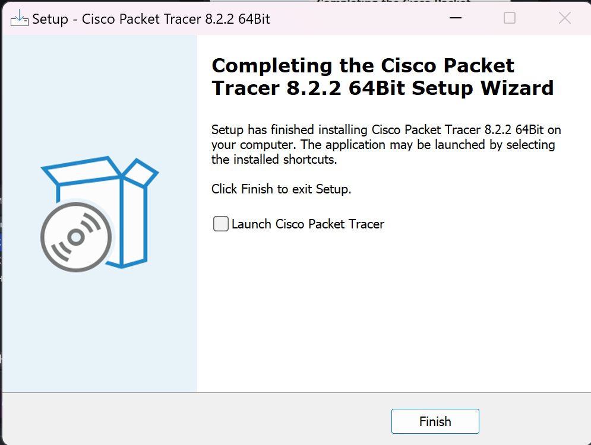{ #fig:001 width=80% }

## Знакомство с интерфейсом Packet Tracer

Открываем Packet Tracer и знакомимся с интерфейсом (рис. [-@fig:002])

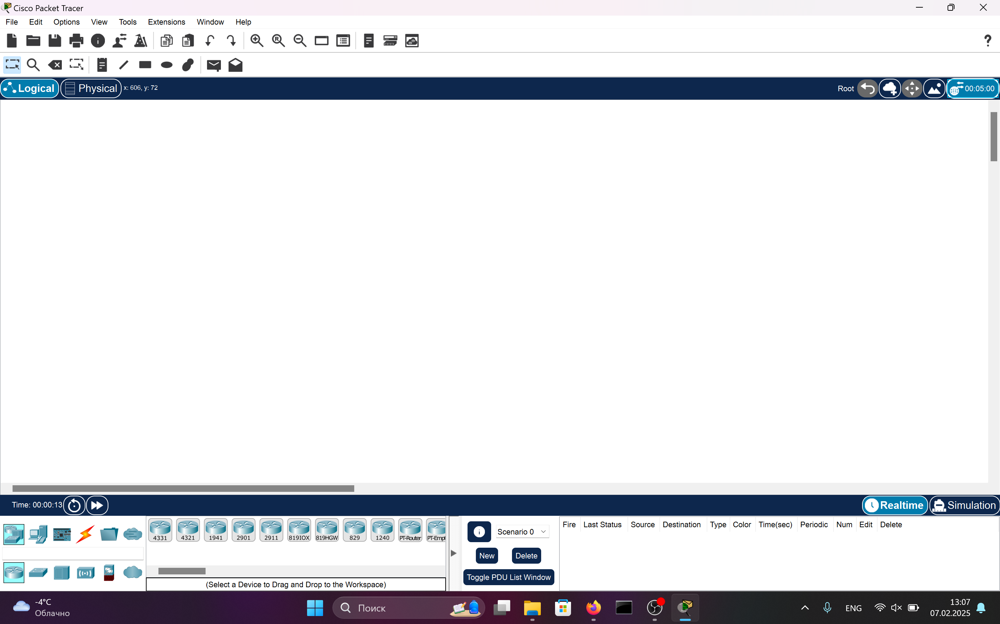{ #fig:002 width=80% }

## Построение простейшей сети

Создадим новый проект (lab_PT-01.pkt). В рабочем пространстве размещаем концентратор (Hub-PT) и четыре оконечных устройства PC Соединим оконечные устройства с концентратором прямым кабелем (рис. [-@fig:003]).

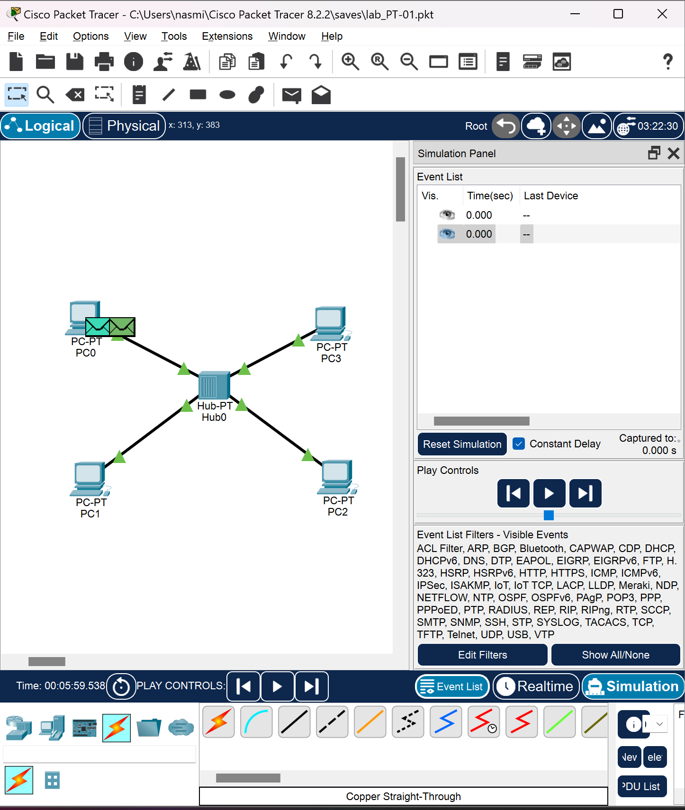{ #fig:003 width=80% }

Щёлкнув последовательно на каждом оконечном устройстве, зададим статические IP-адреса 192.168.1.11, 192.168.1.12, 192.168.1.13, 192.168.1.14 с маской подсети 255.255.255.0 (рис. [-@fig:004]).

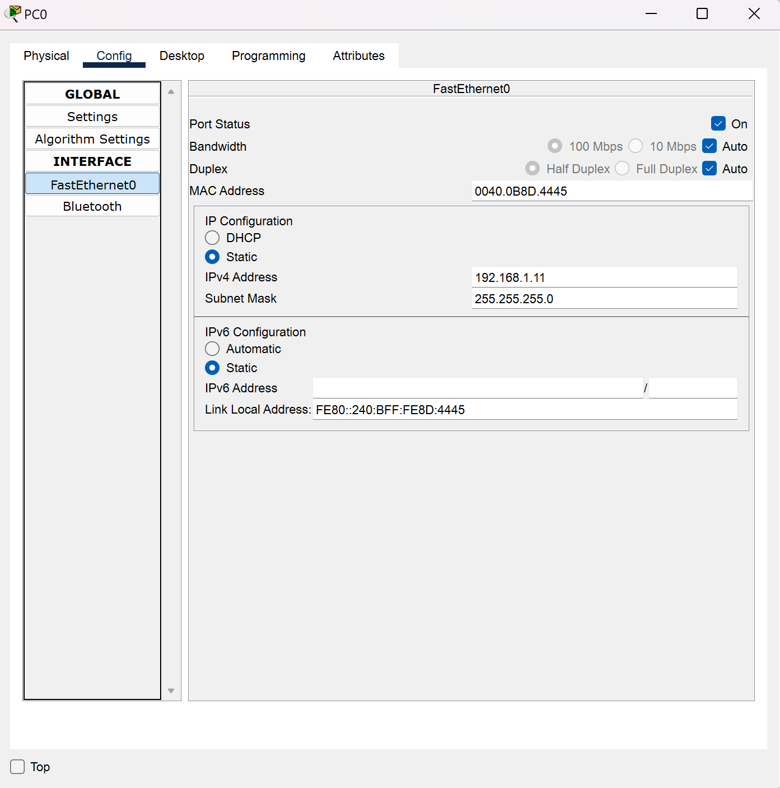{ #fig:004 width=80% }

В основном окне проекта переходим из режима реального времени (Realtime) в режим моделирования (Simulation). Выбираем на панели инструментов мышкой «Add Simple PDU (P)» и щёлкнем сначала на PC0, затем на PC2. В рабочей области появляются два конверта, обозначающих пакеты, в списке событий на панели моделирования появляются два события, относящихся к пакетам ARP и ICMP соответственно. На панели моделирования нажимаем кнопку «Play» и следим за движением пакетов ARP и ICMP от устройства PC0 до устройства PC2 и обратно.

Видим, что сначала пакет отправляется на хаб, потом ко всем устройствам. но принимает его только то, которому он изначально предназначался.

Щёлкнув на строке события, откроем окно информации о PDU и изучим, что происходит на уровне модели OSI при перемещении пакета. Используя кнопку «Проверь себя» (Challenge Me) на вкладке OSI Model, отвечаем на вопросы (рис. [-@fig:005]).

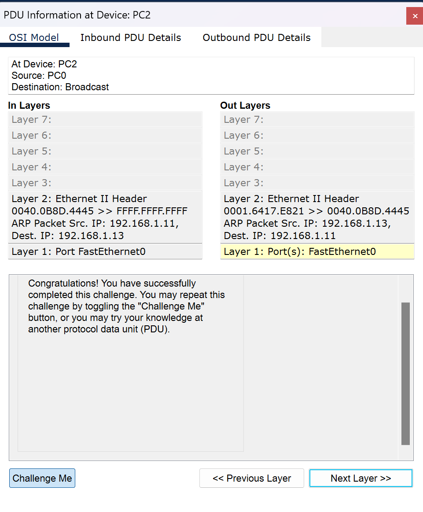{ #fig:005 width=80% }

Откроем вкладку с информацией о PDU (рис. [-@fig:006]). Изначально в PDU есть только заголовок IP, в котором есть соответственно информация об IP-адресах источника и получаетля. Также там есть заголовок ICMP. В нем содержится информация о типе ICMP-пакета, его коде, контрольной сумме, его идентификаторе и порядковом номере. Эти заголовки остаются постоянными при передаче.

Далее появляется кадр Ethernet. Тут есть поле преамбула - 7 байт для синхронизации. Поле SFD. Destination adress - Ethernet-адрес получателя, 6 байт. Source adress - Ethernet-адрес отправителя, 6 байт. Type - тип для обозначения типа протокола уровня. FCS - frame check sequence, 4 байта, поле контрольной последовательности фрейма.

Рассмотрим структуру mac-адреса. 0001.6417.E821 - адрес получателя PC2, 0040.0B8D.4445 - адрес отправителя PC0. Первые три байта указывают на производителя, следующие три байта указывают на идентификатор устройства.

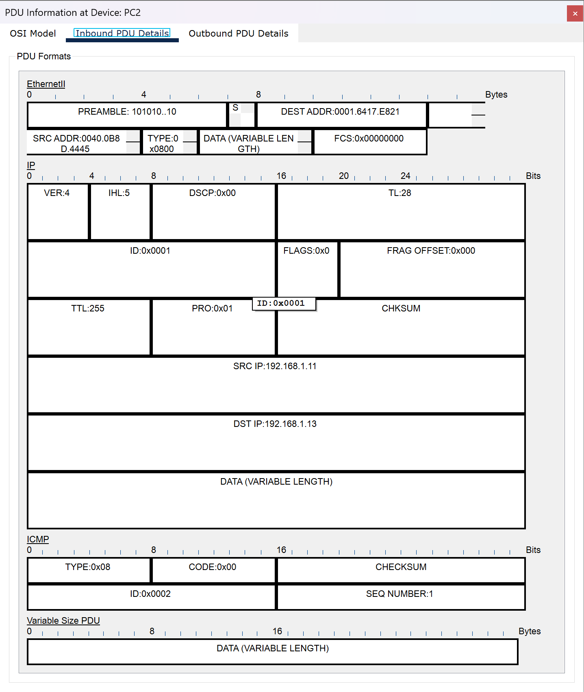{ #fig:006 width=80% }

Очистим список событий, удалив сценарий моделирования. Выберем на панели инструментов мышкой «Add Simple PDU (P)» и щёлкним сначала
на PC0, затем на PC2. Снова выберем на панели инструментов мышкой
«Add Simple PDU (P)» и щёлкним сначала на PC2, затем на PC0. На панели моделирования нажмем кнопку «Play» и проследим за возникновением коллизии (рис. [-@fig:007]).

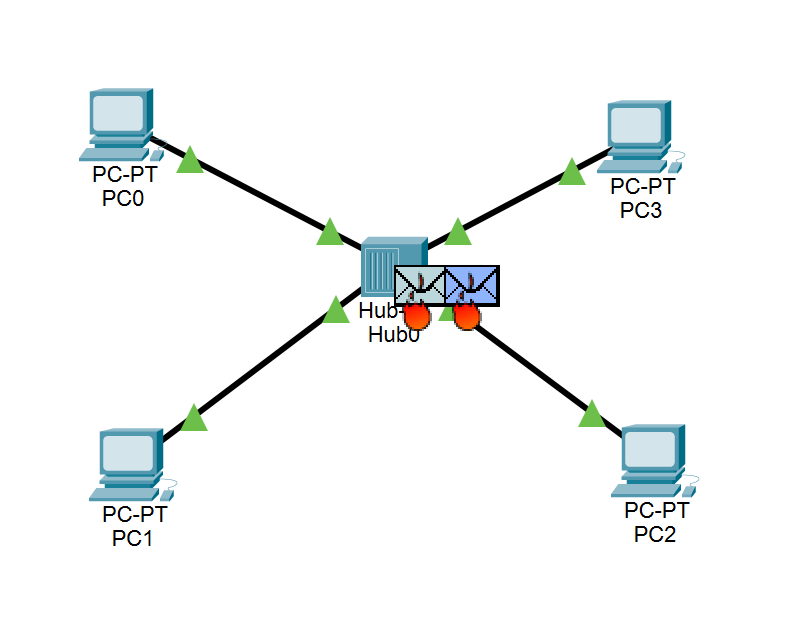{ #fig:007 width=80% }

Пакеты сначала передаются на хаб, где и возникает коллизия, так как он не может передать сообщения одновременно. У первого сообщения информация о PDU не отображается, а у второго ее и не должно быть. Далее второй пакет исчезает, а первый отправляется на все устройства, но пустой (рис. [-@fig:008]).

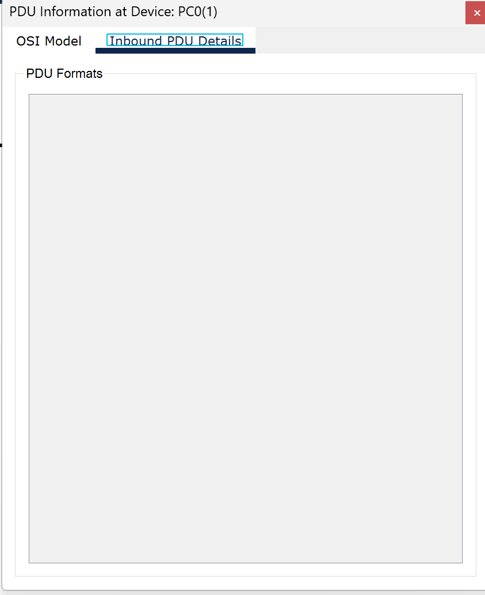{ #fig:008 width=80% }

Перейдем в режим реального времени (Realtime). В рабочем пространстве разместим коммутатор (например Cisco 2950-24) и 4 оконечных устройства PC. Соединим оконечные устройства с коммутатором прямым кабелем. Щёлкнув последовательно на каждом оконечном устройстве, задаем статические IP-адреса 192.168.1.21, 192.168.1.22, 192.168.1.23, 192.168.1.24 с маской подсети 255.255.255.0.

В основном окне проекта перейдем из режима реального времени (Realtime) в режим моделирования (Simulation). Выберем на панели инструментов мышкой «Add Simple PDU (P)» и щёлкнем сначала на PC4, затем на PC6. В рабочей области появляются два конверта, обозначающих пакеты, в списке событий на панели моделирования появляются два события, относящихся к пакетам ARP и ICMP соответственно. На панели моделирования нажимаем кнопку «Play» и следим за движением пакетов ARP и ICMP от устройства PC4 до устройства PC6 и обратно (рис. [-@fig:009]), (рис. [-@fig:010]).

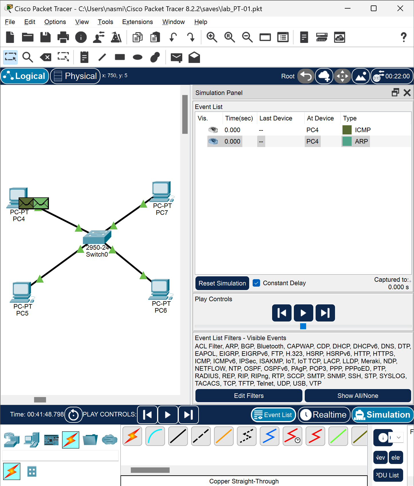{ #fig:009 width=80% }

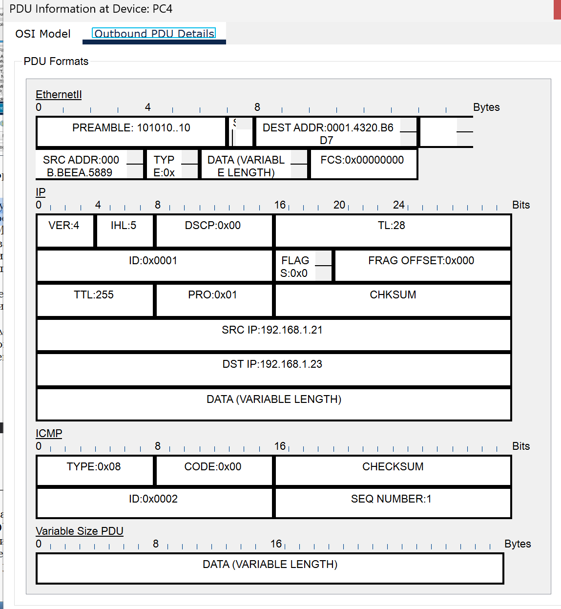{ #fig:010 width=80% }

Сначала, как и в случае с хабом, пакеты ARP рассылались по всем оконечным устройствам, но принимает его только ПК, которому предназначалось сообщение. Обратно ARP уже не рассылается всем устройствам, пакет идет только к PC6 (уже знает путь). Пакет ICMP сразу высылается на нужного получателя в обе стороны.

Исследуем структуру пакета ICMP. Изначально в PDU есть только заголовок IP, в котором есть информация об IP-адресах источника и получателя. Также там есть заголовок ICMP. В нем содержатся данные о типе ICMP-пакета, его коде, контрольной сумме, идентификаторе и порядковом номере. Эти заголовке не меняются при передаче.

Далее появляется кадр Ethernet. Здесь есть поле преамбула - 7 байт для синхронизации. Поле SFD. Destination adress - адрес отправителя, 6 байт. Type - тип для обозначения типа протокола. FCS - frame check sequence, 4 байта, поле контрольной последовательности фрейма.

Пакет отправляется на коммутатор, в заголовке указаны mac-адреса, в которых указано, что пакет идет от PC4 к PC6. Рассмотрим структуру mac-адреса. 0001.4320.B6D7 - адрес получателя PC6, 000B.BEEA.5889 - адрес источника PC4. Первые три байта указывают на производителя, следующие три байта указывают на идентификатор устройства.

Очистим список событий, удалив сценарий моделирования. Выберем на
панели инструментов мышкой «Add Simple PDU (P)» и щёлкнем сначала
на PC4, затем на PC6. Снова выберем на панели инструментов мышкой
«Add Simple PDU (P)» и щёлкнем сначала на PC6, затем на PC4. На
панели моделирования нажмем кнопку «Play» и проследим за движением
пакетов (рис. [-@fig:011]).

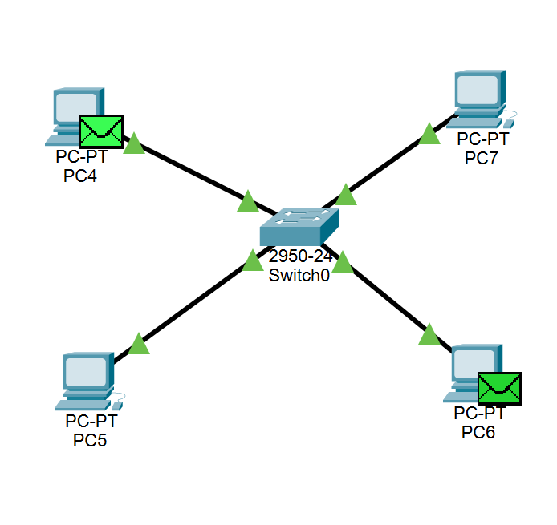{ #fig:011 width=80% }

Коллизия не возникает, потому что пакет не отправляется всем устройствам, а расходится по нужным назначениям коммутатором.

Перейдем в режим реального времени (Realtime). В рабочем пространстве соединим кроссовым кабелем концентратор и коммутатор. Перейдем в режим моделирования (Simulation). Очистим список событий, удалив сценарий моделирования. Выберем на панели инструментов мышкой «Add Simple PDU (P)» и щёлкнем сначала на PC0, затем на PC4. Снова выберем на панели инструментов мышкой «Add Simple PDU (P)» и щёлкнем сначала на PC4, затем на PC0. На панели моделирования нажмем кнопку «Play» и проследим за движением пакетов (рис. [-@fig:012]).

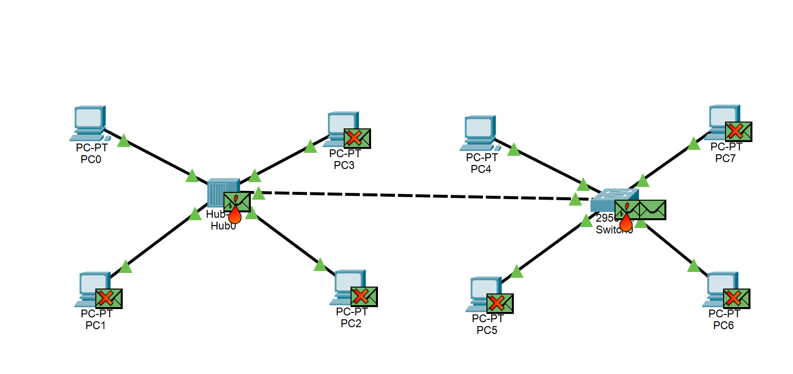{ #fig:012 width=80% }

Пакет, отправленный хабом, как и в прошлый раз исчезает, а пакет, отправленный через коммутатор, достигает своего назначения. Так получается, потому что коммутатор может работать в режиме полного дуплекса (двунаправленная передача данных).

Очистим список событий, удалив сценарий моделирования. На панели
моделирования нажмем «Play» и в списке событий получим пакеты STP (рис. [-@fig:013]).

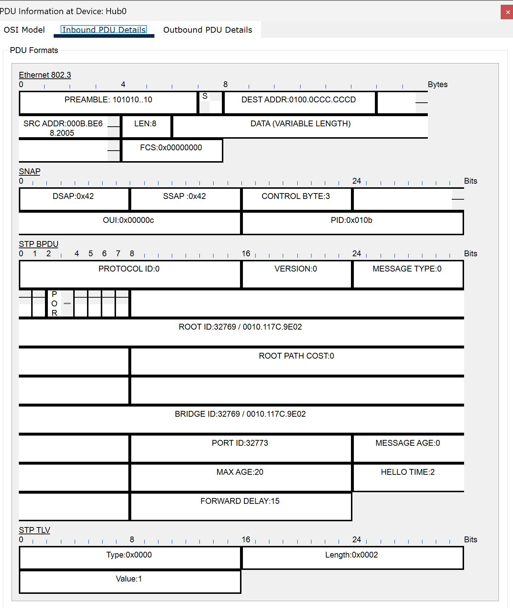{ #fig:013 width=80% }

Заголовок STP (Spanning Tree Protocol) включает в себя поля: Идентификатор протокола (Protocol Identifier) — 2-х байтовое поле, которое всегда равно нулю. Версия STP протокола (Protocol Version Identifier) — поле размером в 1 байт, значение которого, всегда равно «0». Тип BPDU (BPDU type) — 1 байт, которые принимает значение «0», если это конфигурационный BPDU (CBPDU), или «1», если это TCN BPDU. CBPDU (Configuration Bridge Protocol Data Unit) — кадр, используемый для вычисления связующего дерева. То есть, когда значение = 0. Флаги (Flags) — в этом поле используются только 1 байт. Эти флаги используются при изменении топологии (бит «1») и при подтверждении топологии (бит «8»). Идентификатор корневого моста (Root Identifier) — в этом поле содержится информация о корневом коммутаторе, а именно его приоритет и MAC-адрес. Расстояние до корневого моста (Root Path Cost) — здесь содержится суммарная стоимость до корневого коммутатора. Идентификатор моста (Bridge Identifier) — сюда коммутатор-отправитель записывает свои данные (приоритет + MAC-адрес). Идентификатор порта (Port Identifier) — сюда коммутатор-отправитель записывает идентификатор порта (то есть тот, с которого этот BPDU выйдет). Время жизни сообщения (Message Age) — здесь содержится временной интервал (в секундах). Он нужен для того, чтобы распознать устаревшие кадры и отбросить. Максимальное время жизни сообщения (Max Age) — это поле отвечает, как раз, за максимальное время жизни. Превысив его, коммутатор отбрасывает кадр. Время приветствия (Hello Time) — Временной интервал, через который коммутатор посылает BPDU кадры. По-умолчанию — это 2 секунды. Задержка смены состояний (Forward Delay) — временной интервал, указывающий сколько секунд порт коммутатора будет находиться в состоянии прослушивания и обучения.

Опишем структуру кадра Ethernet в этих пакетах. В STP пакетах кадр Ethernet имеет тип 802.3. В нем указана преамбула, mac-адреса источника и назначения и длина. Структура mac-адресов осталась прежней.

Перейдем в режим реального времени (Realtime). В рабочем пространстве добавим маршрутизатор (например, Cisco 2811). Соединим прямым кабелем коммутатор и маршрутизатор. Щёлкнем на маршрутизаторе и на вкладке его конфигурации пропишем статический IP-адрес 192.168.1.254 с маской 255.255.255.0, активируем порт, поставив галочку «On» напротив «Port Status». Перейдем в режим моделирования (Simulation). Очистим список событий, удалив сценарий моделирования. Выберем на панели инструментов мышкой «Add Simple PDU (P)» и щёлкнем сначала на PC3, затем на маршрутизаторе. На панели моделирования нажмем кнопку «Play» и проследим за движением пакетов ARP, ICMP, STP и CDP (рис. [-@fig:014]).

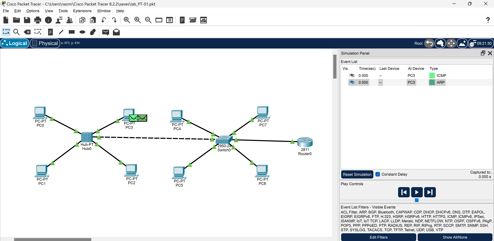{ #fig:014 width=80% }

Сначала посылаются паекты ARP, затем ICMP. В сети с хабом рассылка идет по всем устройствам, а в сети с коммутатором только к пункту назначения. После получения пакеты идет рассылка STP пакетов всем устройствам сети. Затем появляются DTP пакеты, а потом через несколько повторений появляются CDP (Cisco Discovery Protocol) - проприетарный протокол второго уровня, разработанный компанией Cisco Systems.

Исследуем структуру пакета CDP (рис. [-@fig:015]).

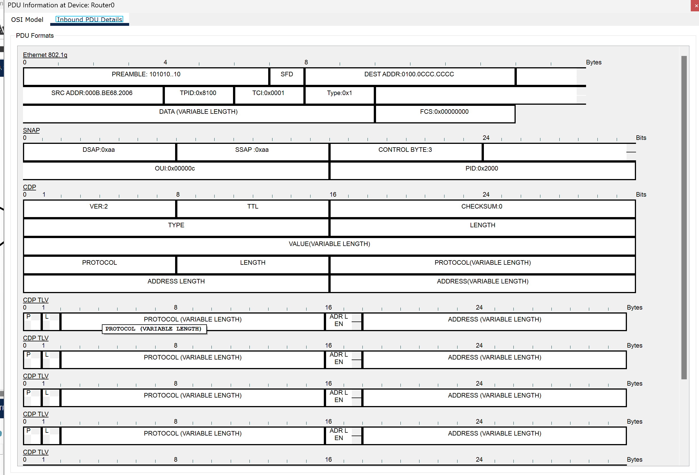{ #fig:015 width=80% }

Поле version - поле версии содержит используемую версию протокола CDP. В этом поле всегда содержится значение 0х01. Поле Time-to-Live (время жизни) указывает на время в секундах, в течение которого получаетль пакета CDP должен сохранять информацию, содержащуюся в пакете. Поле Checksum - контрольная сумма, содержит стандартную для протокола IP контрольную сумму. Поле Type - поле типа указывает на тип тройки type/length/value. Length - поле длины содержит общую длину в байтаз полей type/length/value. Value - поле значения.

Структура кадра Ethernet 802.3 такая же как в пакетах STP и mac-адреса такде остались прежними.

# Контрольные вопросы

1. Дайте определение следующим понятиям: концентратор, коммутатор, маршрутизатор, шлюз (gateway). В каких случаях следует использовать тот или иной тип сетевого оборудования?

- Концентратор (hub) – это устройство, работающее на первом (физическом) уровне модели OSI. Оно принимает входящие данные и отправляет их на все порты, кроме того, откуда они пришли. Используется в небольших сетях, но из-за большого количества коллизий и низкой эффективности почти полностью заменён коммутаторами.

- Коммутатор (switch) – это устройство второго (канального) уровня модели OSI, которое передаёт данные только на конкретный порт, связанный с MAC-адресом получателя. Используется для соединения устройств в локальной сети (LAN), обеспечивая более высокую скорость и меньшую нагрузку на сеть по сравнению с концентратором.

- Маршрутизатор (router) – устройство третьего (сетевого) уровня OSI, которое передаёт пакеты данных между разными сетями, основываясь на IP-адресах. Используется для соединения локальных сетей (LAN) с другими сетями, включая интернет.

- Шлюз (gateway) – устройство или программный компонент, который соединяет сети с разными архитектурами и протоколами. Может выполнять функции маршрутизатора, межсетевого экрана (firewall) или преобразователя протоколов. Используется, когда необходимо соединить сети, использующие разные технологии передачи данных.

2. Дайте определение следующим понятиям: ip-адрес, сетевая маска, broadcast-адрес.

- IP-адрес – это уникальный числовой идентификатор устройства в сети, используемый для его адресации и обмена данными. Существует два основных формата: IPv4 (например, 192.168.1.1) и IPv6 (например, 2001:db8::1).

- Сетевая маска – это параметр, определяющий, какая часть IP-адреса относится к сети, а какая — к конкретному устройству. Например, маска 255.255.255.0 в IPv4 означает, что первые три октета IP-адреса представляют сеть, а последний — узел.

- Broadcast-адрес – специальный адрес в сети, используемый для отправки данных всем устройствам в пределах одной подсети. Например, для сети 192.168.1.0/24 broadcast-адресом будет 192.168.1.255.

3. Как можно проверить доступность узла сети?

Для проверки доступности узла сети можно использовать следующие методы:

- Команда ping – отправляет ICMP-запросы на указанный IP-адрес или доменное имя. Если узел доступен, он отвечает ICMP-ответом. Пример: ping 192.168.1.1

- Команда tracert (Windows) или traceroute (Linux/macOS) – показывает маршрут следования пакетов до указанного узла, что помогает определить задержки и проблемные участки сети. Пример: tracert 8.8.8.8  # Windows и traceroute 8.8.8.8  # Linux/macOS

- Команда nslookup или dig – проверяет разрешение доменных имен в IP-адреса и наоборот. Пример: nslookup google.com и dig google.com

- Команда arp -a – показывает список известных MAC-адресов в локальной сети, что позволяет проверить наличие устройства в сети.

- Команда netstat – помогает анализировать активные соединения и слушающие порты на устройстве.

- Использование telnet или nc (netcat) – проверяет доступность определённого порта на удалённом узле. Например, проверка доступности веб-сервера: telnet 192.168.1.1 80 и nc -zv 192.168.1.1 80

# Выводы

В ходе выполнения данной лабораторной работы я установила инструмент моделирования конфигурации сети Cisco Packet Tracer и ознакомилась с его интерфейсом.

# Список литературы{.unnumbered}

::: {#refs}
:::