---
## Front matter
lang: ru-RU
title: Лабораторная работа №2
subtitle: Администрирование локальных сетей 
author:
  - Мишина А. А.
date: 21 февраля 2025

## i18n babel
babel-lang: russian
babel-otherlangs: english

## Formatting pdf
toc: false
toc-title: Содержание
slide_level: 2
aspectratio: 169
section-titles: true
theme: metropolis
header-includes:
 - \metroset{progressbar=frametitle,sectionpage=progressbar,numbering=fraction}
 - '\makeatletter'

 - '\makeatother'
---

## Докладчик

:::::::::::::: {.columns align=center}
::: {.column width="70%"}

  * Мишина Анастасия Алексеевна
  * НПИбд-02-22
  * <https://github.com/nasmi32>

:::
::: {.column width="30%"}

:::
::::::::::::::

## Цели и задачи

- Получить основные навыки по начальному конфигурированию оборудования Cisco.

## Задание

1. Сделать предварительную настройку маршрутизатора:

- задать имя в виде «город-территория-учётная_записьтип_оборудования-номер»;
- задать интерфейсу Fast Ethernet с номером 0 ip-адрес 192.168.1.254 и маску 255.255.255.0, затем поднять интерфейс;
- задать пароль для доступа к привилегированному режиму (сначала в открытом виде, затем — в зашифрованном);
- настроить доступ к оборудованию сначала через telnet, затем — через ssh (используя в качестве имени домена donskaya.rudn.edu);
- сохранить и экспортировать конфигурацию в отдельный файл.

## Задание

2. Сделать предварительную настройку коммутатора:

- задать имя в виде «город-территория-учётная_записьтип_оборудования-номер» 
- задать интерфейсу vlan 2 ip-адрес 192.168.2.1 и маску 255.255.255.0, затем поднять интерфейс;
- привязать интерфейс Fast Ethernet с номером 1 к vlan 2;
- задать в качестве адреса шлюза по умолчанию адрес 192.168.2.254;
- задать пароль для доступа к привилегированному режиму (сначала в открытом виде, затем — в зашифрованном);
- настроить доступ к оборудованию сначала через telnet, затем — через ssh (используя в качестве имени домена donskaya.rudn.edu);
- для пользователя admin задать доступ 1-го уровня по паролю;
- сохранить и экспортировать конфигурацию в отдельный файл.

# Выполнение лабораторной работы

## Подготовка

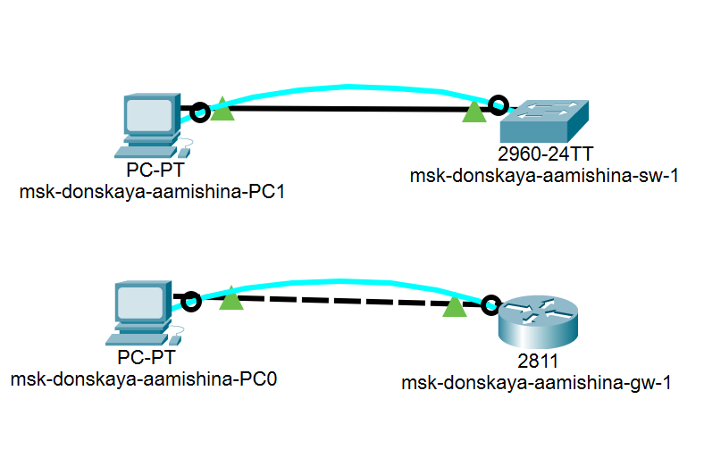{ #fig:001 width=60% }

## Подготовка

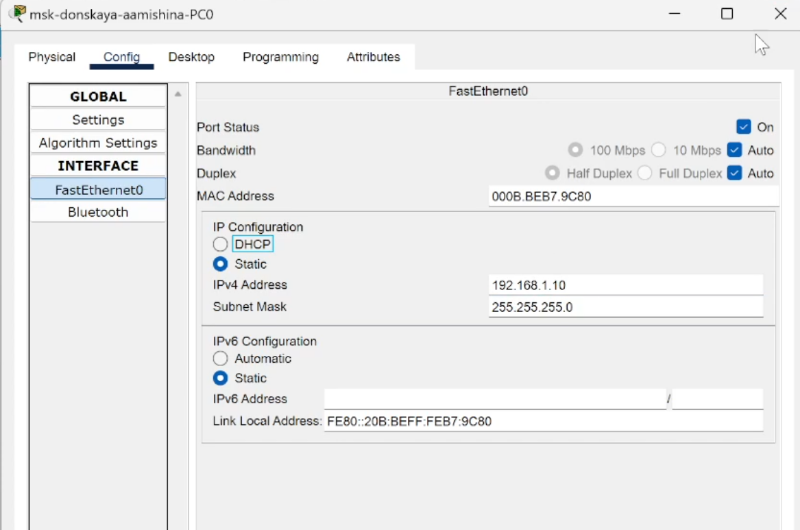{ #fig:002 width=60% }

## Подготовка

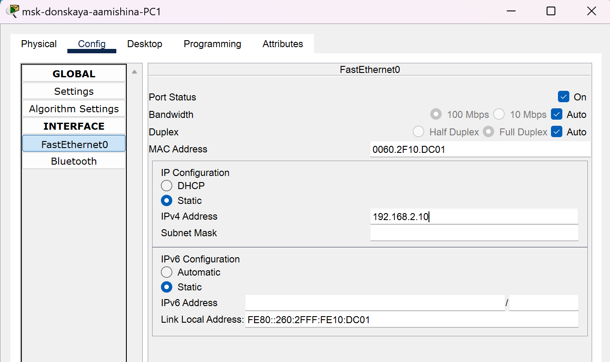{ #fig:003 width=80% }

# Конфигурация маршрутизатора

## Имя хоста и интерфейс

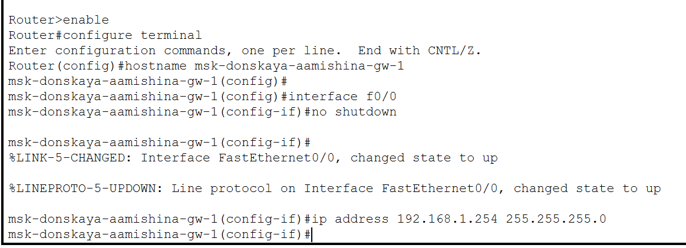{ #fig:004 width=80% }

## Команда ping

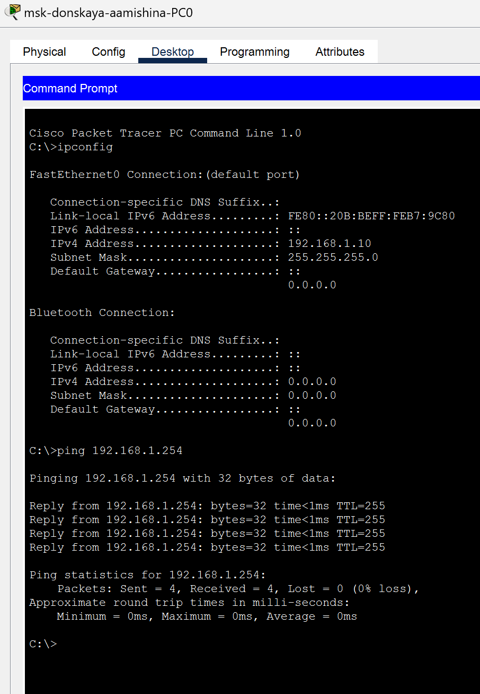{ #fig:005 width=25% }

## Пароли

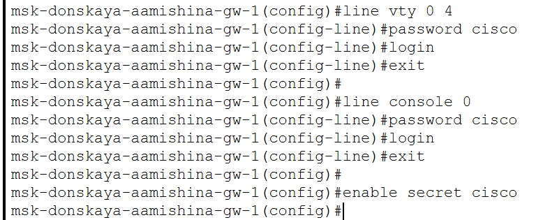{ #fig:006 width=80% }

## Пароли

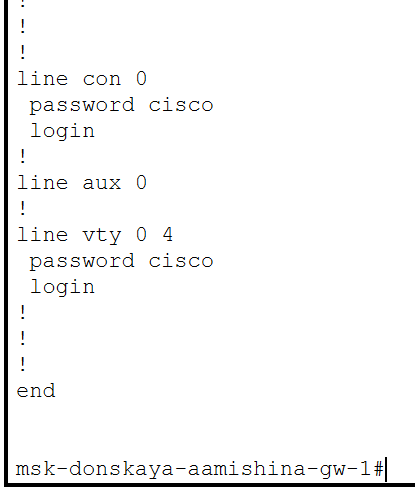{ #fig:007 width=30% }

## Пароли

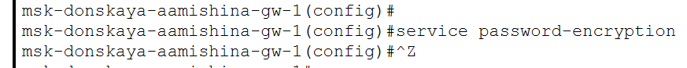{ #fig:008 width=80% }

## Пароли

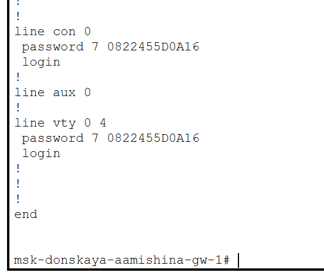{ #fig:009 width=50% }

## Доступ

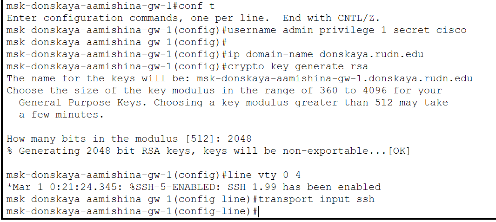{ #fig:010 width=80% }

## Проверка доступа

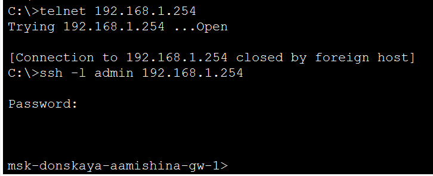{ #fig:011 width=80% }

## Сохранение конфигурации

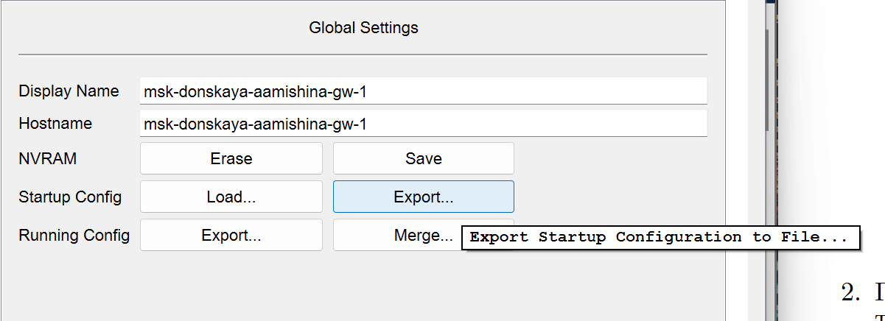{ #fig:012 width=80% }

# Конфигурация коммутатора

## Имя хоста и интерфейс

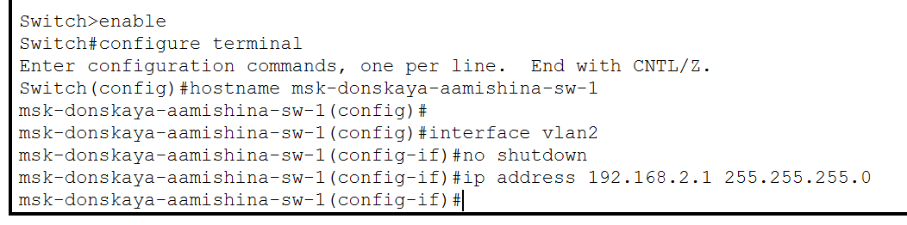{ #fig:013 width=80% }

## Интерфейс

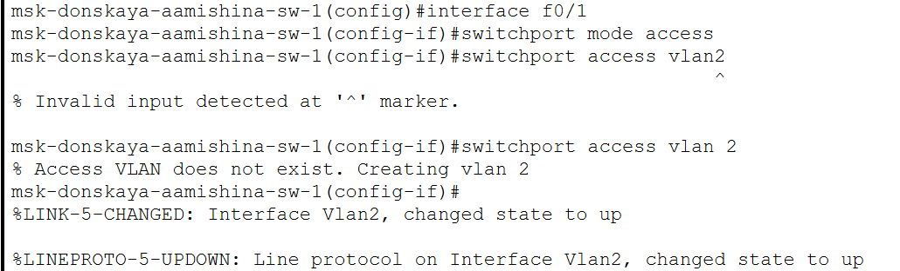{ #fig:014 width=80% }

## Адрес шлюза

{ #fig:015 width=80% }

## Команда ping

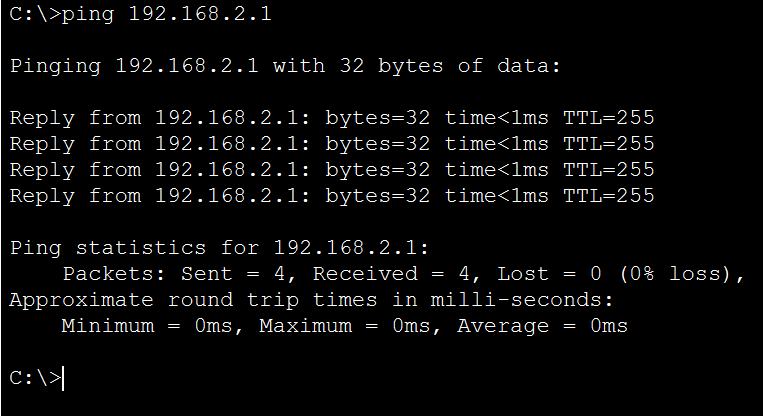{ #fig:016 width=80% }

## Пароли

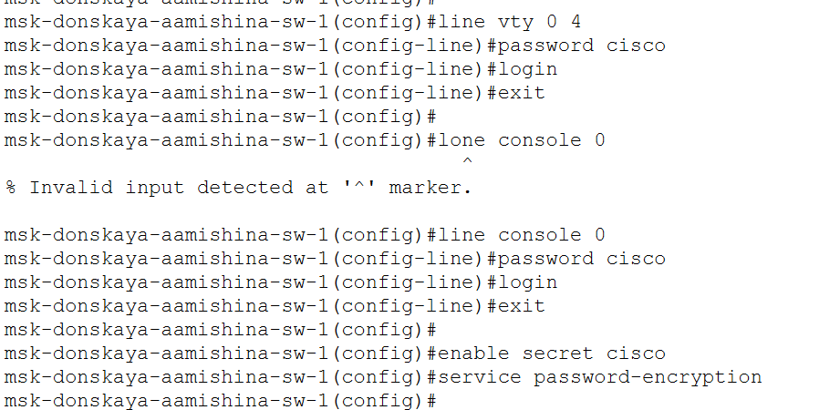{ #fig:017 width=80% }

## Пароли

{ #fig:018 width=80% }

## Доступ

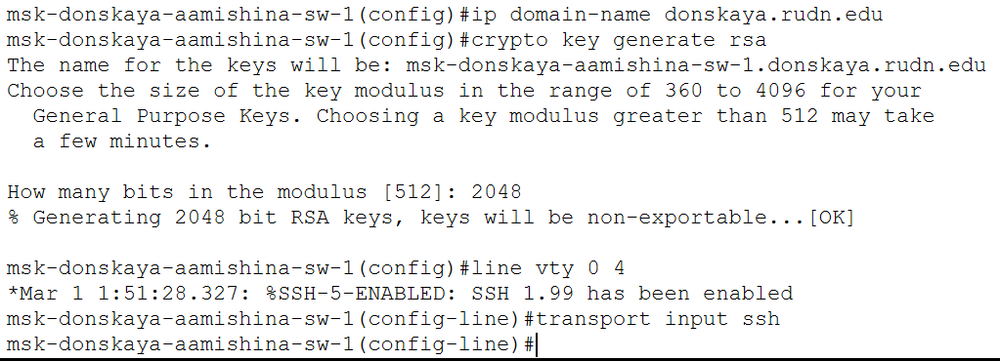{ #fig:019 width=80% }

## Проверка доступа

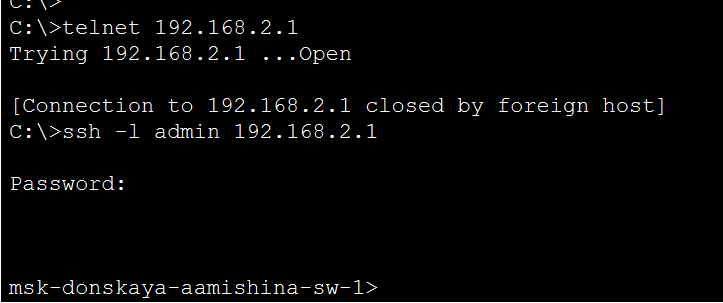{ #fig:020 width=80% }

## Сохранение конфигурации

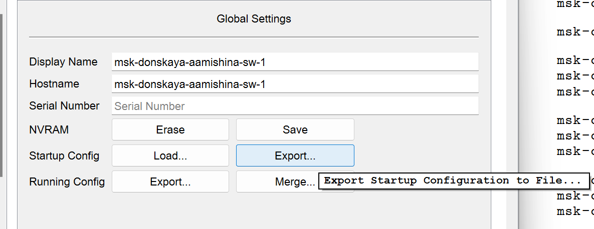{ #fig:021 width=80% }

## Вывод

- В процессе выполнения данной лабораторной работы я получила основные навыки по начальному конфигурированию оборудования Cisco.