---
## Front matter
title: "Отчёт по лабораторной работе №2"
subtitle: "Дисциплина: Администрирование локальных сетей"
author: "Мишина Анастасия Алексеевна"

## Generic options
lang: ru-RU
toc-title: "Содержание"

## Bibliography
bibliography: bib/cite.bib
csl: pandoc/csl/gost-r-7-0-5-2008-numeric.csl

## Pdf output format
toc: true # Table of contents
toc-depth: 2
lof: true # List of figures
lot: true # List of tables
fontsize: 14pt
linestretch: 1.5
papersize: a4
documentclass: scrreprt
## I18n polyglossia
polyglossia-lang:
  name: russian
  options:
	- spelling=modern
	- babelshorthands=true
polyglossia-otherlangs:
  name: english
## I18n babel
babel-lang: russian
babel-otherlangs: english
## Fonts
mainfont: PT Serif
romanfont: PT Serif
sansfont: PT Sans
monofont: PT Mono
mainfontoptions: Ligatures=TeX
romanfontoptions: Ligatures=TeX
sansfontoptions: Ligatures=TeX,Scale=MatchLowercase
monofontoptions: Scale=MatchLowercase,Scale=0.9
## Biblatex
biblatex: true
biblio-style: "gost-numeric"
biblatexoptions:
  - parentracker=true
  - backend=biber
  - hyperref=auto
  - language=auto
  - autolang=other*
  - citestyle=gost-numeric
## Pandoc-crossref LaTeX customization
figureTitle: "Рис."
tableTitle: "Таблица"
listingTitle: "Листинг"
lofTitle: "Список иллюстраций"
lotTitle: "Список таблиц"
lolTitle: "Листинги"
## Misc options
indent: true
header-includes:
  - \usepackage{indentfirst}
  - \usepackage{float} # keep figures where there are in the text
  - \floatplacement{figure}{H} # keep figures where there are in the text
---

# Цель работы

Получить основные навыки по начальному конфигурированию оборудования Cisco [@infosec].

# Задание

1. Сделать предварительную настройку маршрутизатора:

- задать имя в виде «город-территория-учётная_записьтип_оборудования-номер»;

- задать интерфейсу Fast Ethernet с номером 0 ip-адрес 192.168.1.254 и маску 255.255.255.0, затем поднять интерфейс;

- задать пароль для доступа к привилегированному режиму (сначала в открытом виде, затем — в зашифрованном);

- настроить доступ к оборудованию сначала через telnet, затем — через ssh (используя в качестве имени домена donskaya.rudn.edu);

- сохранить и экспортировать конфигурацию в отдельный файл.

2. Сделать предварительную настройку коммутатора:

- задать имя в виде «город-территория-учётная_записьтип_оборудования-номер» 
 
- задать интерфейсу vlan 2 ip-адрес 192.168.2.1 и маску 255.255.255.0, затем поднять интерфейс;

- привязать интерфейс Fast Ethernet с номером 1 к vlan 2;

- задать в качестве адреса шлюза по умолчанию адрес 192.168.2.254;

- задать пароль для доступа к привилегированному режиму (сначала в открытом виде, затем — в зашифрованном);

- настроить доступ к оборудованию сначала через telnet, затем — через ssh (используя в качестве имени домена donskaya.rudn.edu);

- для пользователя admin задать доступ 1-го уровня по паролю;

- сохранить и экспортировать конфигурацию в отдельный файл.

# Выполнение лабораторной работы

В логической рабочей области Packet Tracer разместим коммутатор,
маршрутизатор и 2 оконечных устройства типа PC, соедините один PC
с маршрутизатором, другой PC — с коммутатором (рис. [-@fig:001]).

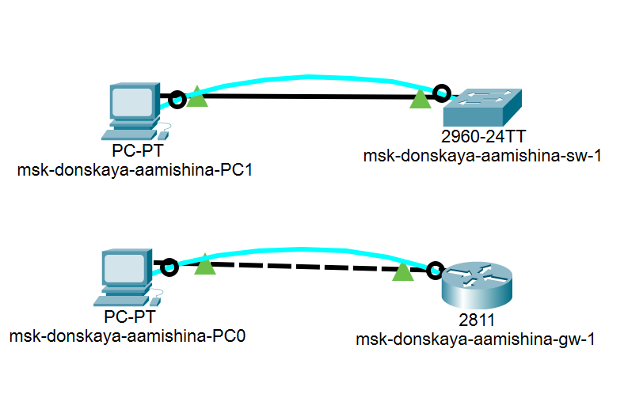{ #fig:001 width=80% }

Для начала настроим статические ip-адреса PC0 - 192.168.1.10 (рис. [-@fig:002]) и PC1 - 192.168.2.10 (рис. [-@fig:003]) и маски подсети 255.255.255.0.

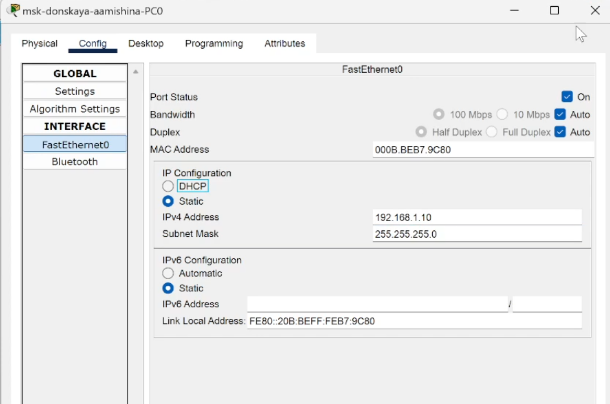{ #fig:002 width=80% }

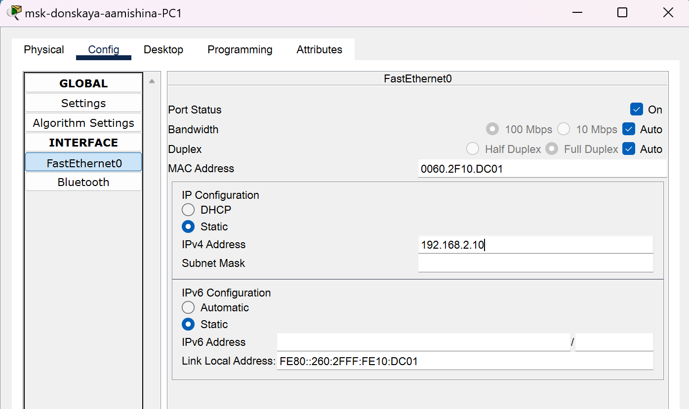{ #fig:003 width=80% }

## Конфигурация маршрутизатора

Проведем настройку маршрутизатора в соответствии с заданием. Откроем Command Line Interface (CLI) у маршрутизатора, который идентичен терминалу ПК. Перейдем в привилегированный режим с помощью команды enable. Перейдем в режим глобальной конфигурации с помощью команды configure terminal. Зададим имя хоста: hostname msk-donskaya-aamishina-gw-1. Зададим интерфейсу Fast Ethernet с номером 0 ip-адрес 192.168.1.254 с маской 255.255.255.0, поднимем интерфейс командой no shutdown (рис. [-@fig:004]).

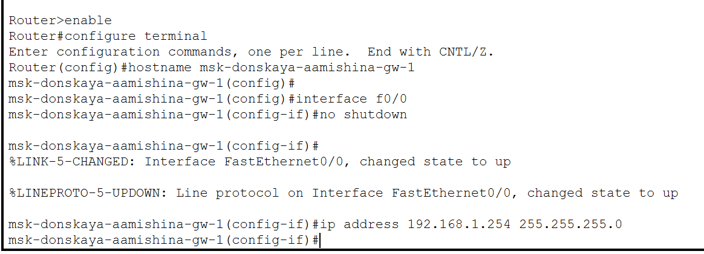{ #fig:004 width=80% }

Проверим работоспособность соединений с помощью команды ping. Видим, что было послано 4 пакета и получено тоже 4 пакета, потерь нет, соединение работает успешно (рис. [-@fig:005]).

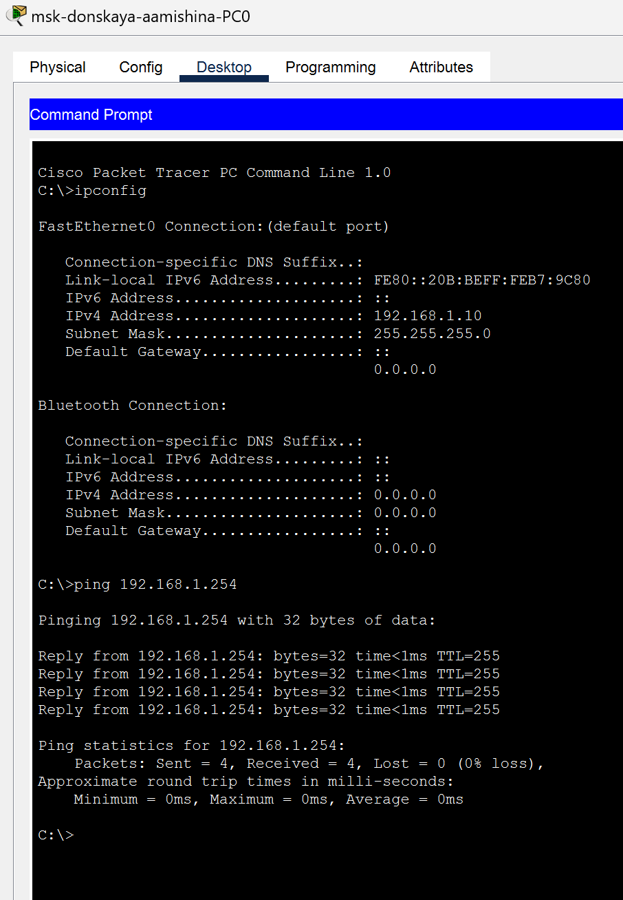{ #fig:005 width=80% }

Задаем пароль для доступа к привилегированному режиму (сначала в открытом, потом в зашифрованном виде). Зададим пароль для доступа к терминалу, к консоли и поставим пароль на enable (привилегированный режим) (рис. [-@fig:006]).

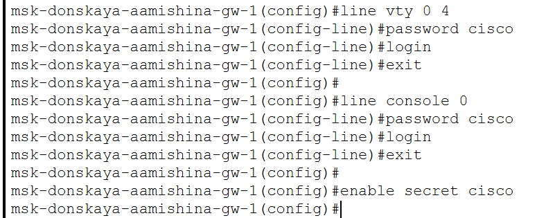{ #fig:006 width=80% }

Если мы используем команду secret, то пароль сразу будет зашифрован. Но там, где мы использовали команду password пароль не скрыт, и его можно посмотреть (рис. [-@fig:007]).

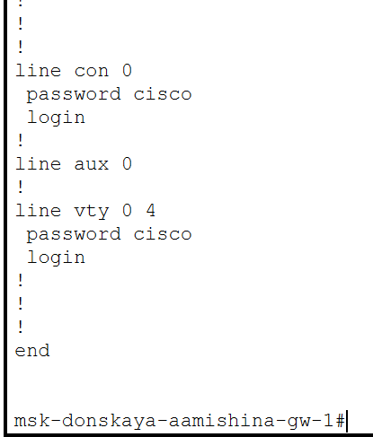{ #fig:007 width=80% }

Исправим это, зашифруем пароли с помощью команды service password−encryption (рис. [-@fig:008]).

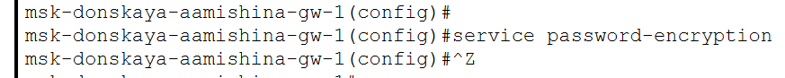{ #fig:008 width=80% }

Просмотрим пароли еще раз, теперь они зашифрованы (рис. [-@fig:009]).

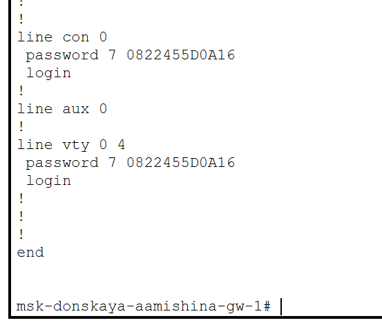{ #fig:009 width=80% }

В качестве дополнительного уровня защиты для пользователя admin зададим доступ 1-ого уровня по паролю. Настроим доступ к оборудованию сначала через telnet, потом через ssh (в качестве доменного имени используем donskaya.rudn.edu) (рис. [-@fig:010]).

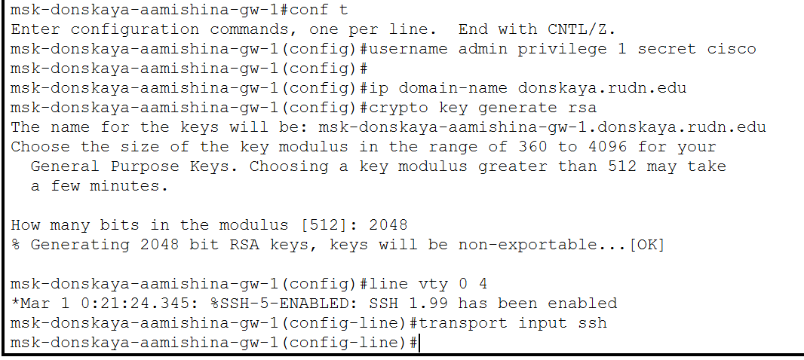{ #fig:010 width=80% }

Так как мы оставили возможным доступ только через ssh, то при попытке доступа через telnet нам отказано. При доступе через ssh запрашивается пароль (cisco), доступ предоставляется (рис. [-@fig:011]).

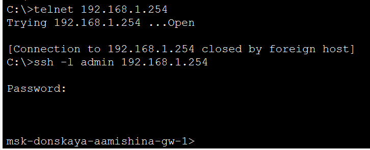{ #fig:011 width=80% }

Сохраним конфигурацию маршрутизатора (рис. [-@fig:012]).

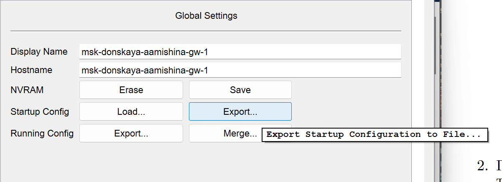{ #fig:012 width=80% }

## Конфигурация коммутатора

Проведем настройку коммутатора в соответствии с заданием. Откроем Command Line Interface (CLI) у коммутатора, который идентичен терминалу ПК. Перейдем в привилегированный режим с помощью команды enable. Перейдем в режим глобальной конфигурации с помощью команды configure terminal. Зададим имя хоста: hostname msk-donskaya-aamishina-sw-1. Зададим интерфейсу Fast Ethernet vlan2 ip-адрес 192.168.2.1 с маской 255.255.255.0, поднимем интерфейс командой no shutdown (рис. [-@fig:013]).

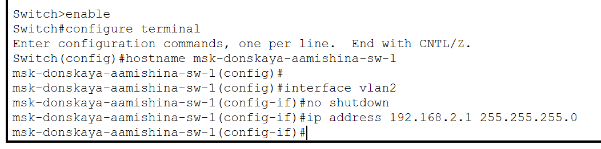{ #fig:013 width=80% }

Привяжем интерфейс Fast Ethernet с номером 1 к vlan2 (рис. [-@fig:014]).

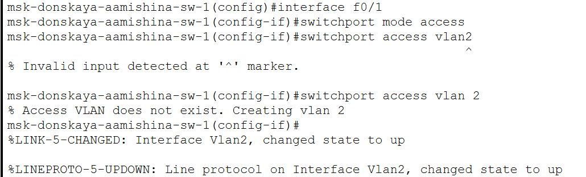{ #fig:014 width=80% }

Зададим в качестве адреса шлюза по умолчанию адрес 192.168.2.254 (рис. [-@fig:015]).

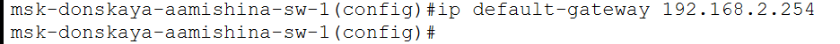{ #fig:015 width=80% }

Проверим работоспособность соединений с помощью команды ping. Видим, что было послано 4 пакета и получено тоже 4 пакета, потерь нет, соединение работает успешно (рис. [-@fig:016]).

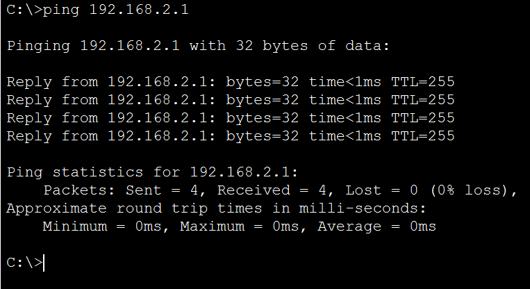{ #fig:016 width=80% }

Задаем пароль для доступа к привилегированному режиму (сначала в открытом, потом в зашифрованном виде). Зададим пароль для доступа к терминалу, к консоли и поставим пароль на enable (привилегированный режим). Зашифруем пароли с помощью команды service password−encryption (рис. [-@fig:017]).

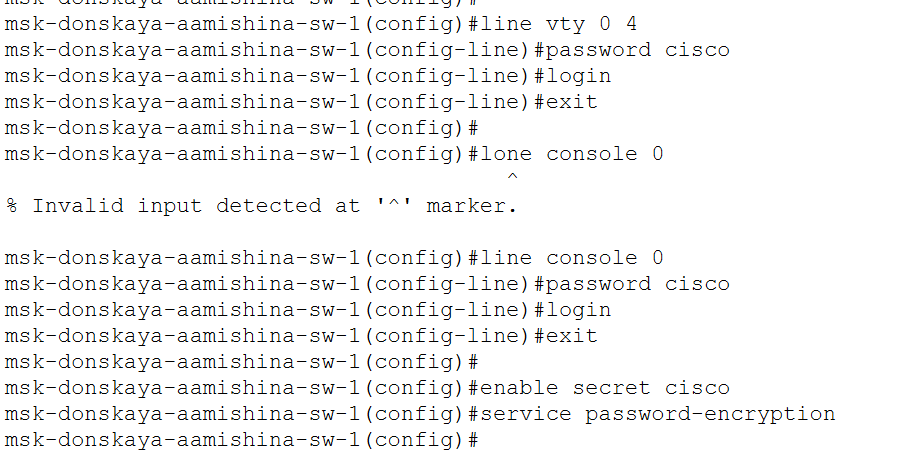{ #fig:017 width=80% }

В качестве дополнительного уровня защиты для пользователя admin зададим доступ 1-ого уровня по паролю (рис. [-@fig:018]).

{ #fig:018 width=80% }

Настроим доступ к оборудованию сначала через telnet, потом через ssh (в качестве доменного имени используем donskaya.rudn.edu) (рис. [-@fig:019]).

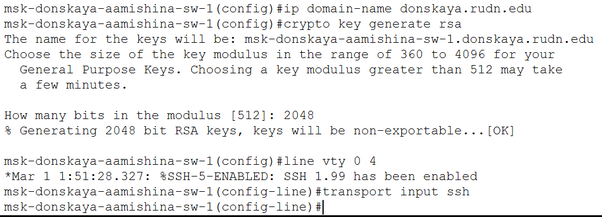{ #fig:019 width=80% }

Так как мы оставили возможным доступ только через ssh, то при попытке доступа через telnet нам отказано. При доступе через ssh запрашивается пароль (cisco), доступ предоставляется (рис. [-@fig:020]).

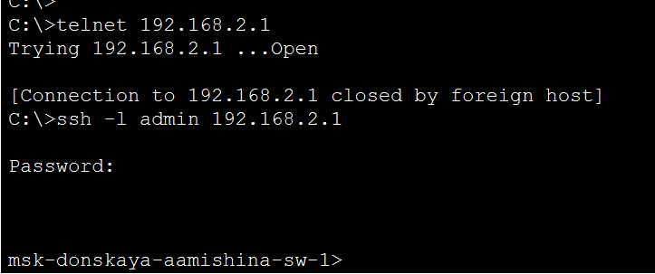{ #fig:020 width=80% }

Сохраним конфигурацию коммутатора (рис. [-@fig:021]).

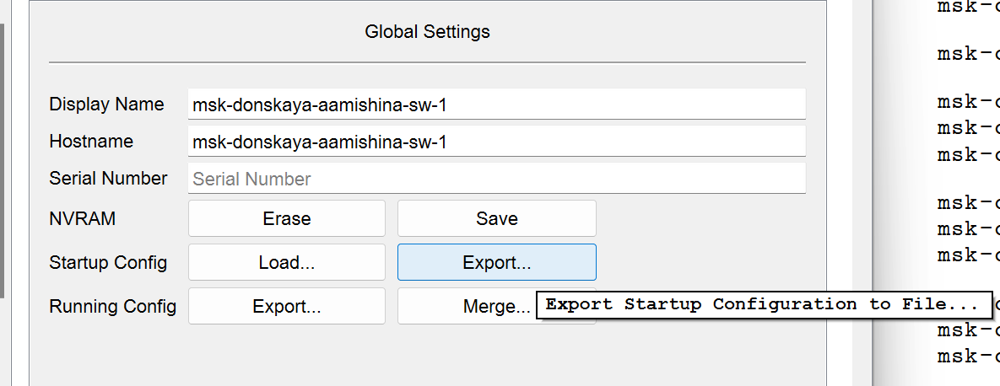{ #fig:021 width=80% }

# Контрольные вопросы

1. Укажите возможные способы подключения к сетевому оборудованию.

Можно подключиться с помощью консольного кабеля или удаленно по ssh или telnet.

2. Каким типом сетевого кабеля следует подключать оконечное оборудование пользователя к маршрутизатору и почему?

Кроссовым кабелем

3. Каким типом сетевого кабеля следует подключать оконечное оборудование пользователя к коммутатору и почему?

Прямым кабелем (витой парой).

4. Каким типом сетевого кабеля следует подключать коммутатор к коммутатору и почему?

Кроссовым кабелем (для соединения одинокого оборудования используют кроссовый кабель)

5. Укажите возможные способы настройки доступа к сетевому оборудованию по паролю.

С помощью команды `password` или с помощью команды `secret`

6. Укажите возможные способы настройки удалённого доступа к сетевому оборудованию. Какой из способов предпочтительнее и почему?

Через telnet или ssh. SSH обеспечивает шифрование и аутентификацию по умолчанию, в отличие от Telnet, который не предоставляет эти функции, поэтому он лучше.

# Выводы

В процессе выполнения данной лабораторной работы я получила основные навыки по начальному конфигурированию оборудования Cisco.

# Список литературы{.unnumbered}

::: {#refs}
:::