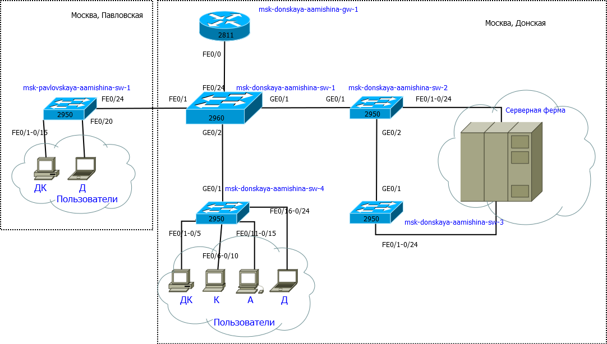
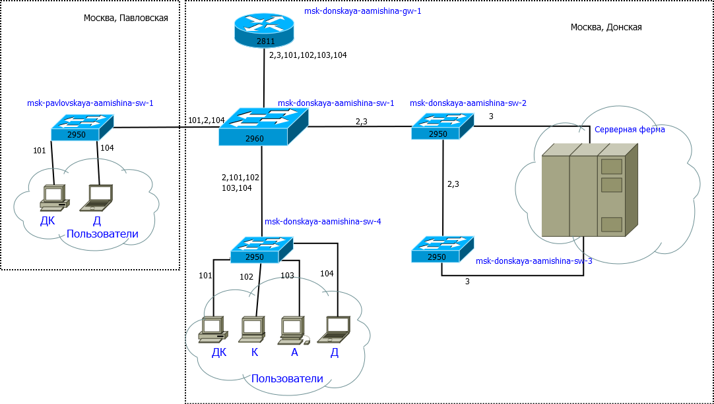
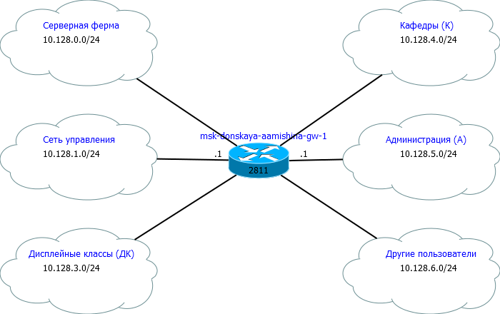

---
## Front matter
lang: ru-RU
title: Лабораторная работа №3
subtitle: Администрирование локальных сетей 
author:
  - Мишина А. А.
date: 26 февраля 2025

## i18n babel
babel-lang: russian
babel-otherlangs: english

## Formatting pdf
toc: false
toc-title: Содержание
slide_level: 2
aspectratio: 169
section-titles: true
theme: metropolis
header-includes:
 - \metroset{progressbar=frametitle,sectionpage=progressbar,numbering=fraction}
 - '\makeatletter'

 - '\makeatother'
---

## Докладчик

:::::::::::::: {.columns align=center}
::: {.column width="70%"}

  * Мишина Анастасия Алексеевна
  * НПИбд-02-22
  * <https://github.com/nasmi32>

:::
::: {.column width="30%"}

:::
::::::::::::::

## Цели и задачи

- Познакомиться с принципами планирования локальной сети организации.

## Задание

1. Используя графический редактор (например, Dia), требуется повторить схемы L1, L2, L3, а также сопутствующие им таблицы VLAN, IP-адресов и портов подключения оборудования планируемой сети.

2. Рассмотренный выше пример планирования адресного пространства сети базируется на разбиении сети 10.128.0.0\/16 на соответствующие подсети. Требуется сделать аналогичный план адресного пространства для сетей 172.16.0.0\/12 и 192.168.0.0\/16 с соответствующими схемами сети и сопутствующими таблицами VLAN, IP-адресов и портов подключения оборудования.

3. При выполнении работы необходимо учитывать соглашение об именовании

# Выполнение лабораторной работы

## Физический уровень модели OSI

{ #fig:001 width=80% }

## Распределение VLAN

:Таблица VLAN {#tbl:vlan}

| № VLAN       | Имя VLAN    | Примечание                  |
|--------------|-------------|-----------------------------|
| 1            | default     | Не используется             |
| 2            | management  | Для управления устройствами |
| 3            | servers     | Для серверной фермы         |
| 4-100        |             | Зарезервировано             |
| 101          | dk          | Дисплейные классы (ДК)      |
| 102          | departamens | Кафедры                     |
| 103          | adm         | Администрация               |
| 104          | other       | Для других пользователей    |

## Канальный уровень модели OSI

{ #fig:002 width=80% }

## Сетевой уровень модели OSI

{ #fig:003 width=80% }

## Распределение IP-адресов в сети

:Таблица IP. Сеть 10.128.0.0/16 {#tbl:ip}

| IP-адреса               | Примечание                 | VLAN |
|-------------------------|----------------------------|------|
| 10.128.0.0/16           | Вся сеть                   |      |
| 10.128.0.0/24           | Серверная ферма            | 3    |
| 10.128.0.1              | Шлюз                       |      |
| 10.128.0.2              | Web                        |      |
| 10.128.0.3              | File                       |      |
| 10.128.0.4              | Mail                       |      |
| 10.128.0.5              | Dns                        |      |
| 10.128.0.6-10.128.0.254 | Зарезервировано            |      |
| 10.128.1.0/24           | Управление                 | 2    |
| 10.128.1.1              | Шлюз                       |      |

## Порты

:Таблица портов {#tbl:fiz}

| Устройство                       | Порт        | Примечание           | Access VLAN | Trunk VLAN               |
|----------------------------------|-------------|----------------------|-------------|--------------------------|
| msk-donskaya-aamishina-gw-1    | f0/1        | UpLink               |             |                          |
|                                  | f0/0        | msk-donskaya-aamishina-sw-1    |             | 2, 3, 101, 102, 103, 104 |
| msk-donskaya-aamishina-sw-1    | f0/24       | msk-donskaya-aamishina-gw-1    |             | 2, 3, 101, 102, 103, 104 |
|                                  | g0/1        | msk-donskaya-aamishina-sw-2    |             | 2, 3                     |
|                                  | g0/2        | msk-donskaya-aamishina-sw-4    |             | 2, 101, 102, 103, 104    |

## Регламент

:Регламент выделения ip-адресов (для сети класса С) {#tbl:reglament}

| IP-адреса | Назначение |
|-----------|------------|
| 1 | Шлюз |
| 2-19 | Сетевое оборудование |
| 20-29 | Серверы |
| 30-199 | Компьютеры, DHCP |
| 200-219 | Компьютеры, Static|
| 220-229 | Принтеры |
| 230-254 | Резерв |

## 172.16.0.0/12

{ #fig:004 width=80% }

## 192.168.0.0/16

{ #fig:005 width=80% }

## Распределение IP-адресов в сети

:Таблица IP. Сеть 172.16.0.0/12 {#tbl:ip2}

| IP-адреса               | Примечание                 | VLAN |
|-------------------------|----------------------------|------|
| 172.16.0.0/12           | Вся сеть                   |      |
| 172.16.0.0/24           | Серверная ферма            | 3    |
| 172.16.0.1              | Шлюз                       |      |
| 172.16.0.2              | Web                        |      |
| 172.16.0.3              | File                       |      |
| 172.16.0.4              | Mail                       |      |
| 172.16.0.5              | Dns                        |      |
| 172.16.0.6-172.16.0.254 | Зарезервировано            |      |
| 172.16.1.0/24           | Управление                 | 2    |
| 172.16.1.1              | Шлюз                       |      |

## Распределение IP-адресов в сети

:Таблица IP. Сеть 192.168.0.0/16 {#tbl:ip3}

| IP-адреса                 | Примечание                 | VLAN |
|---------------------------|----------------------------|------|
| 192.168.0.0/16            | Вся сеть                   |      |
| 192.168.0.0/24            | Серверная ферма            | 3    |
| 192.168.0.1               | Шлюз                       |      |
| 192.168.0.2               | Web                        |      |
| 192.168.0.3               | File                       |      |
| 192.168.0.4               | Mail                       |      |
| 192.168.0.5               | Dns                        |      |
| 192.168.0.6-192.168.0.254 | Зарезервировано            |      |
| 192.168.1.0/24            | Управление                 | 2    |
| 192.168.1.1               | Шлюз                       |      |

## Вывод

- В процессе выполнения лабораторной работы я познакомилась с принципами планирования локальной сети организации.
