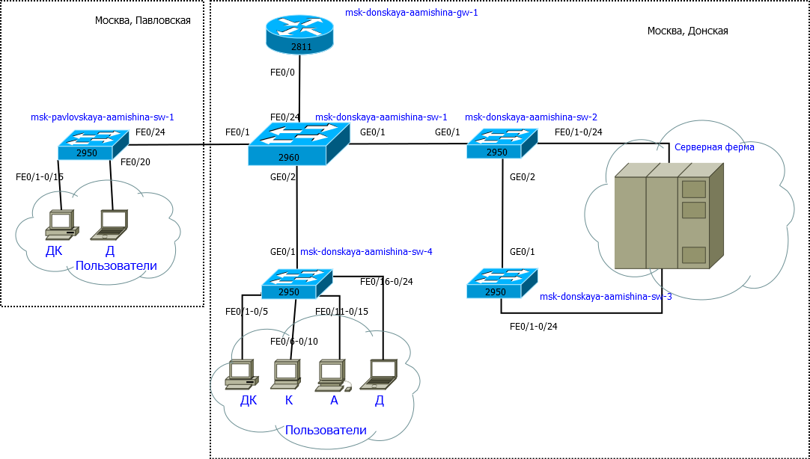
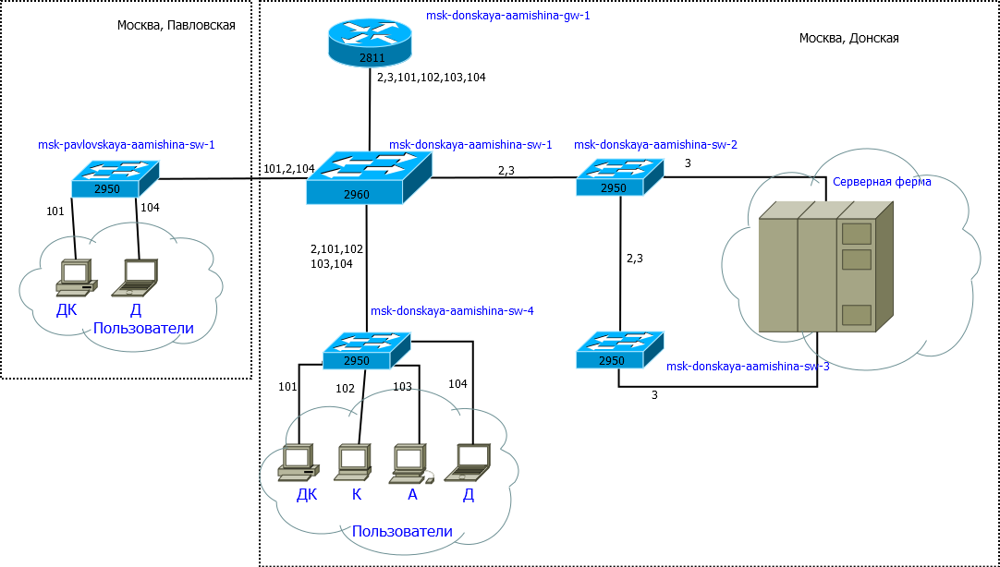
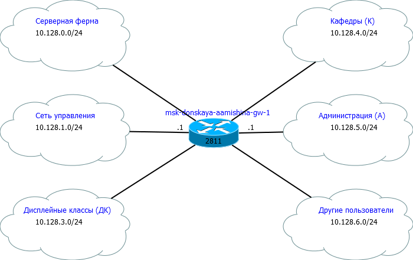

---
## Front matter
title: "Отчёт по лабораторной работе №3"
subtitle: "Дисциплина: Администрирование локальных сетей"
author: "Мишина Анастасия Алексеевна"

## Generic options
lang: ru-RU
toc-title: "Содержание"

## Bibliography
bibliography: bib/cite.bib
csl: pandoc/csl/gost-r-7-0-5-2008-numeric.csl

## Pdf output format
toc: true # Table of contents
toc-depth: 2
lof: true # List of figures
lot: true # List of tables
fontsize: 14pt
linestretch: 1.5
papersize: a4
documentclass: scrreprt
## I18n polyglossia
polyglossia-lang:
  name: russian
  options:
	- spelling=modern
	- babelshorthands=true
polyglossia-otherlangs:
  name: english
## I18n babel
babel-lang: russian
babel-otherlangs: english
## Fonts
mainfont: PT Serif
romanfont: PT Serif
sansfont: PT Sans
monofont: PT Mono
mainfontoptions: Ligatures=TeX
romanfontoptions: Ligatures=TeX
sansfontoptions: Ligatures=TeX,Scale=MatchLowercase
monofontoptions: Scale=MatchLowercase,Scale=0.9
## Biblatex
biblatex: true
biblio-style: "gost-numeric"
biblatexoptions:
  - parentracker=true
  - backend=biber
  - hyperref=auto
  - language=auto
  - autolang=other*
  - citestyle=gost-numeric
## Pandoc-crossref LaTeX customization
figureTitle: "Рис."
tableTitle: "Таблица"
listingTitle: "Листинг"
lofTitle: "Список иллюстраций"
lotTitle: "Список таблиц"
lolTitle: "Листинги"
## Misc options
indent: true
header-includes:
  - \usepackage{indentfirst}
  - \usepackage{float} # keep figures where there are in the text
  - \floatplacement{figure}{H} # keep figures where there are in the text
---

# Цель работы

Познакомиться с принципами планирования локальной сети организации [@infosec].

# Задание

1. Используя графический редактор (например, Dia), требуется повторить схемы L1, L2, L3, а также сопутствующие им таблицы VLAN, IP-адресов и портов подключения оборудования планируемой сети.

2. Рассмотренный выше пример планирования адресного пространства сети базируется на разбиении сети 10.128.0.0\/16 на соответствующие подсети. Требуется сделать аналогичный план адресного пространства для сетей 172.16.0.0\/12 и 192.168.0.0\/16 с соответствующими схемами сети и сопутствующими таблицами VLAN, IP-адресов и портов подключения оборудования.

3. При выполнении работы необходимо учитывать соглашение об именовании

# Выполнение лабораторной работы

Для начала повторим схему планируемой сети с указанием типов и номеров портов подключения устройств, соответствующую физическому уровню модели OSI (L1). Работаем в графичесом редакторе Dia [@dia] (рис. [-@fig:001]). В качестве оборудования уровня ядра будем использовать маршрутизатор Cisco 2811, на уровне распределения — коммутаторы Cisco 2960 с возможностью настройки VLAN, а на уровне доступа — коммутаторы Cisco 2950.

{ #fig:001 width=80% }

Далее спланируем распределение VLAN [-@tbl:vlan]. Рекомендуется выделять в отдельные подсети (VLAN) устройства управления сетью, а также различные группы пользователей.

:Таблица VLAN {#tbl:vlan}

| № VLAN       | Имя VLAN    | Примечание                  |
|--------------|-------------|-----------------------------|
| 1            | default     | Не используется             |
| 2            | management  | Для управления устройствами |
| 3            | servers     | Для серверной фермы         |
| 4-100        |             | Зарезервировано             |
| 101          | dk          | Дисплейные классы (ДК)      |
| 102          | departamens | Кафедры                     |
| 103          | adm         | Администрация               |
| 104          | other       | Для других пользователей    |

Построим примерную схема сети с указанием номеров VLAN, соответствующую канальному уровню модели OSI (L2) (рис. [-@fig:002]).

{ #fig:002 width=80% }

Далее необходимо определить адресное пространство, ассоциированное с выделенными VLAN. Построим примерную схему сети, соответствующую сетевому уровню модели OSI (L3) (рис. [-@fig:003]).

{ #fig:003 width=80% }

Более детальное распределение IP-адресов в сети представлено в табл. [-@tbl:ip]. Сеть 10.128.0.0 является сетью класса А. Маска подсети 16 означает, что последние два октета могут меняться. Разбиваем на сети с маской подсети равной 24, то есть может меняться только последний октет.

:Таблица IP. Сеть 10.128.0.0/16 {#tbl:ip}

| IP-адреса               | Примечание                 | VLAN |
|-------------------------|----------------------------|------|
| 10.128.0.0/16           | Вся сеть                   |      |
| 10.128.0.0/24           | Серверная ферма            | 3    |
| 10.128.0.1              | Шлюз                       |      |
| 10.128.0.2              | Web                        |      |
| 10.128.0.3              | File                       |      |
| 10.128.0.4              | Mail                       |      |
| 10.128.0.5              | Dns                        |      |
| 10.128.0.6-10.128.0.254 | Зарезервировано            |      |
| 10.128.1.0/24           | Управление                 | 2    |
| 10.128.1.1              | Шлюз                       |      |
| 10.128.1.2              | msk-donskaya-aamishina-sw-1|      |
| 10.128.1.3              | msk-donskaya-aamishina-sw-2|      |
| 10.128.1.4              | msk-donskaya-aamishina-sw-3|      |
| 10.128.1.5              | msk-donskaya-aamishina-sw-4|      |
| 10.128.1.6              | msk-pavlovskaya-aamishina-sw-1|      |
| 10.128.1.7-10.128.1.254 | Зарезервировано            |      |
| 10.128.2.0/24           | Сеть Point-to-Point        |      |
| 10.128.2.1              | Шлюз                       |      |
| 10.128.2.2-10.128.2.254 | Зарезервировано            |      |
| 10.128.3.0/24           | Дисплейные классы(DK)      | 101  |
| 10.128.3.1              | Шлюз                       |      |
| 10.128.3.2-10.128.3.254 | Пул для пользователей      |      |
| 10.128.4.0/24           | Кафедра (DEP)              | 102  |
| 10.128.4.1              | Шлюз                       |      |
| 10.128.4.2-10.128.4.254 | Пул для пользователей      |      |
| 10.128.5.0/24           | Администрация (ADM)        | 103  |
| 10.128.5.1              | Шлюз                       |      |
| 10.128.5.2-10.128.5.254 | Пул для пользователей      |      |
| 10.128.6.0/24           | Другие пользователи(OTHER) | 104  |
| 10.128.6.1              | Шлюз                       |      |
| 10.128.6.2-10.128.6.254 | Пул для пользователей      |      |

В табл. [-@tbl:fiz] приведён план подключения оборудования сети по портам.

:Таблица портов {#tbl:fiz}

| Устройство                       | Порт        | Примечание           | Access VLAN | Trunk VLAN               |
|----------------------------------|-------------|----------------------|-------------|--------------------------|
| msk-donskaya-aamishina-gw-1    | f0/1        | UpLink               |             |                          |
|                                  | f0/0        | msk-donskaya-aamishina-sw-1    |             | 2, 3, 101, 102, 103, 104 |
| msk-donskaya-aamishina-sw-1    | f0/24       | msk-donskaya-aamishina-gw-1    |             | 2, 3, 101, 102, 103, 104 |
|                                  | g0/1        | msk-donskaya-aamishina-sw-2    |             | 2, 3                     |
|                                  | g0/2        | msk-donskaya-aamishina-sw-4    |             | 2, 101, 102, 103, 104    |
|                                  | g0/1        | msk-pavlovskaya-aamishina-sw-1 |             | 2, 101, 104              |
| msk-donskaya-aamishina-sw-2    | g0/1        | msk-donskaya-aamishina-sw-1    |             | 2, 3                     |
|                                  | g0/2        | msk-donskaya-aamishina-sw-3    |             | 2, 3                     |
|                                  | f0/1        | Web-server           | 3           |                          |
|                                  | f0/2        | File-server          | 3           |                          |
| msk-donskaya-aamishina-sw-3    | g0/1        | msk-donskaya-aamishina-sw-2    |             | 2, 3                     |
|                                  | f0/1        | Mail-server          | 3           |                          |
|                                  | f0/2        | Dns-server           | 3           |                          |
| msk-donskaya-aamishina-sw-4    | g0/1        | msk-donskaya-aamishina-sw-1    |             | 2, 101, 102, 103, 104    |
|                                  | f0/1–f0/5   | dk                   | 101         |                          |
|                                  | f0/6–f0/10  | departments          | 102         |                          |
|                                  | f0/11–f0/15 | adm                  | 103         |                          |
|                                  | f0/16–f0/24 | other                | 104         |                          |
| msk-pavlovskaya-aamishina-sw-1 | f0/24       | msk-donskaya-aamishina-sw-1    |             | 2, 101, 104              |
|                                  | f0/1–f0/15  | dk                   | 101         |                          |
|                                  | f0/20       | other                | 
104         |                          | 

Регламент выделения ip-адресов дан в табл. [-@tbl:reglament].

:Регламент выделения ip-адресов (для сети класса С) {#tbl:reglament}

| IP-адреса | Назначение |
|-----------|------------|
| 1 | Шлюз |
| 2-19 | Сетевое оборудование |
| 20-29 | Серверы |
| 30-199 | Компьютеры, DHCP |
| 200-219 | Компьютеры, Static|
| 220-229 | Принтеры |
| 230-254 | Резерв |

Выполним аналогичную планировку сети для двух других частных сетей: 172.16.0.0/12 (сеть класса В) и 192.168.0.0/16 (сеть класса С). Физический и канальный уровни останутся неизменными, поэтому схемы для подключения физического оборудования и распределения VLAN, а также соответствующие данные в таблицах также останутся неизменными. Нам необходимо поменять только сетейвой уровень (L3). Схемы маршрутизации для этих сетей представлены на рисунках (рис. [-@fig:004]) и (рис. [-@fig:005]).

{ #fig:004 width=80% }

{ #fig:005 width=80% }

В табл. [-@tbl:ip2] и табл. [-@tbl:ip3] представлены схемы маршрутизации для двух сетей. Мы изменили только первые два байта (октета), поскольку в этих сетях мы можем выделить подсеть с маской 255.255.255.0 (/24), как и в случае сети 10.128.0.0/16.

:Таблица IP. Сеть 172.16.0.0/12 {#tbl:ip2}

| IP-адреса               | Примечание                 | VLAN |
|-------------------------|----------------------------|------|
| 172.16.0.0/12           | Вся сеть                   |      |
| 172.16.0.0/24           | Серверная ферма            | 3    |
| 172.16.0.1              | Шлюз                       |      |
| 172.16.0.2              | Web                        |      |
| 172.16.0.3              | File                       |      |
| 172.16.0.4              | Mail                       |      |
| 172.16.0.5              | Dns                        |      |
| 172.16.0.6-172.16.0.254 | Зарезервировано            |      |
| 172.16.1.0/24           | Управление                 | 2    |
| 172.16.1.1              | Шлюз                       |      |
| 172.16.1.2              | msk-donskaya-aamishina-sw-1|      |
| 172.16.1.3              | msk-donskaya-aamishina-sw-2|      |
| 172.16.1.4              | msk-donskaya-aamishina-sw-3|      |
| 172.16.1.5              | msk-donskaya-aamishina-sw-4|      |
| 172.16.1.6              | msk-pavlovskaya-aamishina-sw-1|      |
| 172.16.1.7-172.16.1.254 | Зарезервировано            |      |
| 172.16.2.0/24           | Сеть Point-to-Point        |      |
| 172.16.2.1              | Шлюз                       |      |
| 172.16.2.2-172.16.2.254 | Зарезервировано            |      |
| 172.16.3.0/24           | Дисплейные классы(DK)      | 101  |
| 172.16.3.1              | Шлюз                       |      |
| 172.16.3.2-172.16.3.254 | Пул для пользователей      |      |
| 172.16.4.0/24           | Кафедра (DEP)              | 102  |
| 172.16.4.1              | Шлюз                       |      |
| 172.16.4.2-172.16.4.254 | Пул для пользователей      |      |
| 172.16.5.0/24           | Администрация (ADM)        | 103  |
| 172.16.5.1              | Шлюз                       |      |
| 172.16.5.2-172.16.5.254 | Пул для пользователей      |      |
| 172.16.6.0/24           | Другие пользователи(OTHER) | 104  |
| 172.16.6.1              | Шлюз                       |      |
| 172.16.6.2-172.16.6.254 | Пул для пользователей      |      |

:Таблица IP. Сеть 192.168.0.0/16 {#tbl:ip3}

| IP-адреса                 | Примечание                 | VLAN |
|---------------------------|----------------------------|------|
| 192.168.0.0/16            | Вся сеть                   |      |
| 192.168.0.0/24            | Серверная ферма            | 3    |
| 192.168.0.1               | Шлюз                       |      |
| 192.168.0.2               | Web                        |      |
| 192.168.0.3               | File                       |      |
| 192.168.0.4               | Mail                       |      |
| 192.168.0.5               | Dns                        |      |
| 192.168.0.6-192.168.0.254 | Зарезервировано            |      |
| 192.168.1.0/24            | Управление                 | 2    |
| 192.168.1.1               | Шлюз                       |      |
| 192.168.1.2               | msk-donskaya-aamishina-sw-1|      |
| 192.168.1.3               | msk-donskaya-aamishina-sw-2|      |
| 192.168.1.4               | msk-donskaya-aamishina-sw-3|      |
| 192.168.1.5               | msk-donskaya-aamishina-sw-4|      |
| 192.168.1.6               | msk-pavlovskaya-aamishina-sw-1|      |
| 192.168.1.7-192.168.1.254 | Зарезервировано            |      |
| 192.168.2.0/24            | Сеть Point-to-Point        |      |
| 192.168.2.1               | Шлюз                       |      |
| 192.168.2.2-192.168.2.254 | Зарезервировано            |      |
| 192.168.3.0/24            | Дисплейные классы(DK)      | 101  |
| 192.168.3.1               | Шлюз                       |      |
| 192.168.3.2-192.168.3.254 | Пул для пользователей      |      |
| 192.168.4.0/24            | Кафедра (DEP)              | 102  |
| 192.168.4.1               | Шлюз                       |      |
| 192.168.4.2-192.168.4.254 | Пул для пользователей      |      |
| 192.168.5.0/24            | Администрация (ADM)        | 103  |
| 192.168.5.1               | Шлюз                       |      |
| 192.168.5.2-192.168.5.254 | Пул для пользователей      |      |
| 192.168.6.0/24            | Другие пользователи(OTHER) | 104  |
| 192.168.6.1               | Шлюз                       |      |
| 192.168.6.2-192.168.6.254 | Пул для пользователей      |      |

# Контрольные вопросы

1. Что такое модель взаимодействия открытых систем (OSI)? Какие уровни в ней есть? Какие функции закреплены за каждым уровнем модели OSI?

Модель взаимодействия открытых систем (Open Systems Interconnection, OSI) — это стандартная модель, предложенная Международной организацией по стандартизации (ISO), которая описывает, как компьютерные системы должны взаимодействовать друг с другом. Она разделяет процесс коммуникации на семь уровней, каждый из которых отвечает за определенные функции.

Описание каждого уровня модели OSI и его функций:

* Физический уровень (Physical Layer): передача битов по физической среде.
* Канальный уровень (Data Link Layer): обеспечивает безошибочную передачу данных между соседними устройствами через общую среду передачи.
* Сетевой уровень (Network Layer): занимается маршрутизацией и пересылкой пакетов данных через несколько сетей.
* Транспортный уровень (Transport Layer): обеспечивает надежную передачу данных между узлами в сети.
* Сеансовый уровень (Session Layer): устанавливает, поддерживает и завершает соединения между двумя узлами в сети.
* Представительный уровень (Presentation Layer):обеспечивает структурирование и кодирование данных перед их передачей.
* Прикладной уровень (Application Layer): предоставляет интерфейс для прикладных программ. Модель OSI помогает стандартизировать процесс взаимодействия между различными системами, что упрощает разработку сетевых приложений и обеспечивает их совместимость.

2. Какие функции выполняет коммутатор?

Коммутатор (switch) — это сетевое устройство, которое играет важную роль в локальной компьютерной сети (LAN). Его основная функция заключается в пересылке данных между устройствами в сети, обеспечивая эффективную и надежную передачу информации. 

Вот основные функции, которые выполняет коммутатор:

* Пересылка кадров (Frame forwarding)
* Фильтрация и обучение (Filtering and Learning)
* Управление коллизиями (Collision Management)
* Управление потоком (Flow Control)
* Дуплексный режим (Duplex Mode Management)

3. Какие функции выполняет маршрутизатор?

Маршрутизатор (router) - это сетевое устройство, которое работает на сетевом уровне (сетевой уровень OSI модели) и обеспечивает передачу данных между различными сегментами сети, используя информацию о маршрутах. Вот основные функции, которые выполняет маршрутизатор:

* Маршрутизация (Routing)
* Перенаправление (Forwarding)
* Фильтрация трафика (Traffic Filtering)
* Адресация (Addressing)
* Управление полосой пропускания (Bandwidth Management)
* Сегментация сети (Network Segmentation)

4. В чём отличие коммутаторов третьего уровня от коммутаторов второго уровня? - Отличие между коммутаторами второго и третьего уровня связано с уровнем, на котором они работают в сетевой модели OSI, а также с функциональностью и способностью обрабатывать данные.

5. Что такое сетевой интерфейс? - Сетевой интерфейс (Network Interface) представляет собой физическое или логическое устройство, которое позволяет компьютеру или другому сетевому устройству подключаться к сети для обмена данными. Сетевой интерфейс обеспечивает связь между устройством и сетью, позволяя передавать данные внутри и между сетями.

6. Что такое сетевой порт? 

Сетевой порт (Network port) — это числовая адресная точка в компьютерной сети, которая используется для идентификации конкретного процесса или службы на устройстве в сети. Порты позволяют множеству приложений и служб работать параллельно на одном устройстве, обеспечивая таким образом многопроцессорный и многопользовательский доступ к ресурсам сети.

7. Кратко охарактеризуйте технологии Ethernet, Fast Ethernet, Gigabit Ethernet.

* Ethernet - это стандартная технология локальных сетей (LAN), которая предоставляет возможность передачи данных по сетевым кабелям. Он работает на скоростях до 10 Мбит/с и использует различные типы кабелей, такие как коаксиальный кабель (10BASE5), витая пара (10BASE-T) и оптоволокно (10BASE-F). Ethernet был первоначально стандартизирован в IEEE 802.3 и стал доминирующим стандартом для проводных локальных сетей.
* Fast Ethernet - это улучшенная версия технологии Ethernet, которая поддерживает скорости передачи данных до 100 Мбит/с. Он использует те же типы кабелей, что и Ethernet, но с повышенной скоростью передачи данных. Fast Ethernet был стандартизирован в IEEE 802.3u и быстро стал популярным выбором для более быстрых сетей в домашних и офисных средах.
* Gigabit Ethernet - это следующий этап развития Ethernet, предоставляющий скорости передачи данных до 1 Гбит/с. Он использует высокоскоростные варианты витой пары (1000BASE-T) или оптоволокна (1000BASE-X) для обеспечения более высокой пропускной способности. Gigabit Ethernet часто используется в корпоративных сетях и дата-центрах для обеспечения высокой производительности и скорости обмена данными между устройствами.

8. Что такое IP-адрес (IPv4-адрес)? Определите понятия сеть, подсеть, маска подсети. Охарактеризуйте служебные IP-адреса. Приведите пример с пояснениями разбиения сети на две или более подсетей с указанием числа узлов в каждой подсети.

* IP-адрес (Internet Protocol Address) - это числовой идентификатор, присваиваемый каждому устройству в компьютерной сети, подключенной к сети, использующей протокол IPv4. IPv4-адрес состоит из четырех октетов (байтов), разделенных точками, каждый из которых может принимать значения от 0 до 255. Например, 192.168.1.1.
* Сеть - это группа компьютеров и других устройств, соединенных между собой для обмена данными и ресурсами. Каждое устройство в сети имеет свой собственный IP-адрес, который позволяет ему уникально идентифицироваться в сети.
* Подсеть (Subnet) - это логический сегмент сети, который образуется путем разделения основной сети на более мелкие части для управления трафиком и повышения безопасности сети.
* Маска подсети (Subnet Mask) - это 32-битовое значение, используемое для определения размера сети и подсети. Маска подсети указывает, какая часть IP-адреса относится к сети, а какая к узлам в этой сети. Она состоит из последовательности единиц, за которыми следуют нули. Например, 255.255.255.0.
* Служебные IP-адреса - это специальные адреса, зарезервированные для определенных целей в сети. Они не используются для назначения устройствам в сети и предназначены для определенных служб или целей, таких как тестирование, маршрутизация, широковещательные и многоадресные коммуникации.
Пример разбиения сети на две подсети с указанием числа узлов в каждой подсети:
Предположим, у нас есть сеть с IP-адресом 192.168.1.0 и маской подсети 255.255.255.0 (24 бита для сети и 8 битов для узлов). Мы хотим разбить эту сеть на две подсети с равным количеством узлов. Мы можем использовать маску подсети 255.255.255.128 (или /25), что означает, что у нас есть 7 битов для узлов (2^7 = 128) и 1 бит для подсети. Таким образом, у нас есть две подсети:

Подсеть 1:

* IP-адрес: 192.168.1.0
* Маска подсети: 255.255.255.128
* Диапазон адресов: 192.168.1.1 - 192.168.1.126 (126 узлов)
* Broadcast адрес: 192.168.1.127

Подсеть 2:

* IP-адрес: 192.168.1.128
* Маска подсети: 255.255.255.128
* Диапазон адресов: 192.168.1.129 - 192.168.1.254 (126 узлов)
* Broadcast адрес: 192.168.1.255

Таким образом, мы разбили исходную сеть на две подсети с равным количеством узлов.

9. Дайте определение понятию VLAN. Для чего применяется VLAN в сети организации? Какие преимущества даёт применение VLAN в сети организации? Приведите примеры разных ситуаций.

VLAN (Virtual Local Area Network) - это логическая сеть, которая создается внутри физической сети с целью разделения устройств на разные группы, независимо от их физического расположения в сети. Устройства в одной VLAN могут обмениваться данными как внутри VLAN, так и с устройствами в других VLAN, в зависимости от настроек маршрутизации или коммутации.

Применение VLAN в сети организации:

* Сегментация сети: позволяет разделить сеть на логические сегменты согласно функциональным, безопасностным или организационным потребностям.
* Управление трафиком: позволяет администраторам сети управлять трафиком, применяя политики безопасности, качества обслуживания (QoS) и т. д.
* Улучшенная безопасность: позволяет разделить чувствительные данные и сервисы от общего трафика в сети, улучшая безопасность и предотвращая несанкционированный доступ к данным.
* Оптимизация ресурсов: позволяет оптимизировать использование сетевых ресурсов, направляя трафик только туда, где он необходим, и уменьшая перегрузку сети.

Преимущества применения VLAN в сети организации:

* Гибкость и масштабируемость: возможность быстро изменять конфигурацию сети, добавлять или удалять VLAN в зависимости от потребностей организации.
* Улучшенная безопасность: возможность физической и логической изоляции сетевых сегментов, что усиливает безопасность и защищает от атак.
* Эффективное использование ресурсов: возможность оптимизации сетевых ресурсов и уменьшения нагрузки на сеть за счет лучшего управления трафиком.
* Улучшенное управление: централизованное управление и настройка VLAN облегчает администрирование сети и обеспечивает более гибкие возможности управления сетью.

Примеры ситуаций применения VLAN:

* Разделение отделов: создание VLAN для разных отделов организации (например, финансового, маркетингового, технического) для логического разделения сетевых ресурсов и безопасности данных.
* Гостевая сеть: создание VLAN для гостевого Wi-Fi, чтобы отделить трафик гостевых пользователей от внутренней сети компании.
* Группировка устройств: группировка сетевых устройств с общими потребностями (например, серверов, IP-телефонов, видеокамер) в отдельные VLAN для оптимизации трафика и улучшения производительности.
* Сегментация по безопасности: создание отдельной VLAN для сегментации трафика с целью улучшения безопасности и защиты критически важных сетевых ресурсов.

10. В чём отличие Trunk Port от Access Port?

Trunk Port и Access Port - это два типа портов на коммутаторах, используемых в сетевых конфигурациях. Они имеют разные функции и настройки.

* Access Port предназначен для подключения устройств конечных пользователей, таких как компьютеры, принтеры или IP-телефоны.
* Trunk Port используется для соединения между коммутаторами или между коммутатором и маршрутизатором.

Отличие между Trunk Port и Access Port:

Трафик:

* Access Port передает трафик только одной VLAN, к которой он принадлежит.
* Trunk Port передает трафик с нескольких VLAN через один порт.

Назначение:

* Access Port предназначен для подключения конечных устройств пользователей к сети.
* Trunk Port используется для соединения коммутаторов и передачи трафика между ними, а также для подключения к маршрутизаторам.

Настройка:

* Access Port настраивается для принадлежности к определенной VLAN.
* Trunk Port настраивается для передачи трафика с нескольких VLAN и может быть настроен для передачи всех или определенных VLAN.

# Выводы

В процессе выполнения лабораторной работы я познакомилась с принципами планирования локальной сети организации.

# Список литературы{.unnumbered}

::: {#refs}
:::