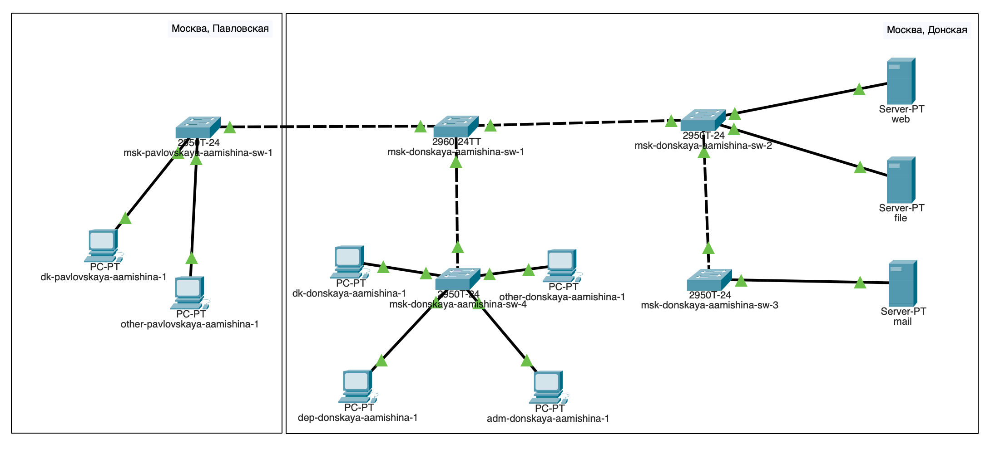
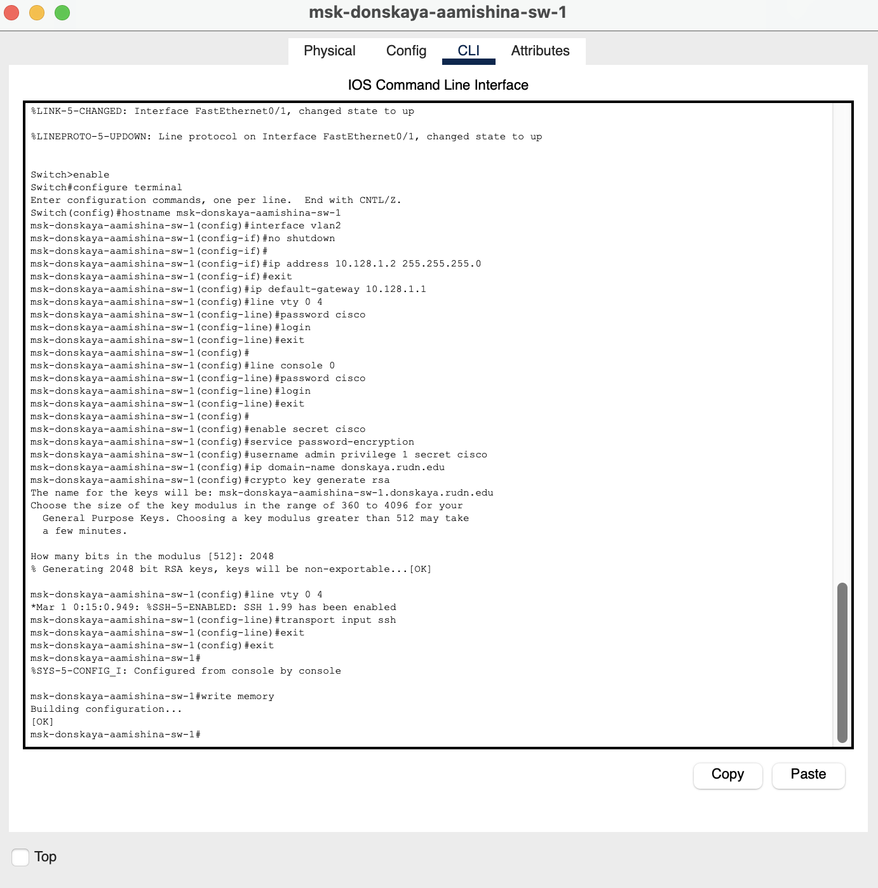
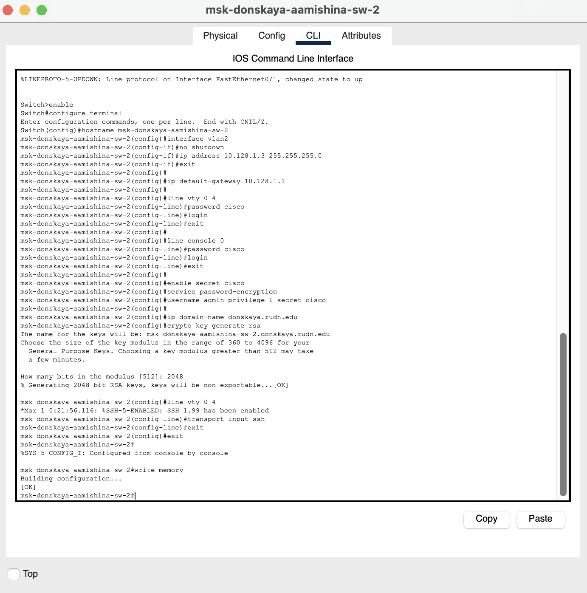
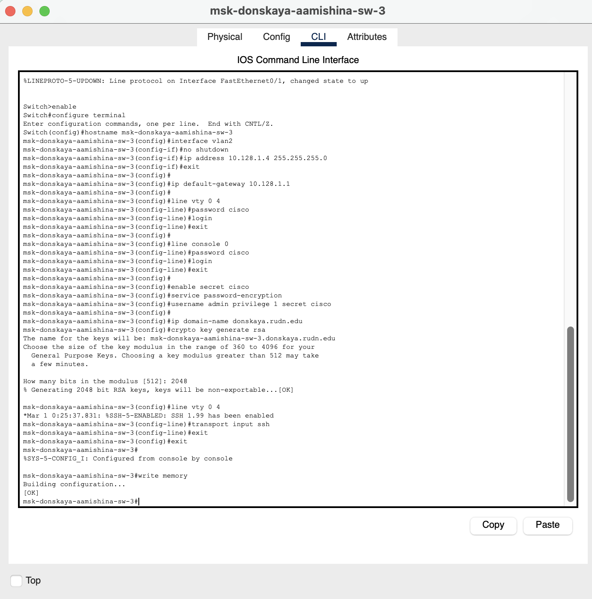
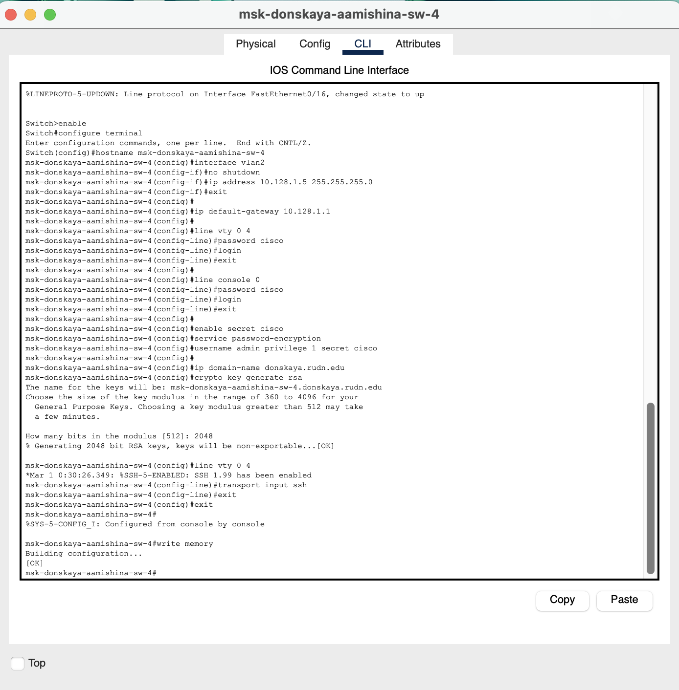
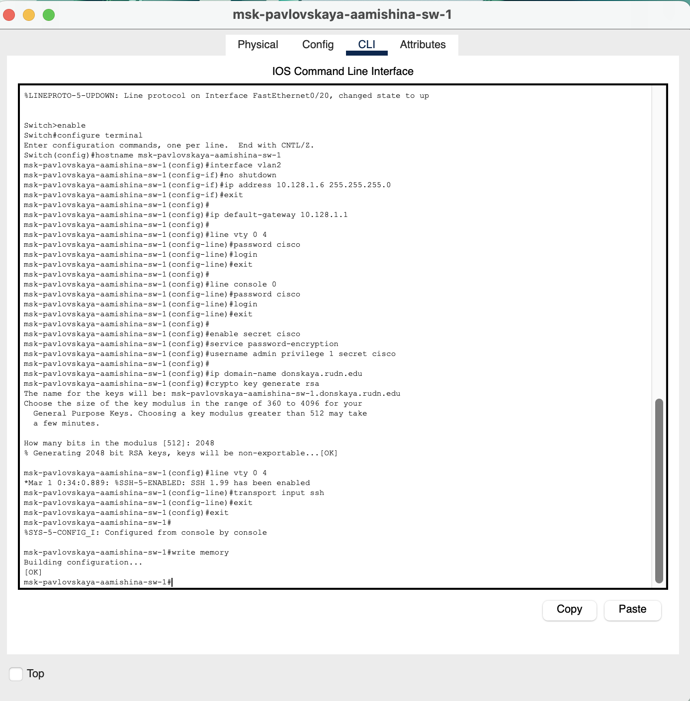

---
## Front matter
lang: ru-RU
title: Лабораторная работа №4
subtitle: Администрирование локальных сетей 
author:
  - Мишина А. А.
date: 4 марта 2025

## i18n babel
babel-lang: russian
babel-otherlangs: english

## Formatting pdf
toc: false
toc-title: Содержание
slide_level: 2
aspectratio: 169
section-titles: true
theme: metropolis
header-includes:
 - \metroset{progressbar=frametitle,sectionpage=progressbar,numbering=fraction}
 - '\makeatletter'

 - '\makeatother'
---

## Докладчик

:::::::::::::: {.columns align=center}
::: {.column width="70%"}

  * Мишина Анастасия Алексеевна
  * НПИбд-02-22
  * <https://github.com/nasmi32>

:::
::: {.column width="30%"}

:::
::::::::::::::

## Цели и задачи

- Провести подготовительную работу по первоначальной настройке коммутаторов сети.

## Задание

- Требуется сделать первоначальную настройку коммутаторов сети, представленной на схеме L1. Под первоначальной настройкой понимается указание имени устройства, его IP-адреса, настройка доступа по паролю к виртуальным терминалам и консоли, настройка удалённого доступа к устройству по ssh. При выполнении работы необходимо учитывать соглашение об именовании.

# Выполнение лабораторной работы

## Подготовка

{ #fig:001 width=80% }

## Настройка коммутатора

{ #fig:002 width=45% }

## Настройка коммутатора

{ #fig:003 width=45% }

## Настройка коммутатора

{ #fig:004 width=45% }

## Настройка коммутатора

{ #fig:005 width=45% }

## Настройка коммутатора

{ #fig:006 width=45% }

## Вывод

- В результате выполнения данной лабораторной работы я провела подготовительную работу по первоначальной настройке коммутаторов сети.