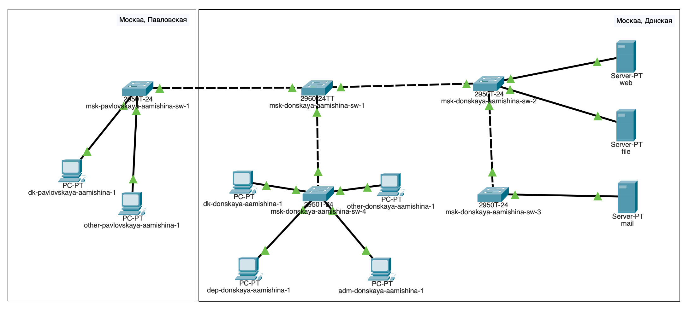
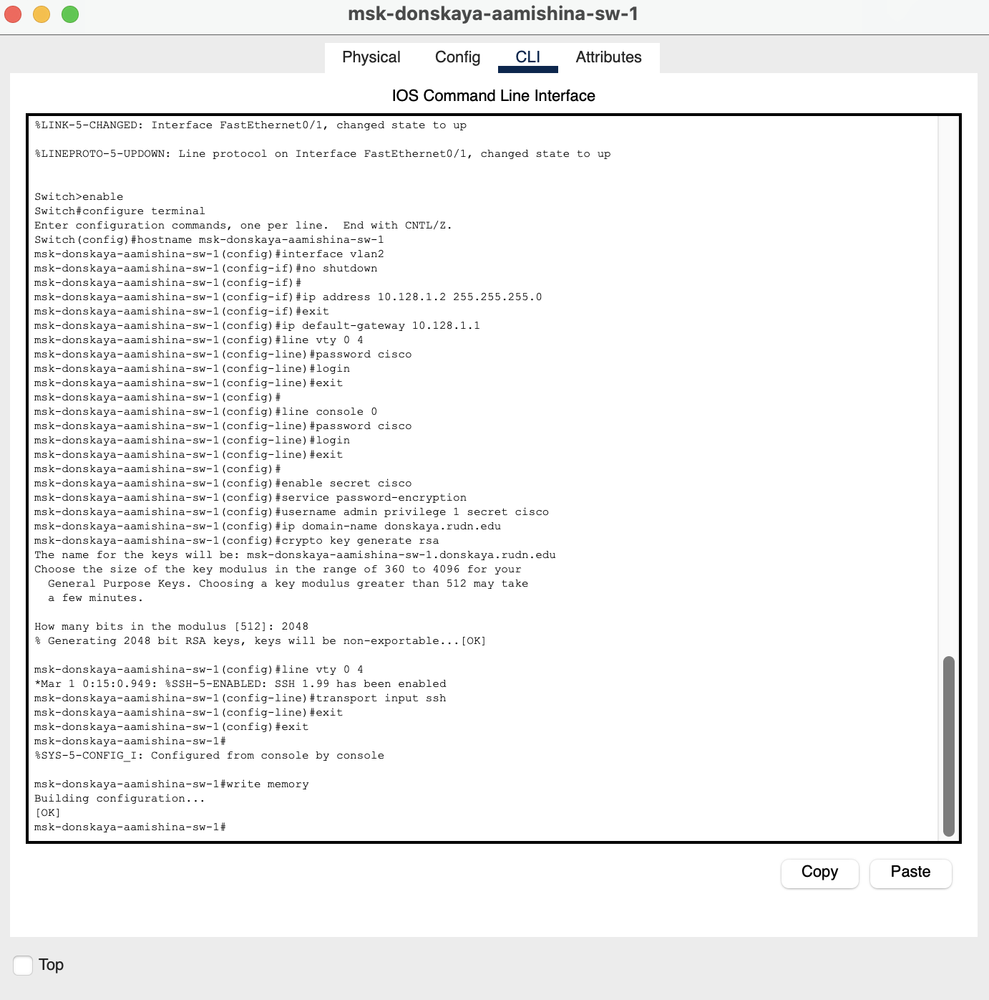
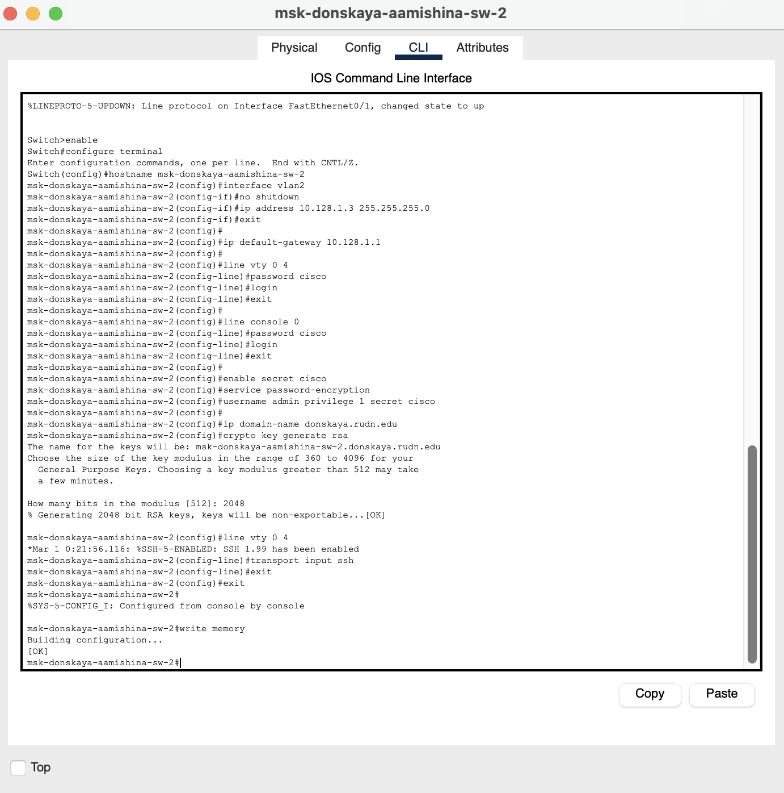
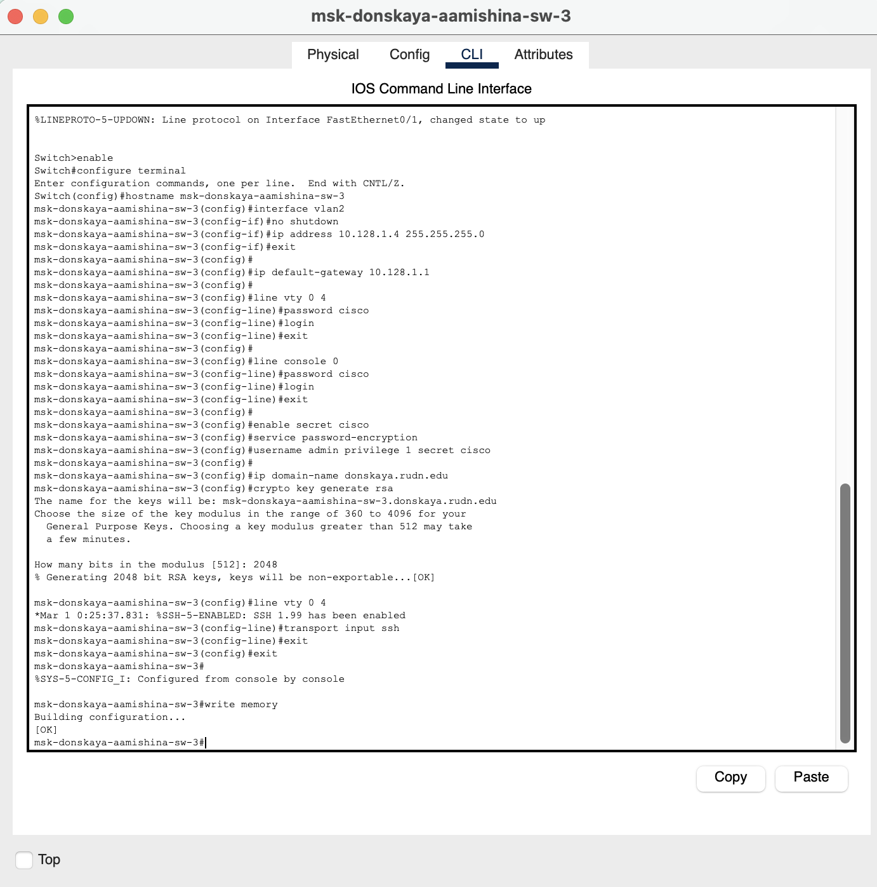
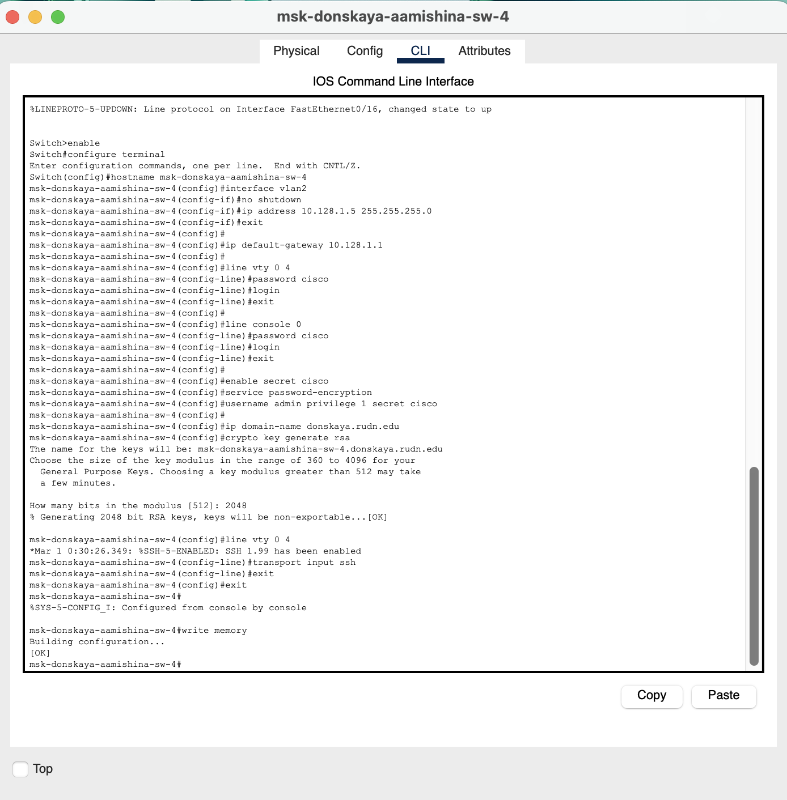
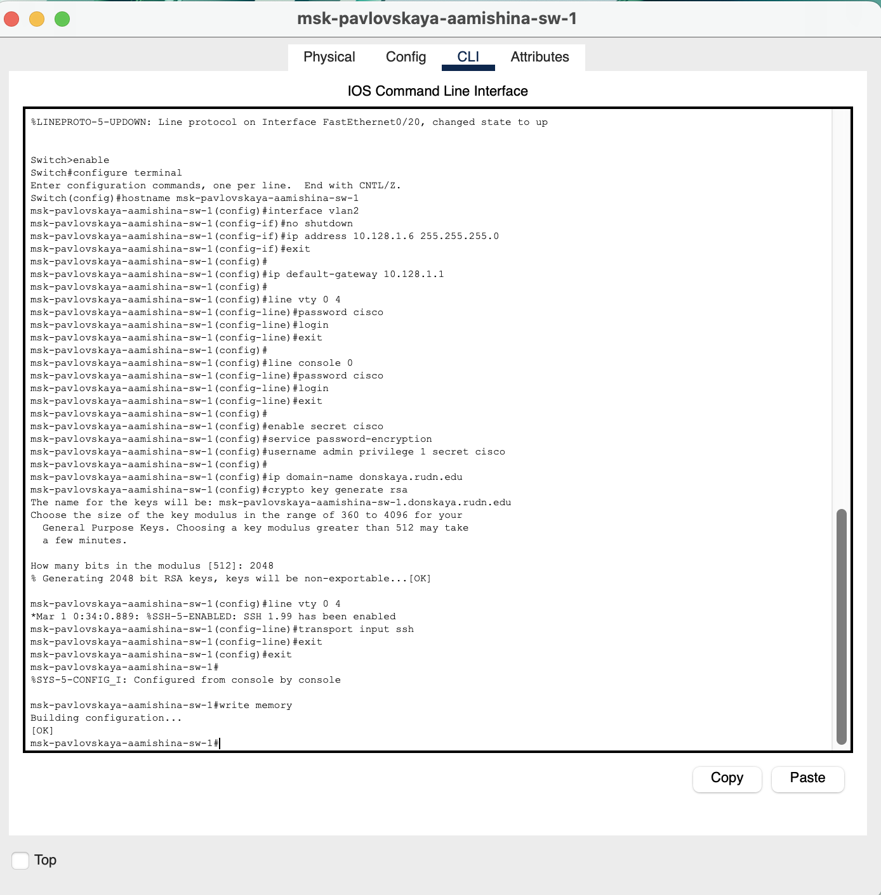

---
## Front matter
title: "Отчёт по лабораторной работе №2"
subtitle: "Дисциплина: Администрирование локальных сетей"
author: "Мишина Анастасия Алексеевна"

## Generic options
lang: ru-RU
toc-title: "Содержание"

## Bibliography
bibliography: bib/cite.bib
csl: pandoc/csl/gost-r-7-0-5-2008-numeric.csl

## Pdf output format
toc: true # Table of contents
toc-depth: 2
lof: true # List of figures
lot: true # List of tables
fontsize: 14pt
linestretch: 1.5
papersize: a4
documentclass: scrreprt
## I18n polyglossia
polyglossia-lang:
  name: russian
  options:
	- spelling=modern
	- babelshorthands=true
polyglossia-otherlangs:
  name: english
## I18n babel
babel-lang: russian
babel-otherlangs: english
## Fonts
mainfont: PT Serif
romanfont: PT Serif
sansfont: PT Sans
monofont: PT Mono
mainfontoptions: Ligatures=TeX
romanfontoptions: Ligatures=TeX
sansfontoptions: Ligatures=TeX,Scale=MatchLowercase
monofontoptions: Scale=MatchLowercase,Scale=0.9
## Biblatex
biblatex: true
biblio-style: "gost-numeric"
biblatexoptions:
  - parentracker=true
  - backend=biber
  - hyperref=auto
  - language=auto
  - autolang=other*
  - citestyle=gost-numeric
## Pandoc-crossref LaTeX customization
figureTitle: "Рис."
tableTitle: "Таблица"
listingTitle: "Листинг"
lofTitle: "Список иллюстраций"
lotTitle: "Список таблиц"
lolTitle: "Листинги"
## Misc options
indent: true
header-includes:
  - \usepackage{indentfirst}
  - \usepackage{float} # keep figures where there are in the text
  - \floatplacement{figure}{H} # keep figures where there are in the text
---

# Цель работы

Провести подготовительную работу по первоначальной настройке коммутаторов сети.

# Задание

Требуется сделать первоначальную настройку коммутаторов сети, представленной на схеме L1. Под первоначальной настройкой понимается указание имени устройства, его IP-адреса, настройка доступа по паролю к виртуальным терминалам и консоли, настройка удалённого доступа к устройству по ssh. При выполнении работы необходимо учитывать соглашение об именовании.

# Выполнение лабораторной работы

В логической рабочей области Packet Tracer разместим коммутаторы и оконечные устройства согласно схеме сети L1 (см. рис. 3.1 из раздела 3.3) и соединим их через соответствующие интерфейсы (рис. [-@fig:001]).

{ #fig:001 width=80% }

Используя типовую конфигурацию коммутатора, настроим все коммутаторы, изменяя название устройства и его IP-адрес согласно плану IP.

Для начала настроим коммутатор msk-donkaya-aamishina-sw-1 (рис. [-@fig:002]). Зададим имя в виде «город-территория-учётная_запись-тип_оборудования-номер», зададим интерфейсу vlan 2 ip-адрес 10.128.1.2 и маску 255.255.255.0, затем поднимем интерфейс. Зададим в качестве адреса шлюза по умолчанию адрес 10.128.1.1. Зададим пароль для доступа к привилегированному режиму (сначала в открытом виде, затем — в зашифрованном). Настроим доступ к оборудованию сначала через telnet, затем — через ssh (используя в качестве имени домена donskaya.rudn.edu). Для пользователя admin зададим доступ 1-го уровня по паролю.

{ #fig:002 width=80% }

Аналогично настраиваем остальные коммутаторы. Настроим коммутатор msk-donkaya-aamishina-sw-2 (рис. [-@fig:003]). Зададим интерфейсу vlan 2 ip-адрес 10.128.1.3 и маску 255.255.255.0.

{ #fig:003 width=80% }

Настроим коммутатор msk-donkaya-aamishina-sw-3 (рис. [-@fig:004]). Зададим интерфейсу vlan 2 ip-адрес 10.128.1.4 и маску 255.255.255.0.

{ #fig:004 width=80% }

Настроим коммутатор msk-donkaya-aamishina-sw-4 (рис. [-@fig:005]). Зададим интерфейсу vlan 2 ip-адрес 10.128.1.5 и маску 255.255.255.0.

{ #fig:005 width=80% }

Настроим коммутатор msk-pavlovskaya-aamishina-sw-1 (рис. [-@fig:006]). Зададим интерфейсу vlan 2 ip-адрес 10.128.1.6 и маску 255.255.255.0.

{ #fig:006 width=80% }

# Контрольные вопросы

1. При помощи каких команд можно посмотреть конфигурацию сетевого оборудования?

При помощи команд:

```
sh ru
show running-config
```

2. При помощи каких команд можно посмотреть стартовый конфигурационный файл оборудования?

При помощи команд:

```
sh sta
show run
```

3. При помощи каких команд можно экспортировать конфигурационный файл оборудования?

Можно нажать кнопку `Export`  в окне для конфигурации устройства.

4. При помощи каких команд можно импортировать конфигурационный файл оборудования?

Можно нажать кнопку `Import`  в окне для конфигурации устройства.

# Выводы

В результате выполнения данной лабораторной работы я провела подготовительную работу по первоначальной настройке коммутаторов сети.

# Список литературы{.unnumbered}

::: {#refs}
:::