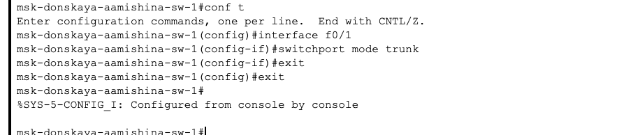

---
## Front matter
lang: ru-RU
title: Лабораторная работа №5
subtitle: Администрирование локальных сетей 
author:
  - Мишина А. А.
date: 13 марта 2025

## i18n babel
babel-lang: russian
babel-otherlangs: english

## Formatting pdf
toc: false
toc-title: Содержание
slide_level: 2
aspectratio: 169
section-titles: true
theme: metropolis
header-includes:
 - \metroset{progressbar=frametitle,sectionpage=progressbar,numbering=fraction}
 - '\makeatletter'

 - '\makeatother'
---

## Докладчик

:::::::::::::: {.columns align=center}
::: {.column width="70%"}

  * Мишина Анастасия Алексеевна
  * НПИбд-02-22
  * <https://github.com/nasmi32>

:::
::: {.column width="30%"}

:::
::::::::::::::

## Цели и задачи

- Получить основные навыки по настройке VLAN на коммутаторах сети.

## Задание

1. На коммутаторах сети настроить Trunk-порты на соответствующих интерфейсах, связывающих коммутаторы между собой.
2. Коммутатор msk-donskaya-sw-1 настроить как VTP-сервер и прописать на нём номера и названия VLAN.
3. Коммутаторы msk-donskaya-sw-2 — msk-donskaya-sw-4, mskpavlovskaya-sw-1 настроить как VTP-клиенты, на интерфейсах указать принадлежность к соответствующему VLAN.
4. На серверах прописать IP-адреса.
5. На оконечных устройствах указать соответствующий адрес шлюза и прописать статические IP-адреса из диапазона соответствующей сети, следуя регламенту выделения ip-адресов.
6. Проверить доступность устройств, принадлежащих одному VLAN, и недоступность устройств, принадлежащих разным VLAN.
7. При выполнении работы необходимо учитывать соглашение об именовании.

# Выполнение лабораторной работы

## Настройка Trunk-портов

{ #fig:001 width=80% }

## Настройка Trunk-портов

{ #fig:002 width=80% }

## Настройка Trunk-портов

{ #fig:003 width=80% }

## Настройка Trunk-портов

{ #fig:004 width=80% }

## Настройка Trunk-портов

{ #fig:005 width=80% }

## Настройка Trunk-портов

{ #fig:006 width=80% }

## Коммутатор msk-donskaya-aamishina-sw-1

{ #fig:007 width=80% }

## Коммутатор msk-donskaya-aamishina-sw-1

{ #fig:008 width=80% }

## VTP-сервер

{ #fig:009 width=80% }

## VTP-клиент

{ #fig:010 width=80% }

## VTP-клиент

{ #fig:011 width=80% }

## VTP-клиент

{ #fig:012 width=80% }

## Проверка

{ #fig:013 width=80% }

## Проверка

{ #fig:014 width=60% }

## VTP-клиент

{ #fig:015 width=80% }

## VLAN

{ #fig:016 width=80% }

## VLAN

{ #fig:017 width=80% }

## VLAN

{ #fig:018 width=80% }

## VLAN

{ #fig:019 width=80% }

## IP-адреса

{ #fig:020 width=80% }

## IP-адреса

{ #fig:021 width=40% }

## Проверка

{ #fig:022 width=80% }

## Проверка

{ #fig:023 width=60% }

## Симуляция

{ #fig:024 width=80% }

## PDU

{ #fig:025 width=60% }

## Вывод

- В процессе выполнения данной лабораторной работы я получила основные навыки по настройке VLAN на коммутаторах сети.