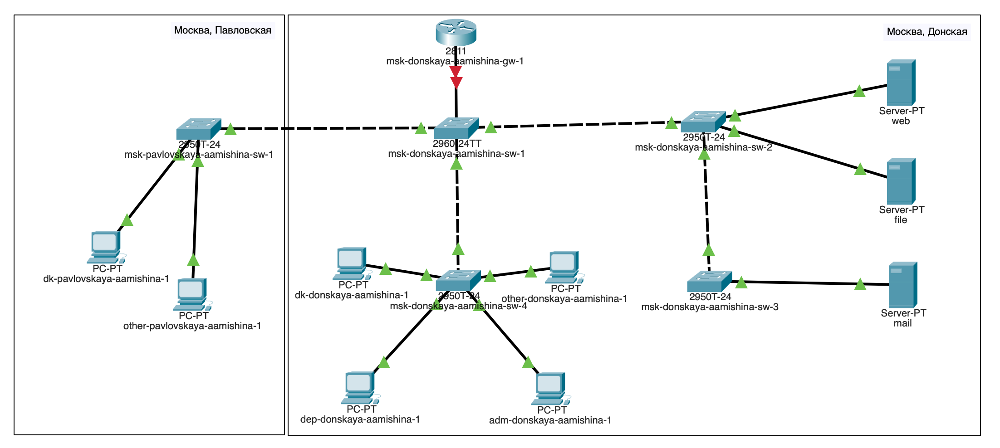
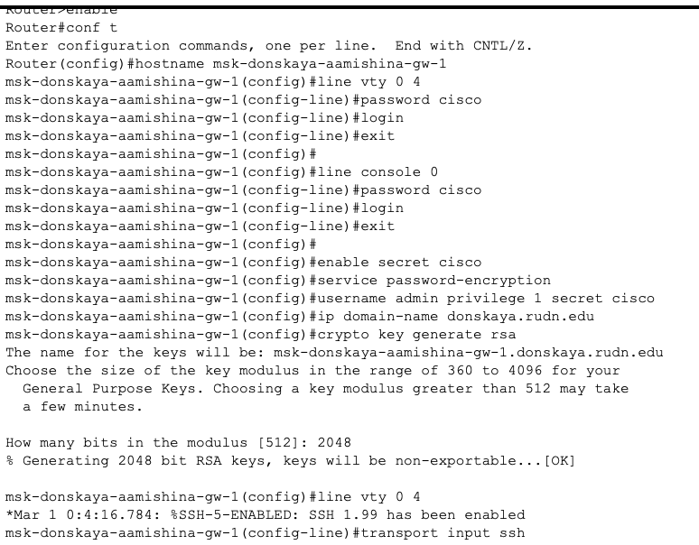
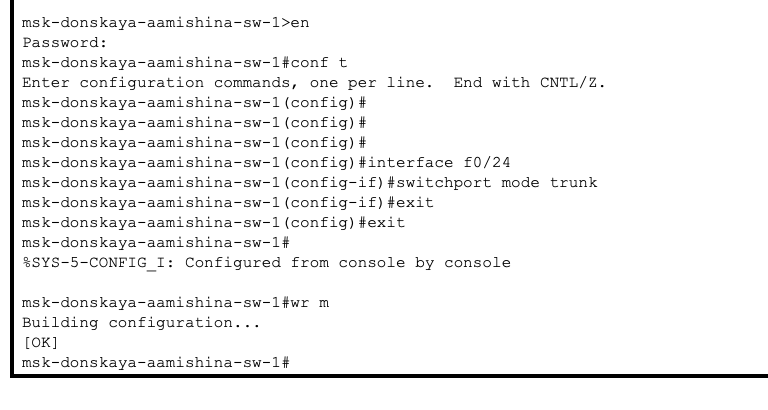
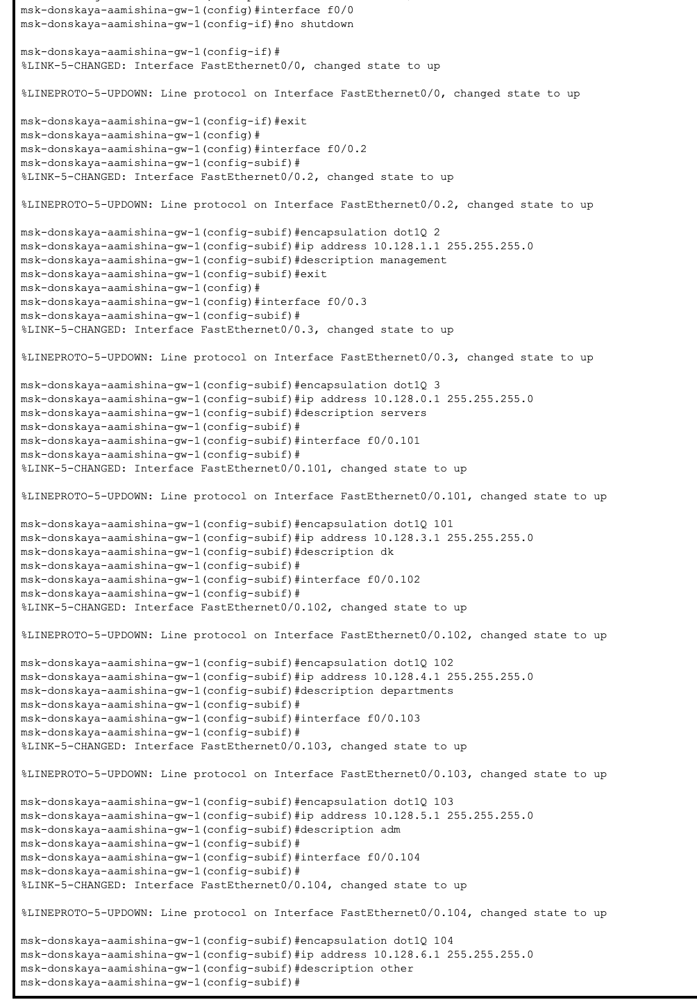
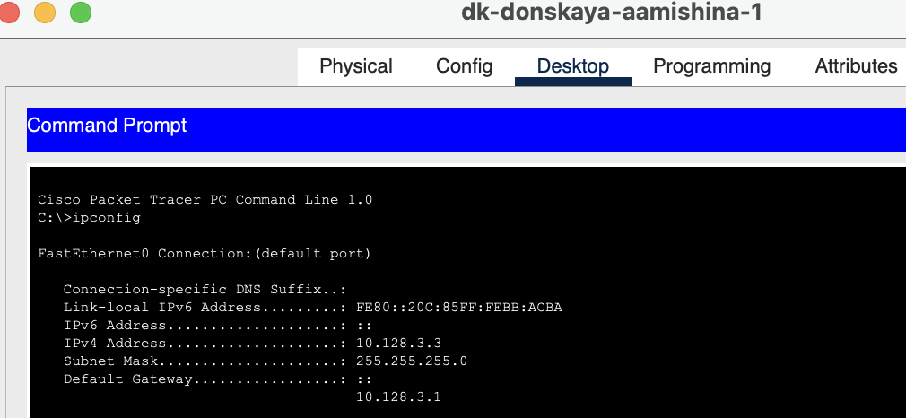
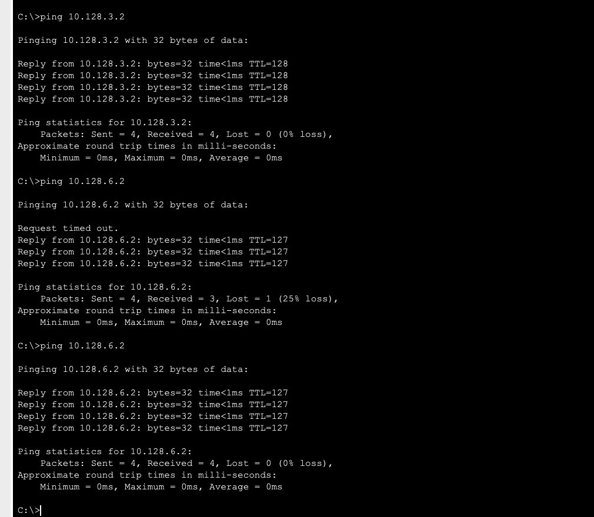
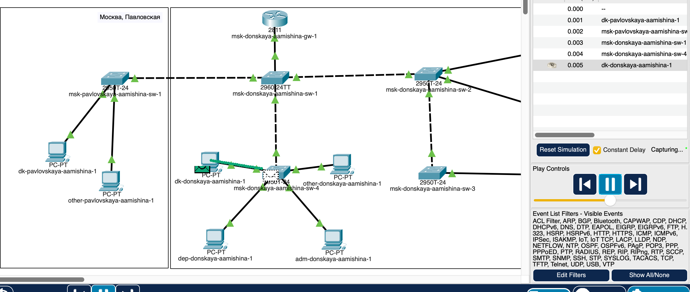
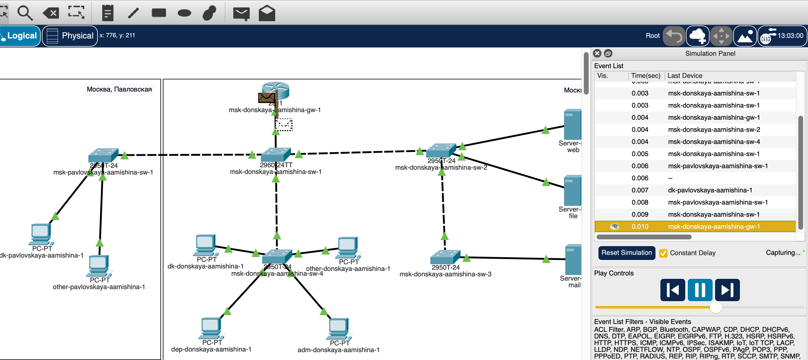
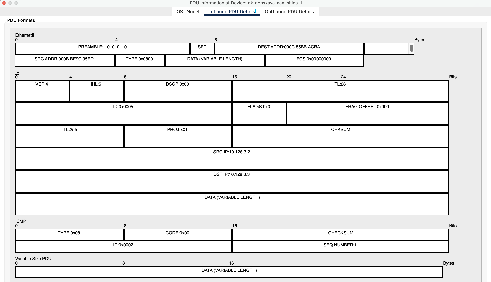

---
## Front matter
lang: ru-RU
title: Лабораторная работа №6
subtitle: Администрирование локальных сетей 
author:
  - Мишина А. А.
date: 14 марта 2025

## i18n babel
babel-lang: russian
babel-otherlangs: english

## Formatting pdf
toc: false
toc-title: Содержание
slide_level: 2
aspectratio: 169
section-titles: true
theme: metropolis
header-includes:
 - \metroset{progressbar=frametitle,sectionpage=progressbar,numbering=fraction}
 - '\makeatletter'

 - '\makeatother'
---

## Докладчик

:::::::::::::: {.columns align=center}
::: {.column width="70%"}

  * Мишина Анастасия Алексеевна
  * НПИбд-02-22
  * <https://github.com/nasmi32>

:::
::: {.column width="30%"}

:::
::::::::::::::

## Цели и задачи

- Настроить статическую маршрутизацию VLAN в сети.

## Задание

1. Добавить в локальную сеть маршрутизатор, провести его первоначальную настройку.

2. Настроить статическую маршрутизацию VLAN.

3. При выполнении работы необходимо учитывать соглашение об именовании

# Выполнение лабораторной работы

## Маршрутизатор

{ #fig:001 width=60% }

## Маршрутизатор

{ #fig:002 width=60% }

## Настройка Trunk-порта

{ #fig:003 width=60% }

## Маршрутизатор

{ #fig:004 width=30% }

## dk-donskaya-aamishina-1

{ #fig:005 width=60% }

## Проверка

{ #fig:006 width=40% }

## Симуляция

{ #fig:007 width=60% }

## Симуляция

{ #fig:008 width=60% }

## Симуляция

{ #fig:009 width=60% }

## Вывод

- В результате выполнения лабораторной работы я настроила статическую маршрутизацию VLAN в сети.