---
## Front matter
lang: ru-RU
title: Лабораторная работа №7
subtitle: Администрирование локальных сетей 
author:
  - Мишина А. А.
date: 27 марта 2025

## i18n babel
babel-lang: russian
babel-otherlangs: english

## Formatting pdf
toc: false
toc-title: Содержание
slide_level: 2
aspectratio: 169
section-titles: true
theme: metropolis
header-includes:
 - \metroset{progressbar=frametitle,sectionpage=progressbar,numbering=fraction}
 - '\makeatletter'

 - '\makeatother'
---

## Докладчик

:::::::::::::: {.columns align=center}
::: {.column width="70%"}

  * Мишина Анастасия Алексеевна
  * НПИбд-02-22
  * <https://github.com/nasmi32>

:::
::: {.column width="30%"}

:::
::::::::::::::

## Цели и задачи

- Получить навыки работы с физической рабочей областью Packet Tracer, а также учесть физические параметры сети.

## Задание

Требуется заменить соединение между коммутаторами двух территорий msk-donskaya-sw-1 и msk-pavlovskaya-sw-1 на соединение, учитывающее физические параметры сети, а именно — расстояние между двумя территориями. При выполнении работы необходимо учитывать соглашение об именовании.

# Выполнение лабораторной работы

## Город

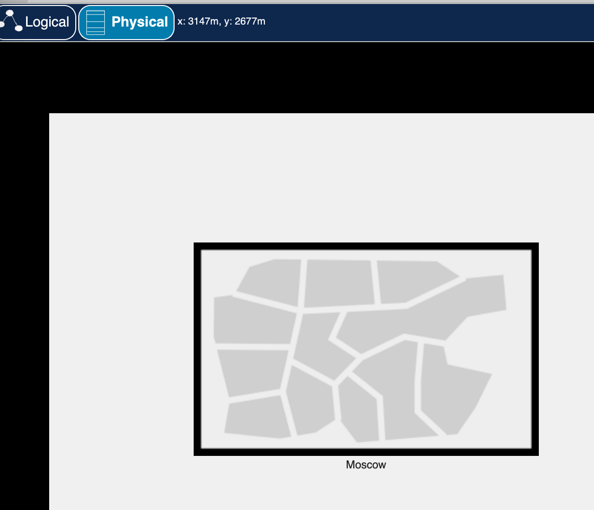{ #fig:001 width=40% }

## Здания

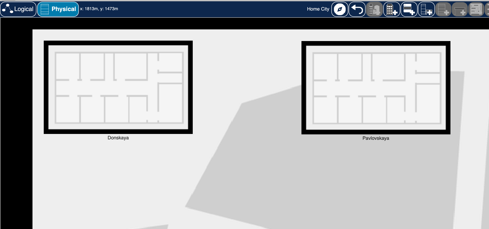{ #fig:002 width=60% }

## Donskaya

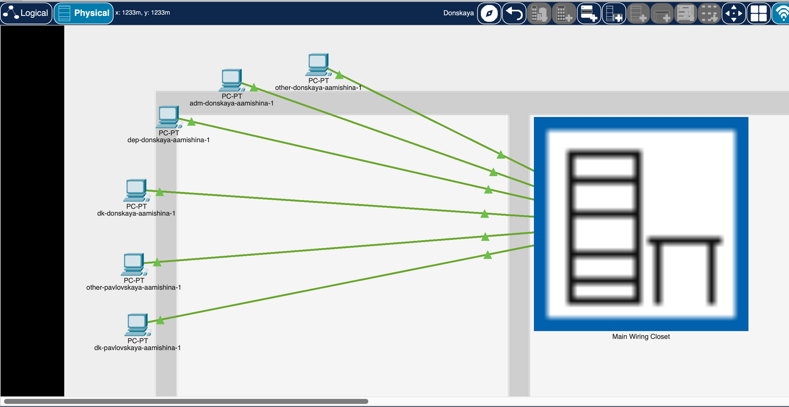{ #fig:003 width=60% }

## Donskaya

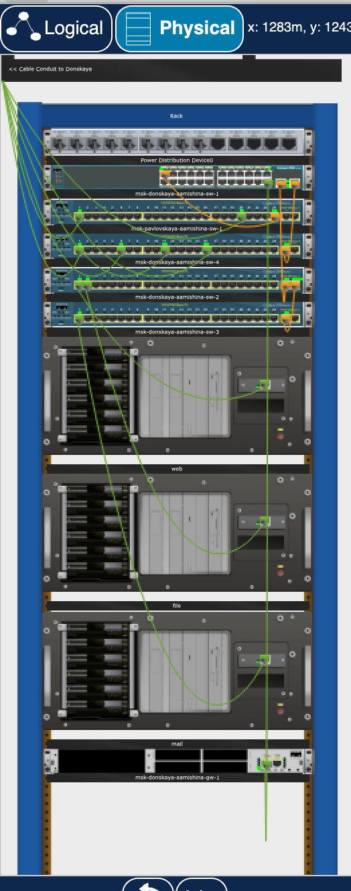{ #fig:004 width=17% }

## Pavlovskaya

{ #fig:005 width=60% }

## Pavlovskaya

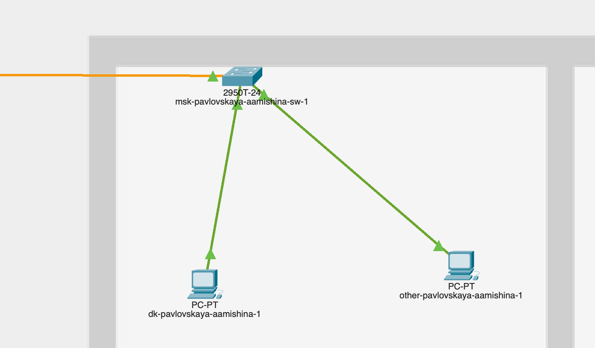{ #fig:006 width=60% }

## Проверка

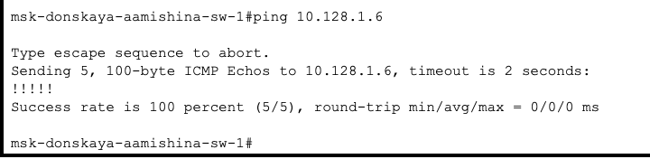{ #fig:007 width=60% }

## Настройки

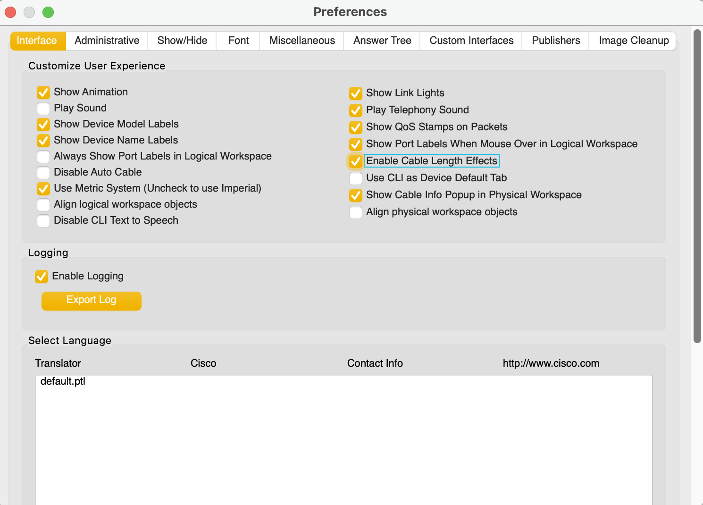{ #fig:008 width=60% }

## Здания

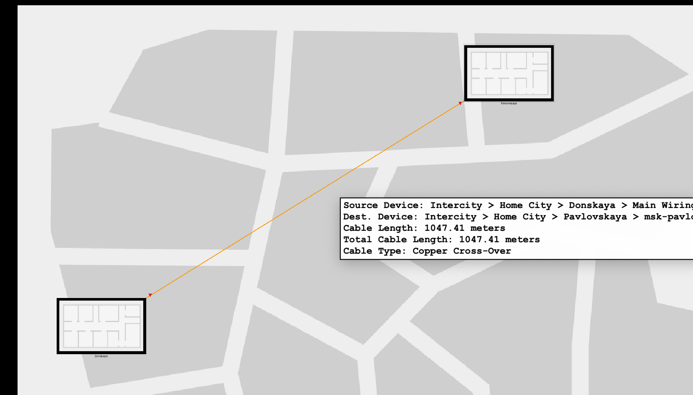{ #fig:009 width=60% }

## Проверка

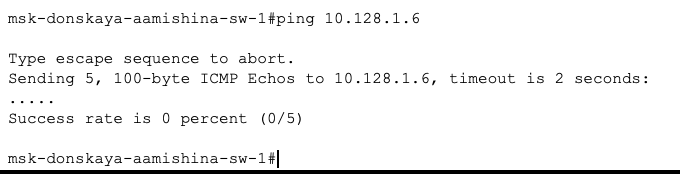{ #fig:010 width=60% }

## Повторители

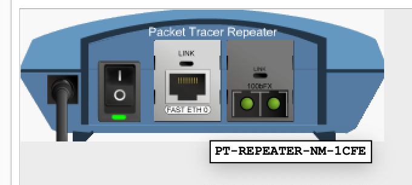{ #fig:011 width=60% }

## Pavlovskaya

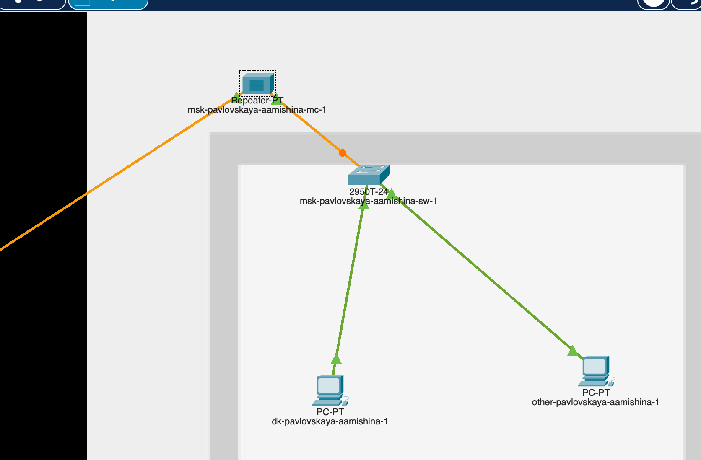{ #fig:012 width=60% }

## Итоговая схема сети

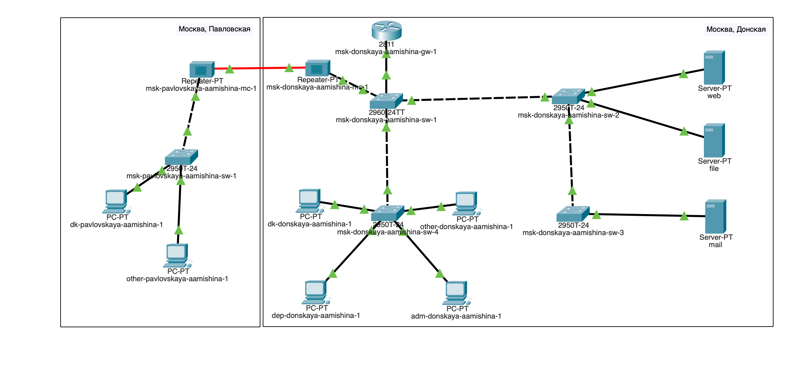{ #fig:013 width=60% }

## Проверка

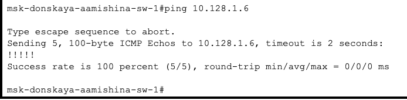{ #fig:014 width=60% }

## Вывод

- В результате выполнения лабораторной работы я получила навыки работы с физической рабочей областью Packet Tracer, а также учитывала физические параметры сети.