---
## Front matter
title: "Отчёт по лабораторной работе №7"
subtitle: "Дисциплина: Администрирование локальных сетей"
author: "Мишина Анастасия Алексеевна"

## Generic options
lang: ru-RU
toc-title: "Содержание"

## Bibliography
bibliography: bib/cite.bib
csl: pandoc/csl/gost-r-7-0-5-2008-numeric.csl

## Pdf output format
toc: true # Table of contents
toc-depth: 2
lof: true # List of figures
lot: true # List of tables
fontsize: 14pt
linestretch: 1.5
papersize: a4
documentclass: scrreprt
## I18n polyglossia
polyglossia-lang:
  name: russian
  options:
	- spelling=modern
	- babelshorthands=true
polyglossia-otherlangs:
  name: english
## I18n babel
babel-lang: russian
babel-otherlangs: english
## Fonts
mainfont: PT Serif
romanfont: PT Serif
sansfont: PT Sans
monofont: PT Mono
mainfontoptions: Ligatures=TeX
romanfontoptions: Ligatures=TeX
sansfontoptions: Ligatures=TeX,Scale=MatchLowercase
monofontoptions: Scale=MatchLowercase,Scale=0.9
## Biblatex
biblatex: true
biblio-style: "gost-numeric"
biblatexoptions:
  - parentracker=true
  - backend=biber
  - hyperref=auto
  - language=auto
  - autolang=other*
  - citestyle=gost-numeric
## Pandoc-crossref LaTeX customization
figureTitle: "Рис."
tableTitle: "Таблица"
listingTitle: "Листинг"
lofTitle: "Список иллюстраций"
lotTitle: "Список таблиц"
lolTitle: "Листинги"
## Misc options
indent: true
header-includes:
  - \usepackage{indentfirst}
  - \usepackage{float} # keep figures where there are in the text
  - \floatplacement{figure}{H} # keep figures where there are in the text
---

# Цель работы

Получить навыки работы с физической рабочей областью Packet Tracer, а также учесть физические параметры сети [@netadmin].

# Задание

Требуется заменить соединение между коммутаторами двух территорий msk-donskaya-sw-1 и msk-pavlovskaya-sw-1 на соединение, учитывающее физические параметры сети, а именно — расстояние между двумя территориями. При выполнении работы необходимо учитывать соглашение об именовании.

# Выполнение лабораторной работы

Откроем проект с предыдущей лабораторной работы. Перейдем в физическую рабочую область PacketTracer. Присвоим название городу — Moscow (рис. [-@fig:001]).

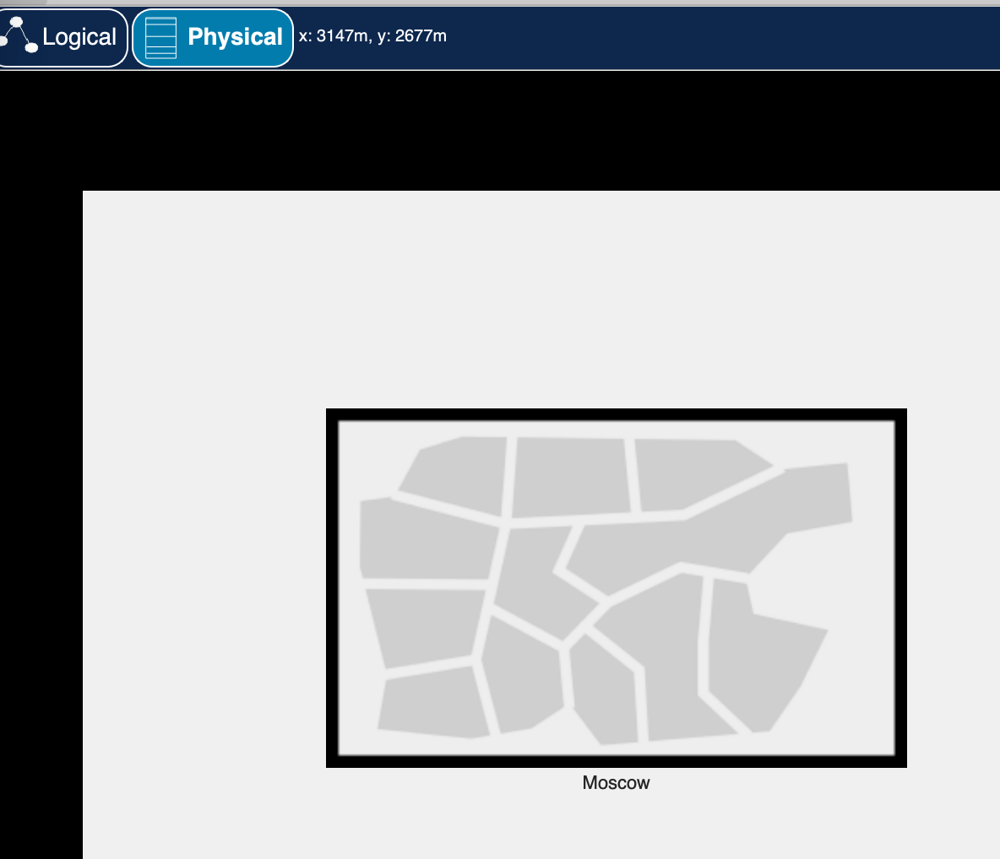{ #fig:001 width=60% }

Щёлкнув на изображении города, видим изображение здания. Присвоим ему название Donskaya. Добавим здание для территории Pavlovskaya (рис. [-@fig:002]).

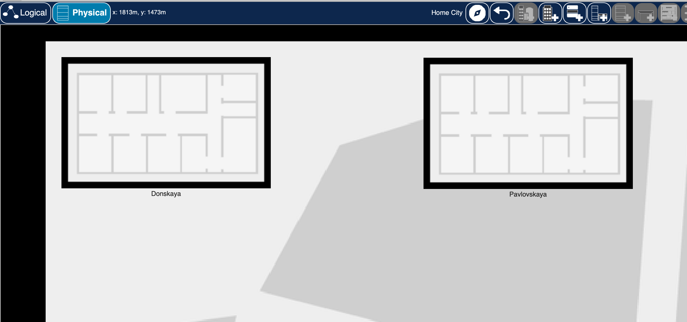{ #fig:002 width=60% }

Щёлкнув на изображении здания Donskaya, переместим изображение, обозначающее серверное помещение, в него (рис. [-@fig:003]).

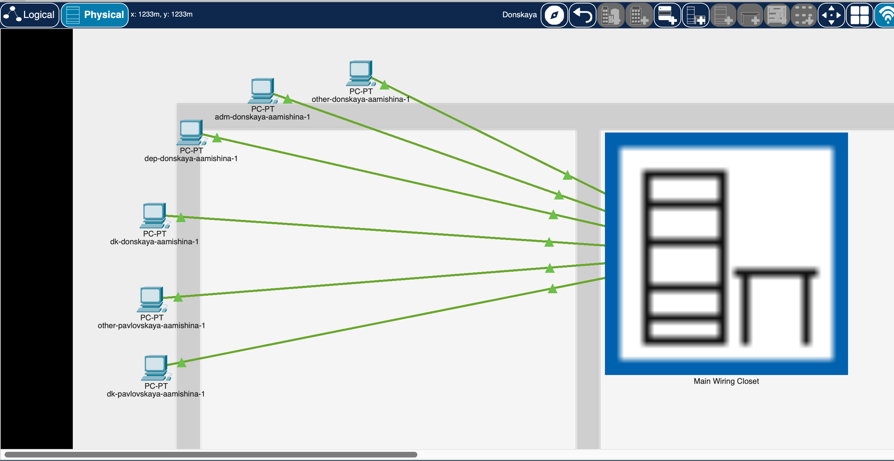{ #fig:003 width=60% }

Щёлкнув на изображении серверной, видим отображение серверных стоек (рис. [-@fig:004]).

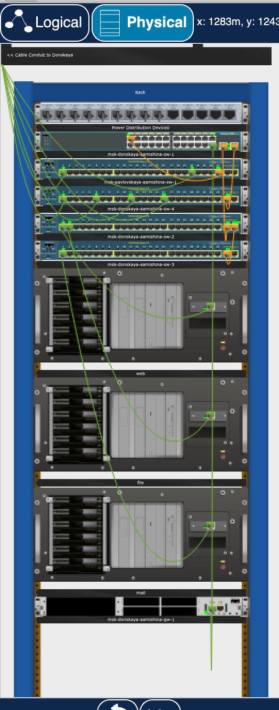{ #fig:004 width=60% }

Переместим коммутатор msk-pavlovskaya-aamishina-sw-1 и два оконечных устройства dk-pavlovskaya-aamishina-1 и other-pavlovskaya-aamishina-1 на территорию Pavlovskaya, используя меню Move физической рабочей области Packet Tracer (рис. [-@fig:005]), (рис. [-@fig:006]).

{ #fig:005 width=60% }

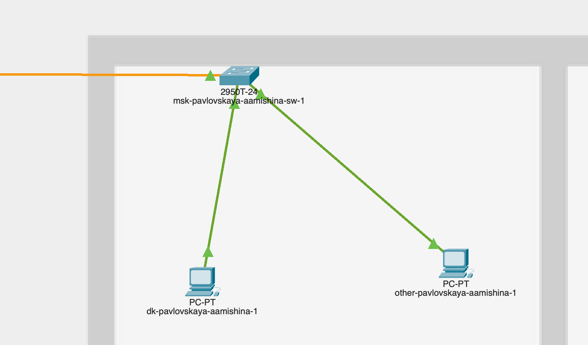{ #fig:006 width=60% }

Вернувшись в логическую рабочую область Packet Tracer, пропингуем с коммутатора msk-donskaya-aamishina-sw-1 коммутатор msk-pavlovskaya-aamishina-sw-1. Убедимся в работоспособности соединения (рис. [-@fig:007]).

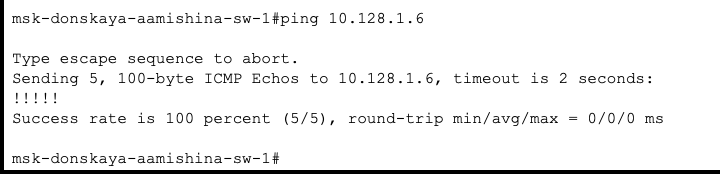{ #fig:007 width=60% }

В меню Options, Preferences во вкладке Interface активируем разрешение на учёт физических характеристик среды передачи (EnableCableLength Effects) (рис. [-@fig:008]).

{ #fig:008 width=60% }

В физической рабочей области Packet Tracer разместим две территории на расстоянии более 100 м друг от друга (рекомендуемое расстояние — около 1000 м или более) (рис. [-@fig:009]).

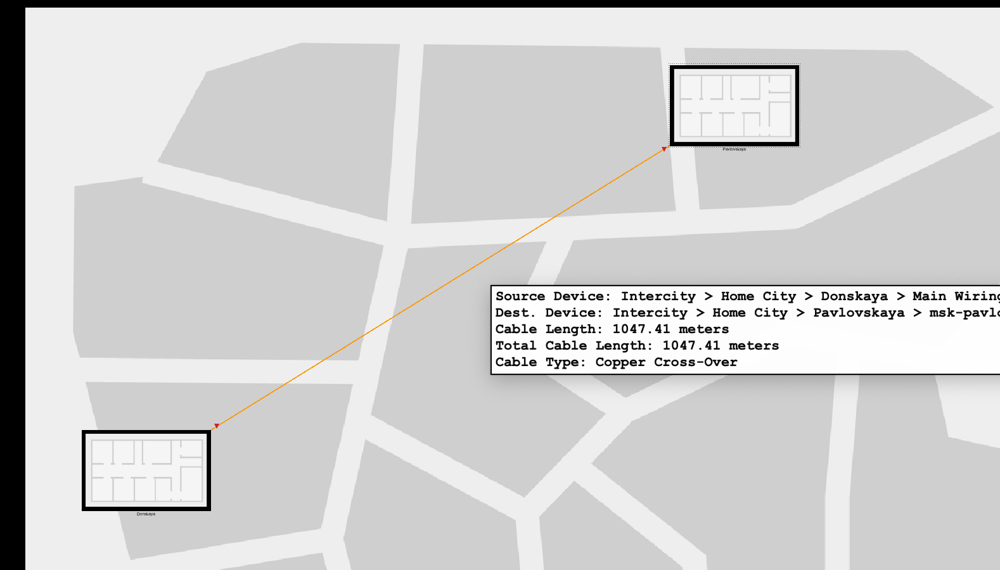{ #fig:009 width=60% }

Вернувшись в логическую рабочую область Packet Tracer, пропингуйем с коммутатора msk-donskaya-aamishina-sw-1 коммутатор msk-pavlovskaya-aamishina-sw-1. Убедимся в неработоспособности соединения (рис. [-@fig:010]).

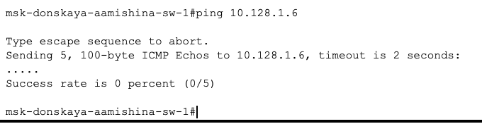{ #fig:010 width=60% }

Удалим соединение между msk-donskaya-aamishina-sw-1 и msk-pavlovskaya-aamishina-sw-1. Добавим в логическую рабочую область два повторителя (Repeater-PT). Присвоим им соответствующие названия msk-donskaya-aamishina-mc-1 и msk-pavlovskaya-aamishina-mc-1. Заменим имеющиеся модули на PT-REPEATER-NM-1FFE и PT-REPEATER-NM-1CFE для подключения оптоволокна и витой пары по технологии Fast Ethernet (рис. [-@fig:011]).

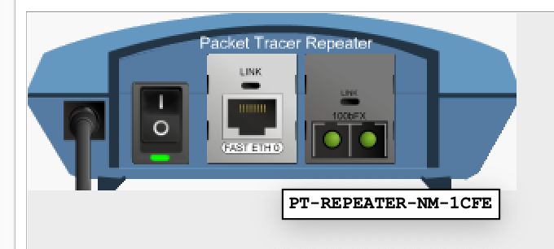{ #fig:011 width=60% }

Переместим msk-pavlovskaya-aamishina-mc-1 на территорию Pavlovskaya (в физической рабочей области Packet Tracer) (рис. [-@fig:012]).

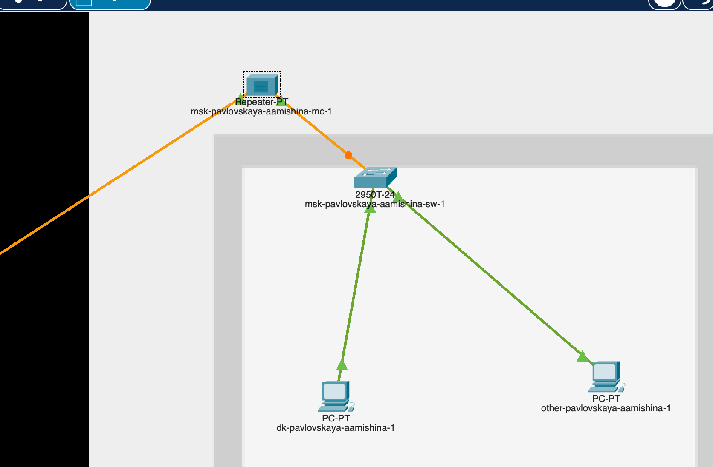{ #fig:012 width=60% }

Подключим коммутатор msk-donskaya-aamishina-sw-1 к msk-donskaya-aamishina-mc-1 повитой паре, msk-donskaya-aamishina-mc-1 и msk-pavlovskaya-aamishina-mc-1 — по оптоволокну, msk-pavlovskaya-aamishina-sw-1 к msk-pavlovskaya-aamishina-mc-1 — по витой паре (рис. [-@fig:013]).

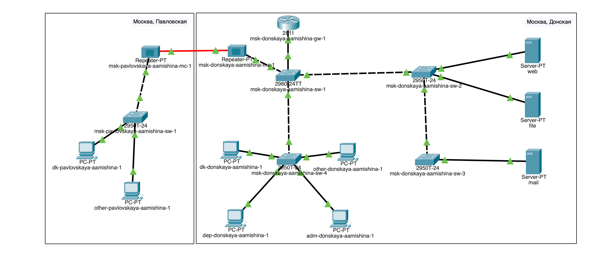{ #fig:013 width=60% }

Также внесем изменения в таблицу портов (табл. [-@tbl:fiz]).

:Таблица портов {#tbl:fiz}

| Устройство                       | Порт        | Примечание                         |
|----------------------------------|-------------|------------------------------------|
| msk-donskaya-aamishina-gw-1      | f0/1        | UpLink                             |
|                                  | f0/0        | msk-donskaya-aamishina-sw-1        |
| msk-donskaya-aamishina-sw-1      | f0/24       | msk-donskaya-aamishina-gw-1        |
|                                  | g0/1        | msk-donskaya-aamishina-sw-2        |
|                                  | g0/2        | msk-donskaya-aamishina-sw-4        |
|                                  | f0/1        | msk-donskaya-aamishina-mc-1        |
| msk-donskaya-aamishina-sw-2      | g0/1        | msk-donskaya-aamishina-sw-1        |
|                                  | f0/1        | Web-server                         |
|                                  | g0/2        | msk-donskaya-aamishina-sw-3        |
|                                  | f0/2        | File-server                        |
| msk-donskaya-aamishina-sw-3      | g0/1        | msk-donskaya-aamishina-sw-2        |
|                                  | f0/2        | Dns-server                         |
|                                  | f0/1        | Mail-server                        |
| msk-donskaya-aamishina-sw-4      | g0/1        | msk-donskaya-aamishina-sw-1        |
|                                  | f0/6–f0/10  | departments                        |
|                                  | f0/1–f0/5   | dk                                 |
|                                  | f0/11–f0/15 | adm                                |
|                                  | f0/16–f0/24 | other                              |
| msk-donskaya-aamishina-mc-1      | f0/0        | msk-donskaya-aamishina-sw-1        |
|                                  | f0/1        | msk-pavlovskaya-aamishina-mc-1     |
| msk-pavlovskaya-aamishina-mc-1   | f0/0        | msk-pavlovskaya-aamishina-sw-1     |
|                                  | f0/1        | msk-donskaya-aamishina-mc-1        |
| msk-pavlovskaya-aamishina-sw-1   | f0/24       | msk-pavlovskaya-aamishina-mc-1.    |
|                                  | f0/1–f0/15  | dk                                 |
|                                  | f0/20       | other                              |

Убедимся в работоспособности соединения между msk-donskaya-aamishina-sw-1 и msk-pavlovskaya-aamishina-sw-1 (рис. [-@fig:014]).

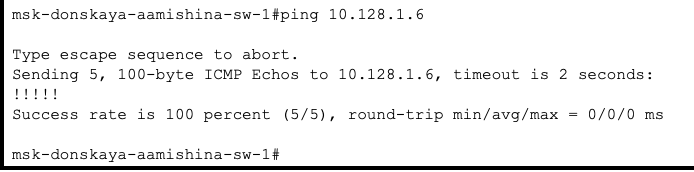{ #fig:014 width=60% }

# Контрольные вопросы

1. Перечислите возможные среды передачи данных. На какие характеристики среды передачи данных следует обращать внимание при планировании сети?

Существуют разные среды передачи данных, например, проводная (витая пара, коаксиальный кабель, оптоволокно), беспроводная (Wi-Fi, Bluetooth, сотовая связь). 

При выборе оптимального типа носителя следует знать следующие характеристики среды передачи данных:
- стоимость;
- сложность установки;
- пропускную способность;
- затухание сигнала;
- подверженность электромагнитным помехам (EMI, Electro-Magnetic Interference);
- возможность несанкционированного прослушивания.

2. Перечислите категории витой пары. Чем они отличаются? Какая категория в каких условиях может применяться?

Класс проводов и кабелей всегда определяет какой-то общепринятый стандарт. В случае с витой парой таких стандартов два: ISO 11801 и TIA-EIA-568B. Первый — международный, согласно нему существует 8 классов кабелей UTP: A, B, C, D, E, EA, F, FA. Второй — американский, по нему UTP кабели ранжируются не по классам, а по категориям, которых также восемь. Категорию в маркировке продукции принято обозначать сокращением Cat, после которого цифрой указывает номер категории.

**Описание классов витой пары**

- Кабель 1 класса (Cat 1) состоит из всего одной пары проводников и в настоящее время не используется из-за плохого сопротивления помехам и низкой частоты передачи данных.
- Кабель 2 класса (Cat 2) обеспечивает обмен данными на скорости до 4 Мбит/с, чего достаточно, например, для Token Ring и Arcnet. Но в последнее время кабели, состоящие всего из двух пар проводников разве что изредка встречаются на участках телефонных линий.
- Кабель 3 класса (Cat 3) мощнее предшественников, он способен обеспечивать обмен данными на скорости потока до 10 Мбит/сек, а при использовании 100BASE-T — до 100 Мбит/с. На сегодня основная сфера его применения — телефония.
- Кабель класса 4 (Cat 4) — в свое время обеспечивал работу сетей 10BASE-T и 10BASE-T4, но в последние годы встречается только на еще не обновившихся участках локальных сетей крупных и слабо цифровизирующихся предприятий.
- Кабель 5 класса D (Cat 5) — четырехпарный кабель с возможностью организации потока скоростью до 1000 Мбит/с. Подходит и для локальных сетей, и для телефонии. На сегодня оптимален по соотношению цены и качества.
- Кабель 6 класса (Cat 6, класс E) — «разгоняет» данные до  10 Гбит/с при длине сегмента до 55 метров и прочих ограничениях, но тем не менее еще долго будет считаться наиболее подходящим решением для Fast Ethernet и 10 Gigabit Ethernet. Cat 6a — «старший брат» шестерки, более стабильный, а потому выдает те же характеристики на сегментах до 100 метров, тем самым упрощая прокладку и обеспечивая меньшую сегментацию сети.
- Витая пара 7 класса (Cat 7, класс F) отличается от предыдущей категории наличием отдельных экранов на каждую пару, а также общего защитного экрана. При этом рабочая частота кабеля колеблется в диапазоне 600–700 МГц — достаточно для скоростной передачи данных в локальной сети, системе видеонаблюдения, безопасности. 7A — "старший брат" с большей частотой (до 1200 МГц) и в 4 раза большей скоростью передачи данных, за счет чего 7a (она же — класс FA) подходит для использования в высокоскоростных сетях 40 Gigabit Ethernet.
- Кабели класса 8 позволяют передавать данные со скоростью до 100 Гбит/с, что пока не используется широко, но скоро будет повсеместно внедряться для повышения качества обмена данными, например, в системах автоматизации для взаимодействия узлов в реальном времени.

Таким образом, для большинства задач оптимальным выбором будут кабели «витая пара» категорий 5, 5а, 6 и 6а.

1. В чем отличие одномодового и многомодового оптоволокна? Какой тип кабеля в каких условиях может применяться?

Одномодовое оптоволокно передает свет в одном направлении, многомодовое - в нескольких. Одномодовое используется на большие расстояния, многомодовое - на короткие.

4. Какие разъёмы встречаются на патчах оптоволокна? Чем они отличаются?

Разъемы на патчах оптоволокна: LC, SC, ST. Они различаются по типу соединения. LC - для высокоскоростных сетей, SC и ST - для обычных сетей.

# Выводы

В результате выполнения лабораторной работы я получила навыки работы с физической рабочей областью Packet Tracer, а также учитывала физические параметры сети.

# Список литературы{.unnumbered}

::: {#refs}
:::