---
## Front matter
lang: ru-RU
title: Лабораторная работа №8
subtitle: Администрирование локальных сетей 
author:
  - Мишина А. А.
date: 31 марта 2025

## i18n babel
babel-lang: russian
babel-otherlangs: english

## Formatting pdf
toc: false
toc-title: Содержание
slide_level: 2
aspectratio: 169
section-titles: true
theme: metropolis
header-includes:
 - \metroset{progressbar=frametitle,sectionpage=progressbar,numbering=fraction}
 - '\makeatletter'

 - '\makeatother'
---

## Докладчик

:::::::::::::: {.columns align=center}
::: {.column width="70%"}

  * Мишина Анастасия Алексеевна
  * НПИбд-02-22
  * <https://github.com/nasmi32>

:::
::: {.column width="30%"}

:::
::::::::::::::

## Цели и задачи

- Приобретение практических навыков по настройке динамического распределения IP-адресов посредством протокола DHCP (Dynamic Host Configuration Protocol) в локальной сети.

## Задание

1. Добавить DNS-записи для домена donskaya.rudn.ru на сервер dns.
2. Настроить DHCP-сервис на маршрутизаторе.
3. Заменить в конфигурации оконечных устройствах статическое распределение адресов на динамическое.
4. При выполнении работы необходимо учитывать соглашение об именовании.

# Выполнение лабораторной работы

## Cisco Packet Tracer

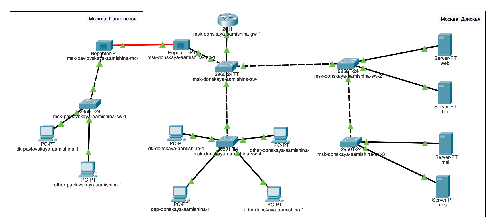{ #fig:001 width=60% }

## Порт Fa0/2

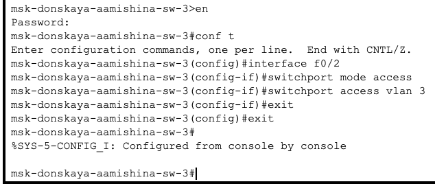{ #fig:002 width=60% }

## DNS-сервер

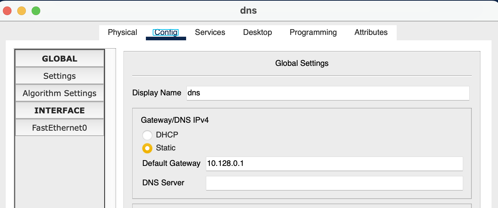{ #fig:003 width=60% }

## DNS-сервер 

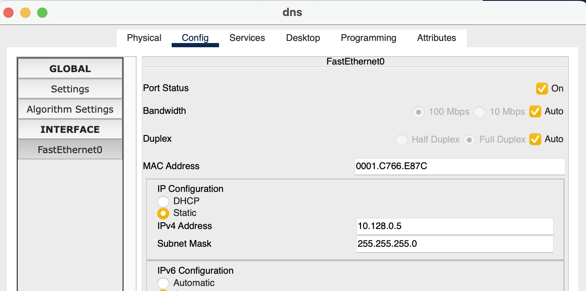{ #fig:004 width=60% }

## DNS-сервер 

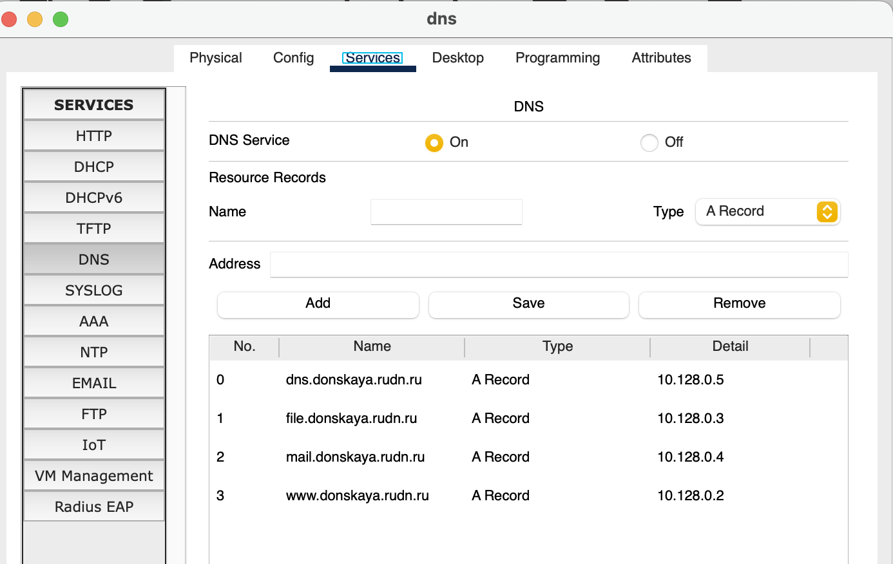{ #fig:005 width=60% }

## DHCP-сервис

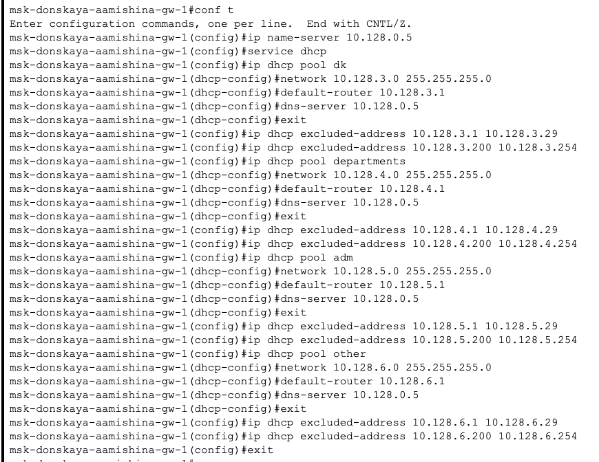{ #fig:006 width=60% }

## Просмотр

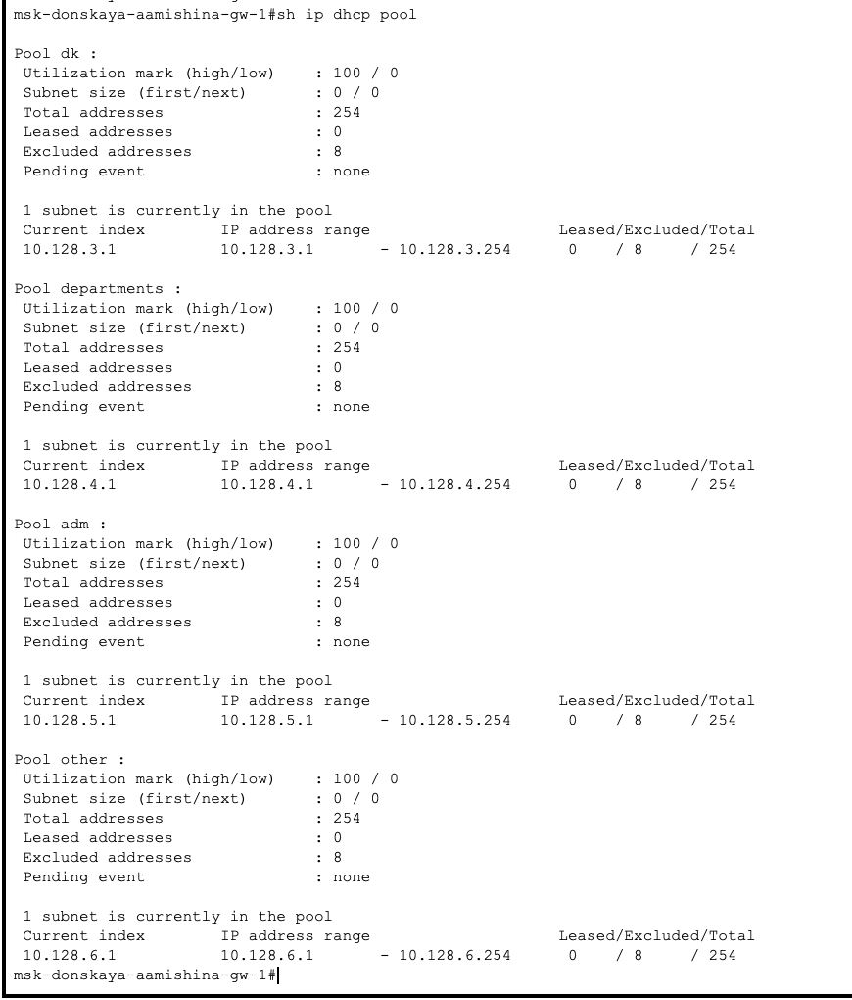{ #fig:007 width=30% }

## Просмотр

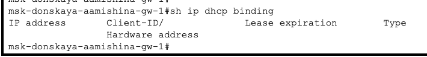{ #fig:008 width=60% }

## IP-адрес

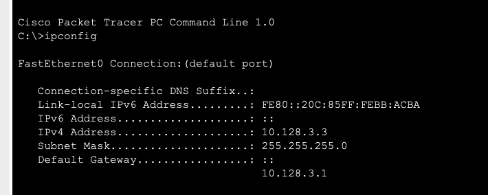{ #fig:009 width=60% }

## IP-адрес

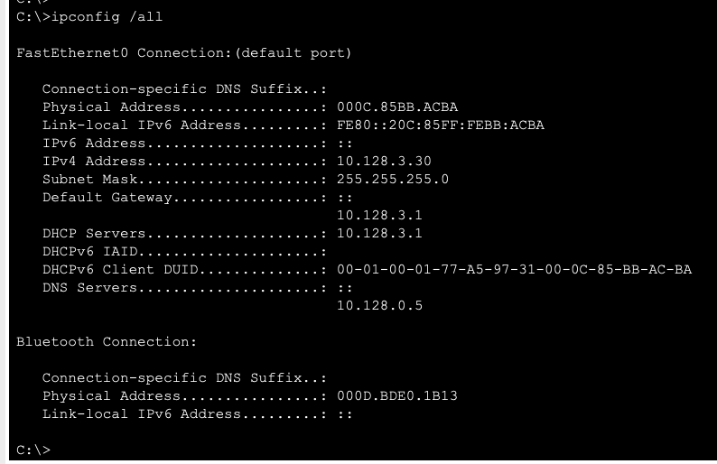{ #fig:010 width=60% }

## Проверка

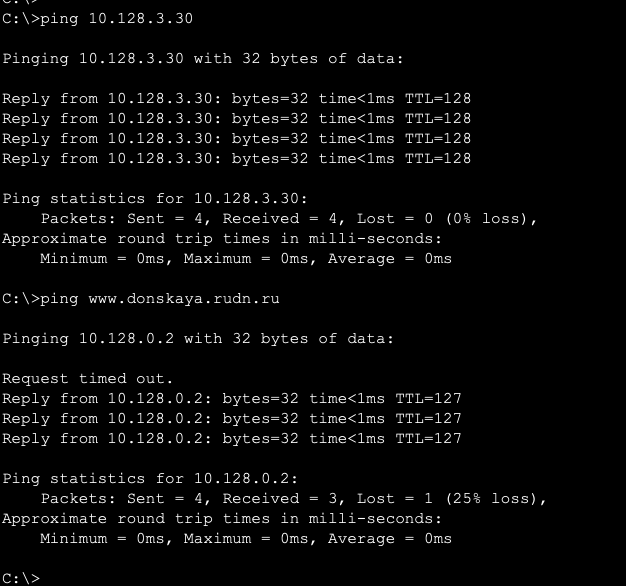{ #fig:011 width=40% }

## Web browser

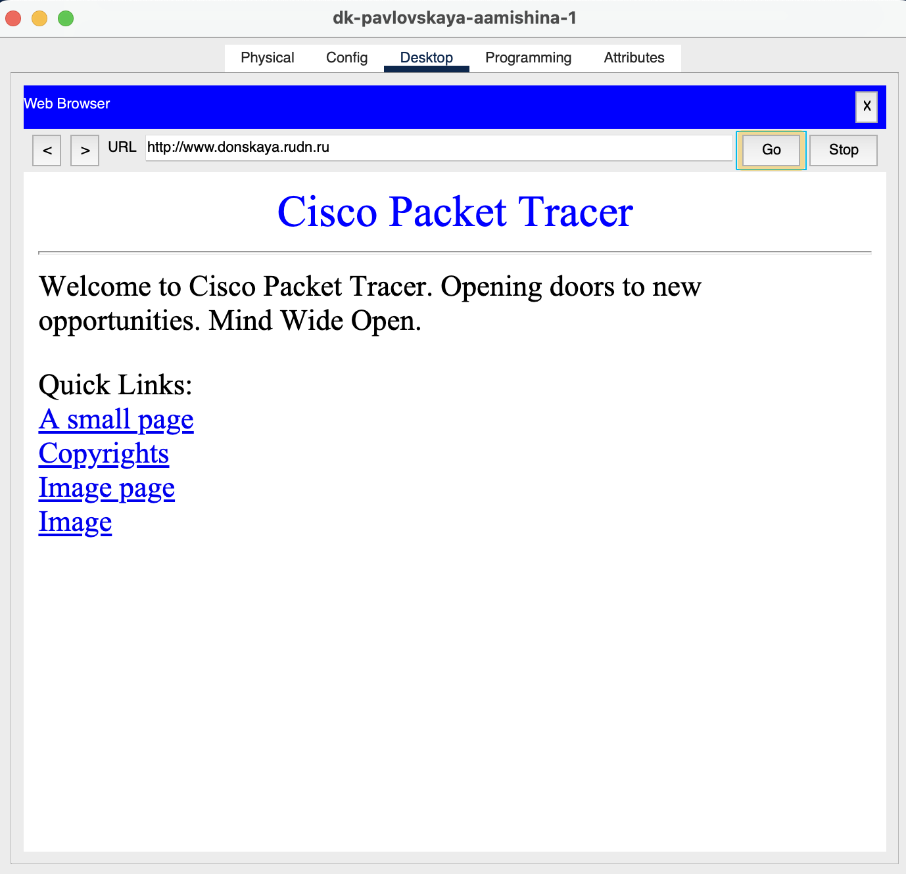{ #fig:012 width=40% }

## Режим симуляции

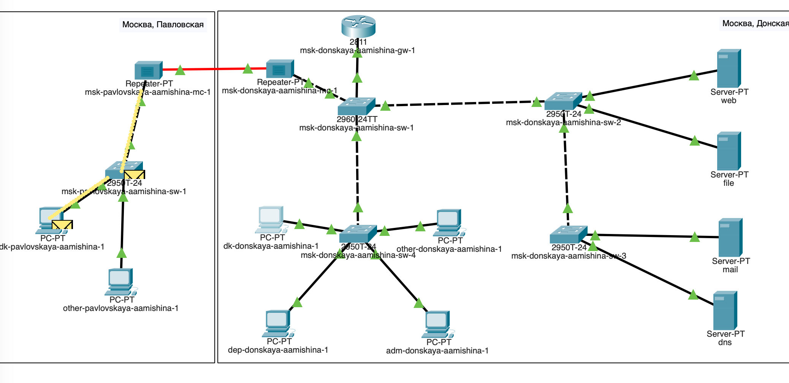{ #fig:013 width=60% }

## Список событий

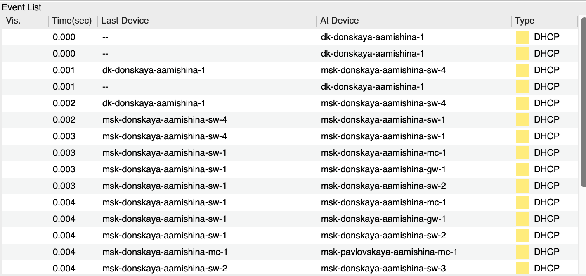{ #fig:014 width=60% }

## Запрос

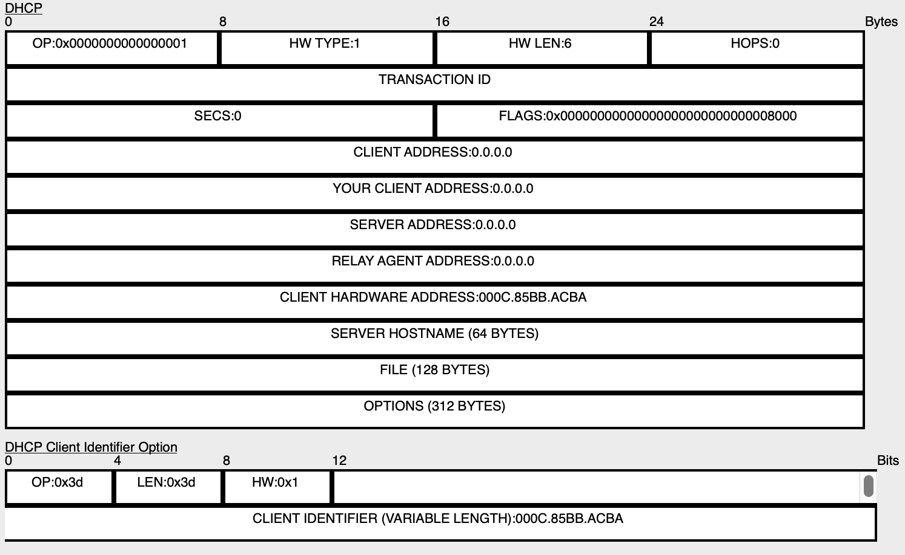{ #fig:015 width=60% }

## Ответ

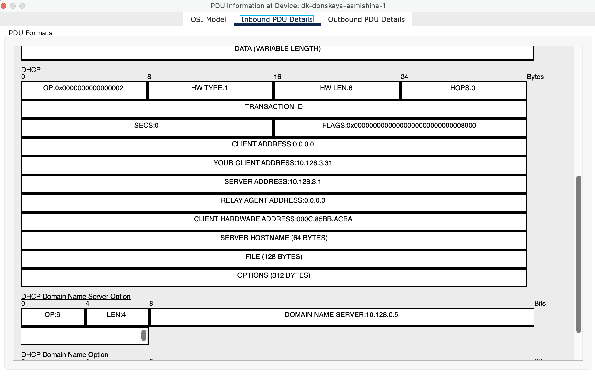{ #fig:016 width=60% }

## Вывод

- В результате выполнения лабораторной работы я приобрела практические навыки по настройке динамического распределения IP-адресов посредством протокола DHCP (Dynamic Host Configuration Protocol) в локальной сети.