---
## Front matter
lang: ru-RU
title: Лабораторная работа №9
subtitle: Администрирование локальных сетей
author:
  - Мишина А. А.
date: 1 апреля 2025

## i18n babel
babel-lang: russian
babel-otherlangs: english

## Formatting pdf
toc: false
toc-title: Содержание
slide_level: 2
aspectratio: 169
section-titles: true
theme: metropolis
header-includes:
 - \metroset{progressbar=frametitle,sectionpage=progressbar,numbering=fraction}
---

## Докладчик

:::::::::::::: {.columns align=center}
::: {.column width="70%"}

  * Мишина Анастасия Алексеевна
  * НПИбд-02-22
  * <https://github.com/nasmi32>

:::
::: {.column width="30%"}

:::
::::::::::::::

## Цели и задачи

- Изучить возможности протокола STP и его модификаций по обеспечению отказоустойчивости сети, агрегированию интерфейсов и перераспределению нагрузки между ними.

## Задание

1. Сформировать резервное соединение между коммутаторами msk-donskaya-sw-1 и msk-donskaya-sw-3.
2. Настроить балансировку нагрузки между резервными соединениями.
3. Настроить режим Portfast на тех интерфейсах коммутаторов, к которым подключены серверы.
4. Изучить отказоустойчивость резервного соединения.
5. Сформировать и настроить агрегированное соединение интерфейсов Fa0/20 -- Fa0/23 между коммутаторами msk-donskaya-sw-1 и msk-donskaya-sw-4.
6. При выполнении работы необходимо учитывать соглашение об именовании.

# Выполнение лабораторной работы

## Cisco Packet Tracer

{ #fig:001 width=60% }

## trunk-порт

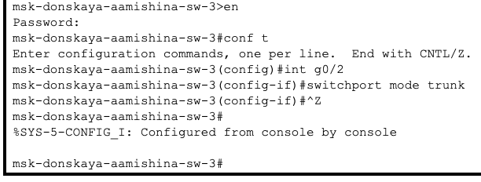{ #fig:002 width=60% }

## trunk-порт

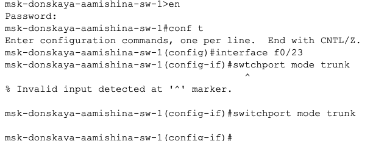{ #fig:003 width=60% }

## trunk-порт

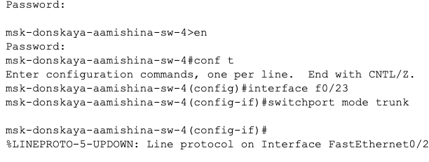{ #fig:004 width=60% }

## Пингование

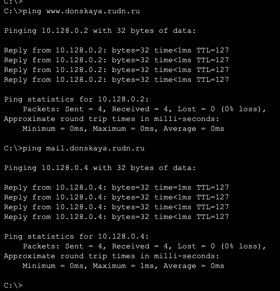{ #fig:005 width=40% }

## Режим симуляции

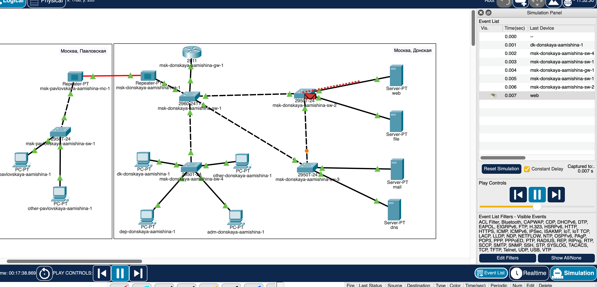{ #fig:006 width=60% }

## Режим симуляции

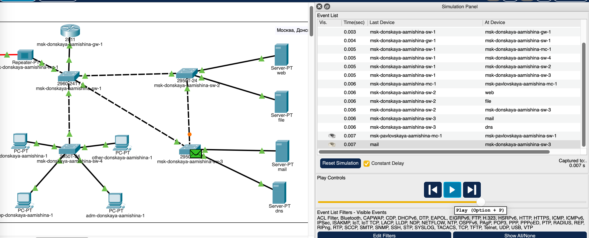{ #fig:007 width=60% }

## STP

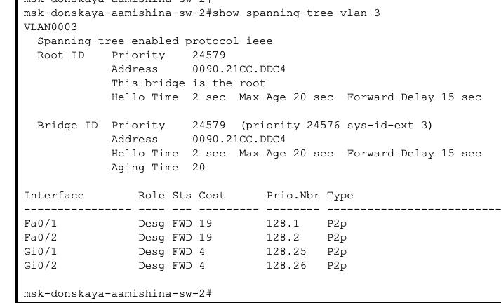{ #fig:008 width=60% }

## Настройка

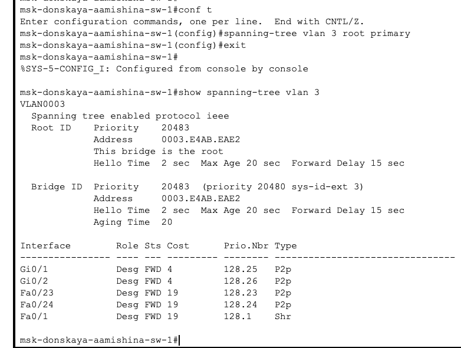{ #fig:009 width=60% }

## Режим симуляции

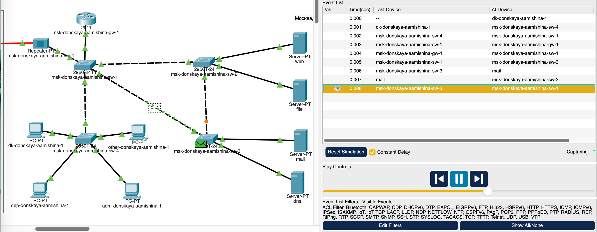{ #fig:010 width=60% }

## Режим симуляции

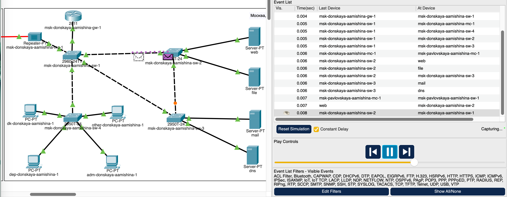{ #fig:011 width=60% }

## Portfast

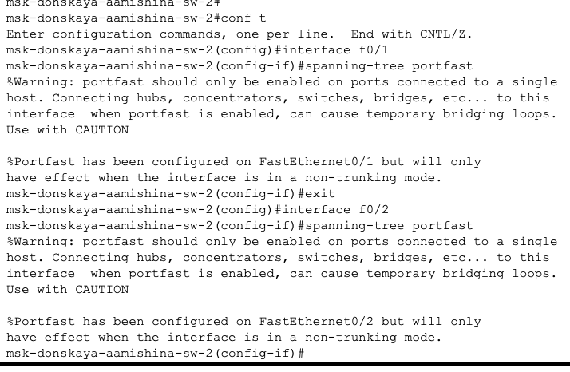{ #fig:012 width=60% }

## Portfast

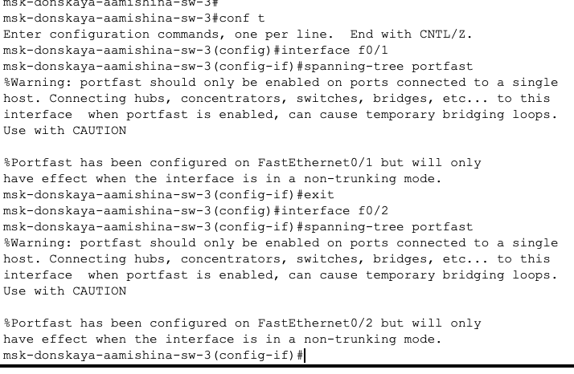{ #fig:013 width=60% }

## Пингование

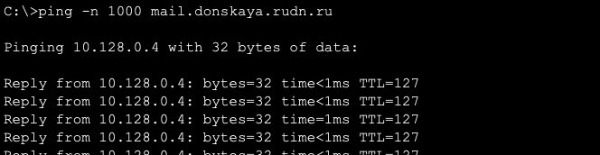{ #fig:014 width=60% }

## Разрыв

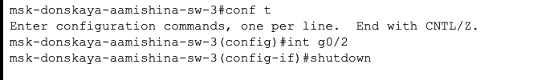{ #fig:015 width=60% }

## Пингование

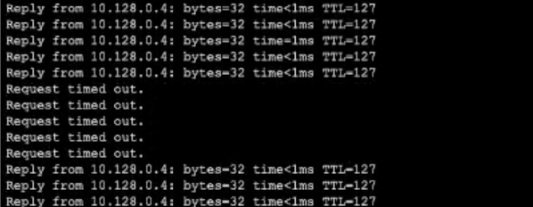{ #fig:016 width=60% }

## Rapid PVST+

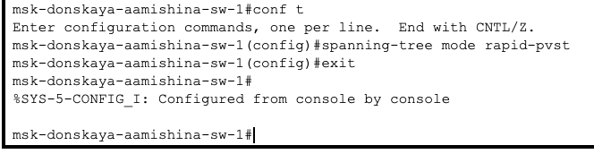{ #fig:017 width=60% }

## Rapid PVST+

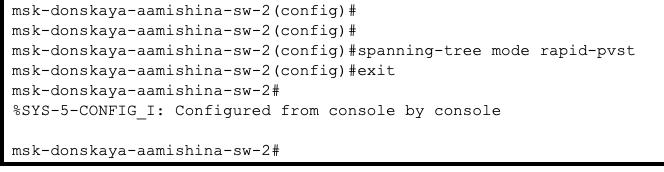{ #fig:018 width=60% }

## Rapid PVST+

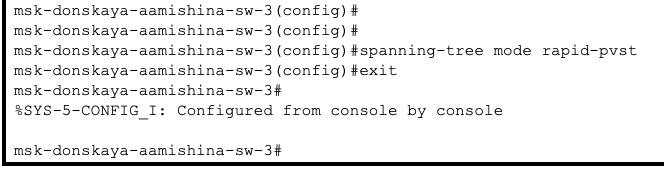{ #fig:019 width=60% }

## Rapid PVST+

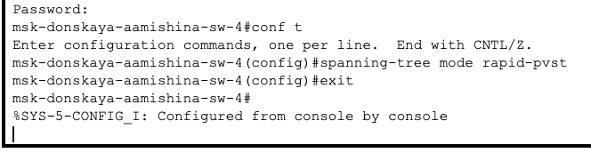{ #fig:020 width=60% }

## Rapid PVST+

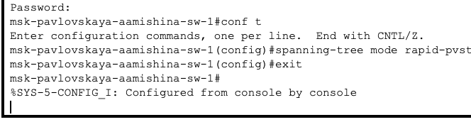{ #fig:021 width=60% }

## Пингование

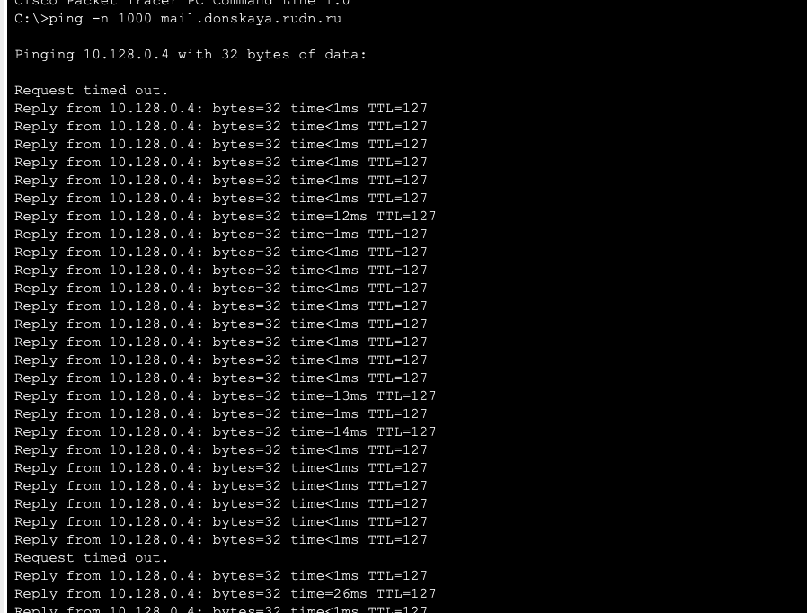{ #fig:022 width=60% }

## Разрыв

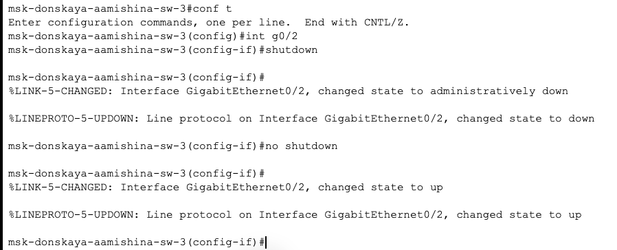{ #fig:023 width=60% }

## Cisco Packet Tracer

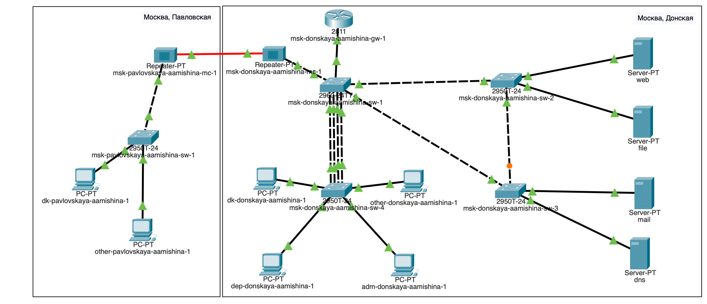{ #fig:024 width=60% }

## Настройка

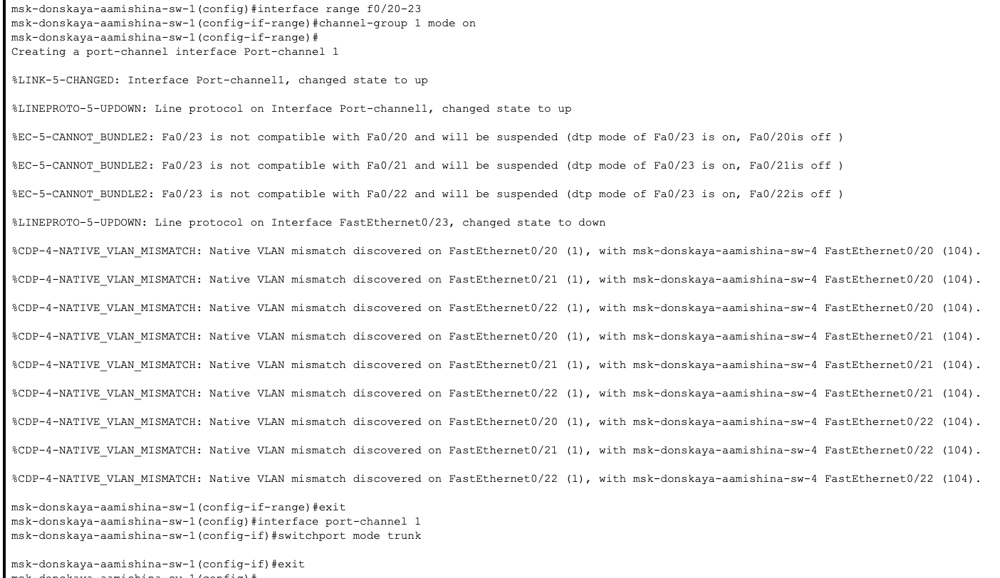{ #fig:025 width=60% }

## Настройка

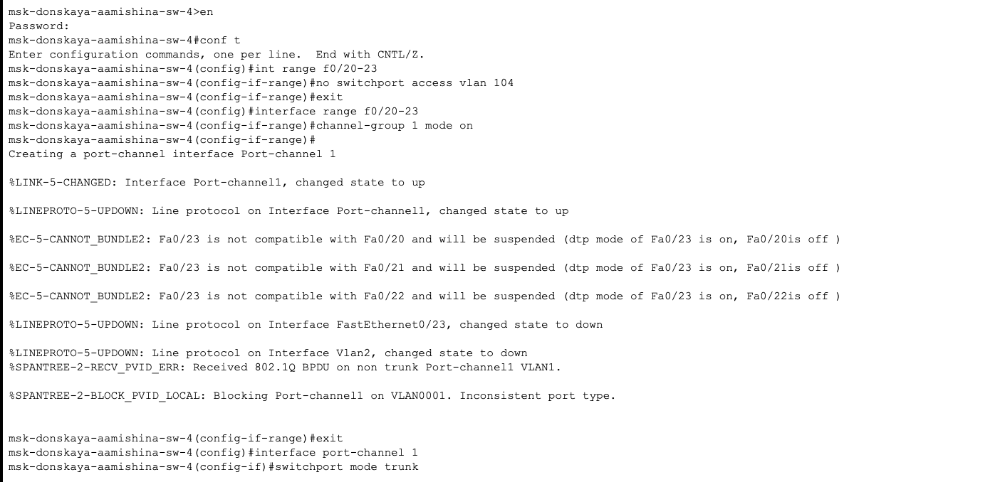{ #fig:026 width=60% }

## Вывод

- В результате выполнения лабораторной работы я изучила возможности протокола STP и его модификаций по обеспечению отказоустойчивости сети, агрегированию интерфейсов и перераспределению нагрузки между ними.