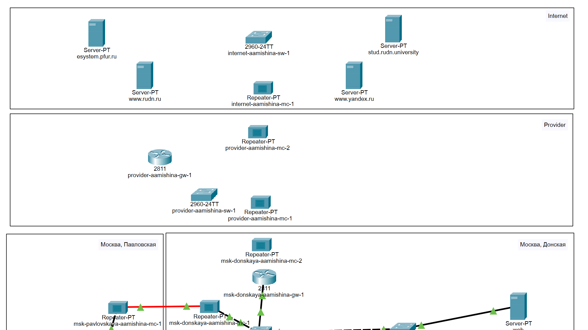

---
## Front matter
lang: ru-RU
title: Лабораторная работа №11
subtitle: Администрирование локальных сетей
author:
  - Мишина А. А.
date: 24 апреля 2025

## i18n babel
babel-lang: russian
babel-otherlangs: english

## Formatting pdf
toc: false
toc-title: Содержание
slide_level: 2
aspectratio: 169
section-titles: true
theme: metropolis
header-includes:
 - \metroset{progressbar=frametitle,sectionpage=progressbar,numbering=fraction}
---

## Докладчик

:::::::::::::: {.columns align=center}
::: {.column width="70%"}

  * Мишина Анастасия Алексеевна
  * НПИбд-02-22
  * <https://github.com/nasmi32>

:::
::: {.column width="30%"}

:::
::::::::::::::

## Цель работы

- Провести подготовительные мероприятия по подключению локальной сети организации к Интернету.

## Задачи

1. Построить схему подсоединения локальной сети к Интернету;
2. Построить модельные сети провайдера и сети Интернет;
3. Построить схемы сетей L1, L2, L3;
4. При выполнении работы необходимо учитывать соглашение об именовании.

# Выполнение лабораторной работы

## Таблица

{#fig:014 width=70%}

## Сеть NAT

{#fig:001 width=50%}

## Схема L1

{#fig:002 width=35%}

## Схема L2

{#fig:003 width=35%}

## Схема L3

{#fig:004 width=50%}

## Новые устройства

{#fig:005 width=70%}

## Добавление зданий

{#fig:006 width=70%}

## Перенос оборудования

{#fig:007 width=70%}

## Перенос оборудования

{#fig:008 width=50%}

## Замена модулей

{#fig:009 width=50%}

## Итоговая схема сети

{#fig:010 width=50%}

## Установка IP-адресов

{#fig:011 width=70%}

## Установка IP-адресов

{#fig:012 width=70%}

## DNS-сервер сети "Донская"

{#fig:013 width=50%}

## Выводы

- В процессе выполнения данной лабораторной работы я провела подготовительные мероприятия по подключению локальной сети организации к Интернету.