---
## Front matter
lang: ru-RU
title: Лабораторная работа №12
subtitle: Администрирование локальных сетей
author:
  - Мишина А. А.
date: 29 апреля 2025

## i18n babel
babel-lang: russian
babel-otherlangs: english

## Formatting pdf
toc: false
toc-title: Содержание
slide_level: 2
aspectratio: 169
section-titles: true
theme: metropolis
header-includes:
 - \metroset{progressbar=frametitle,sectionpage=progressbar,numbering=fraction}
---

## Докладчик

:::::::::::::: {.columns align=center}
::: {.column width="70%"}

  * Мишина Анастасия Алексеевна
  * НПИбд-02-22
  * <https://github.com/nasmi32>

:::
::: {.column width="30%"}

:::
::::::::::::::

# Цель работы

- Приобрести практические навыки по настройке доступа локальной сети к внешней сети посредством NAT.

# Задание

1. Сделать первоначальную настройку маршрутизатора provider-gw-1 и коммутатора provider-sw-1 провайдера: задать имя, настроить доступ по
паролю и т.п.
2. Настроить интерфейсы маршрутизатора provider-gw-1 и коммутатора
provider-sw-1 провайдера.
3. Настроить интерфейсы маршрутизатора сети «Донская» для доступа к сети провайдера.
4. Настроить на маршрутизаторе сети «Донская» NAT с правилами.
5. Настроить доступ из внешней сети в локальную сеть организации.
6. Проверить работоспособность заданных настроек.
7. При выполнении работы необходимо учитывать соглашение об именовании.

# Выполнение лабораторной работы

## Первоначальная настройка

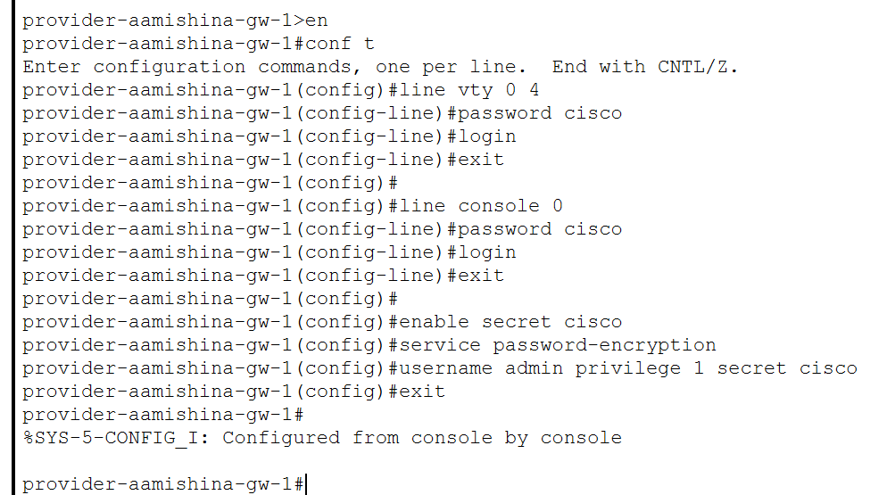{#fig:001 width=70%}

## Первоначальная настройка

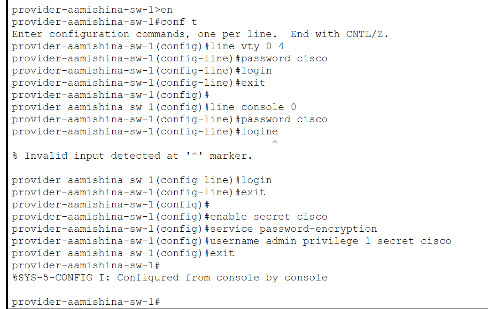{#fig:002 width=70%}

## Настройка интерфейсов

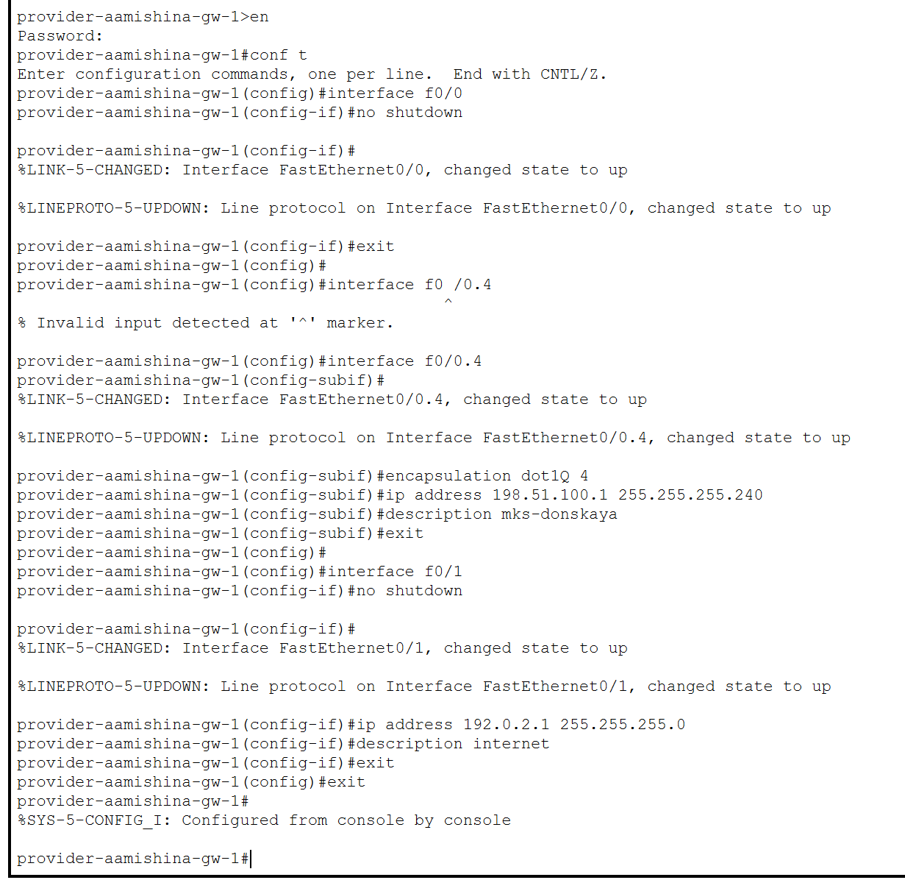{#fig:003 width=50%}

## Настройка интерфейсов

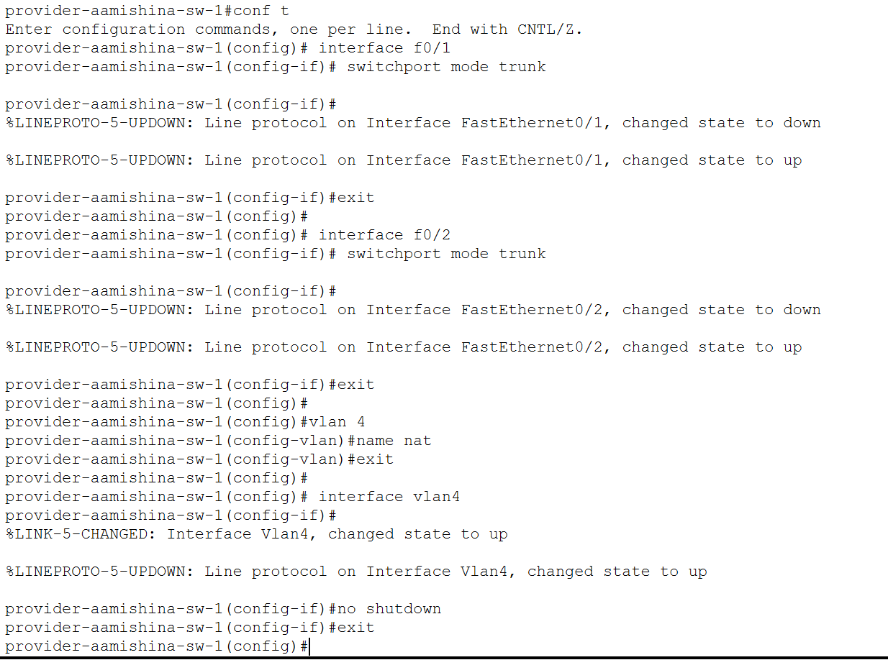{#fig:004 width=50%}

## Настройка интерфейсов

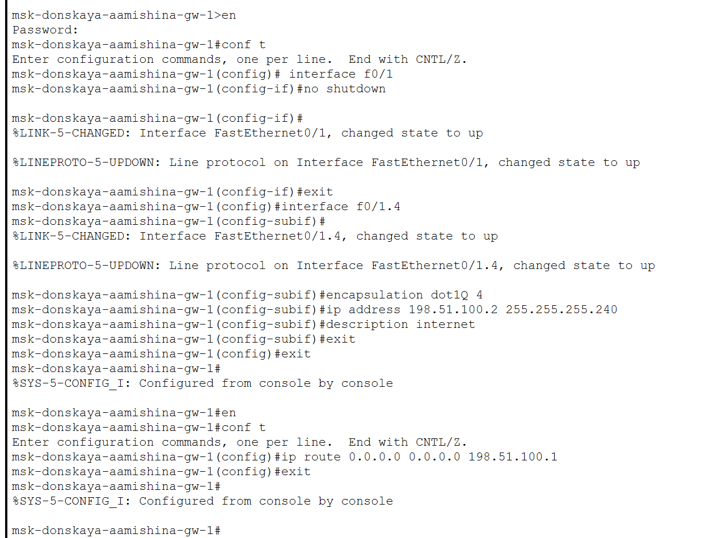{#fig:005 width=50%}

## Проверка

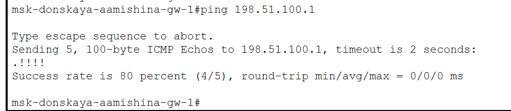{#fig:006 width=70%}

## Настройка пула адресов для NAT

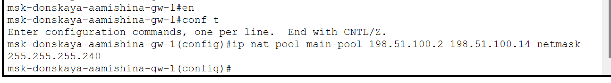{#fig:007 width=70%}

## Настройка списка доступа для NAT

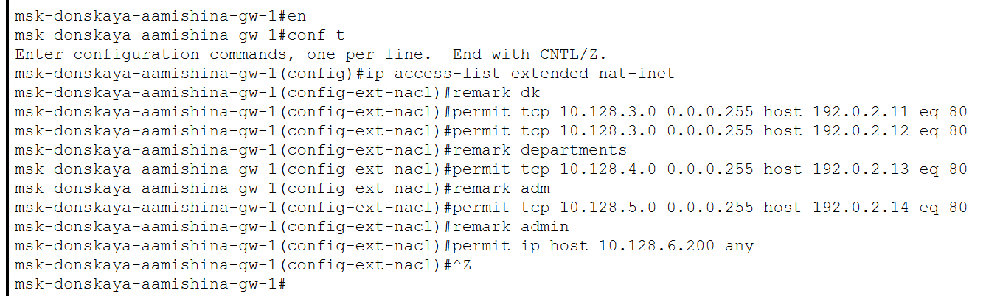{#fig:008 width=70%}

## Настройка PAT

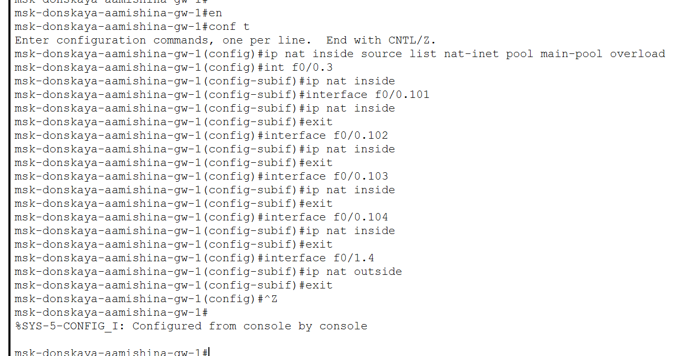{#fig:009 width=70%}

## Проверка

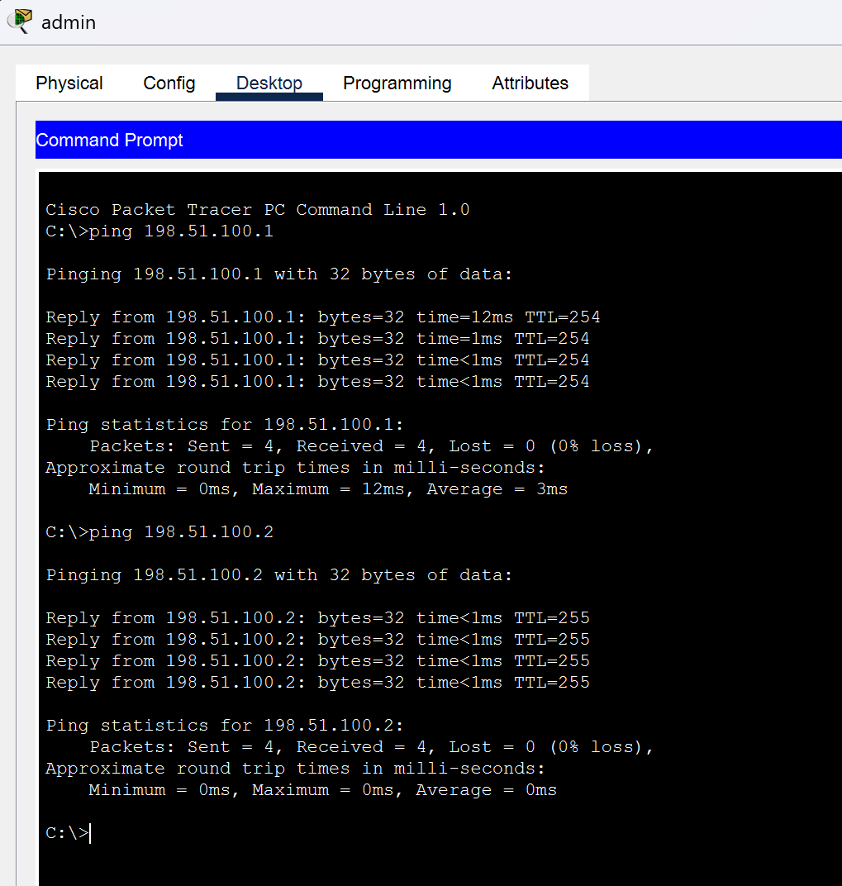{#fig:010 width=40%}

## Настройка доступа из Интернета

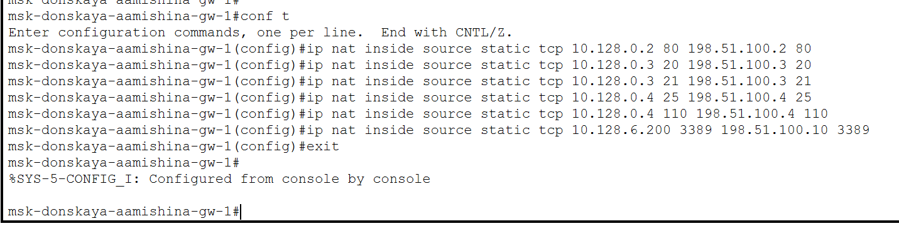{#fig:011 width=70%}

## Проверка

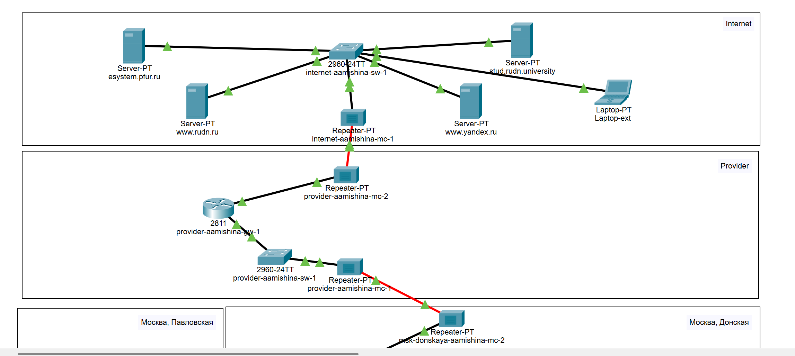{#fig:012 width=70%}

## Проверка

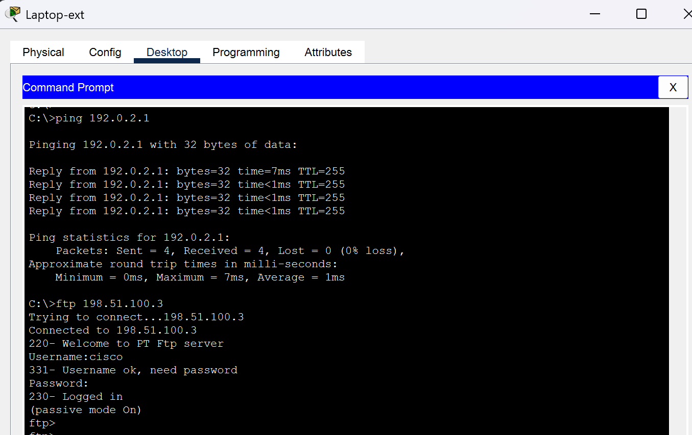{#fig:013 width=70%}

## Проверка

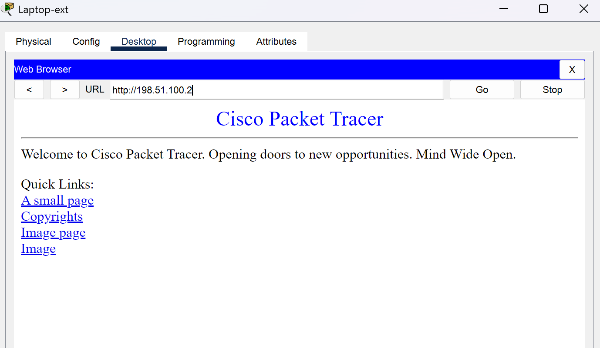{#fig:014 width=70%}

## Проверка

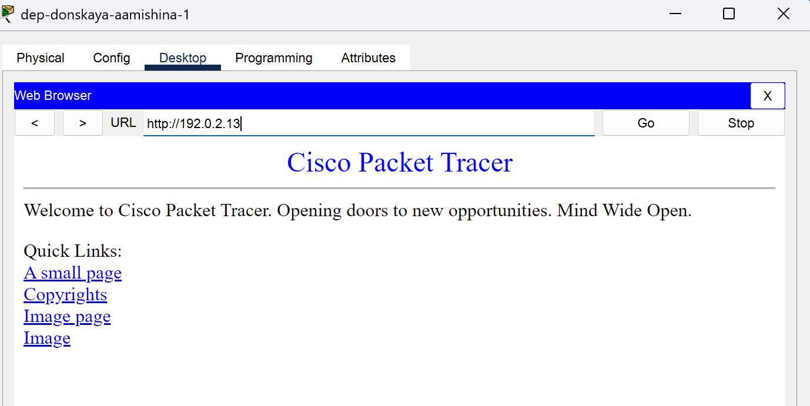{#fig:015 width=70%}

## Проверка

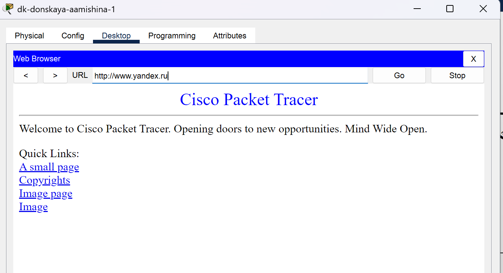{#fig:016 width=70%}

## Проверка

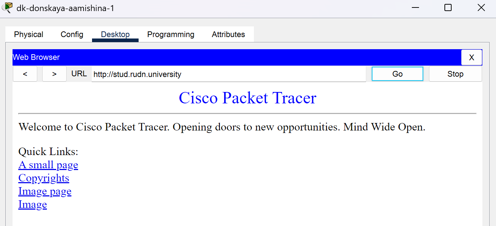{#fig:017 width=70%}

## Проверка

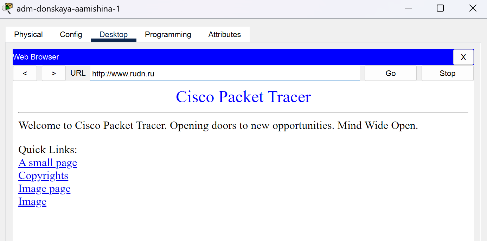{#fig:018 width=70%}

## Выводы

- В результате выполнения данной лабораторной работы я приобрела практические навыки по настройке доступа локальной сети к внешней сети посредством NAT.
