---
## Front matter
title: "Лабораторная работа №12"
subtitle: "Дисциплина: Администрирование локальных сетей"
author: "Мишина Анастасия Алексеевна"

## Generic otions
lang: ru-RU
toc-title: "Содержание"

## Bibliography
bibliography: bib/cite.bib
csl: pandoc/csl/gost-r-7-0-5-2008-numeric.csl

## Pdf output format
toc: true # Table of contents
toc-depth: 2
lof: true # List of figures
lot: true # List of tables
fontsize: 12pt
linestretch: 1.5
papersize: a4
documentclass: scrreprt
## I18n polyglossia
polyglossia-lang:
  name: russian
  options:
	- spelling=modern
	- babelshorthands=true
polyglossia-otherlangs:
  name: english
## I18n babel
babel-lang: russian
babel-otherlangs: english
## Fonts
mainfont: IBM Plex Serif
romanfont: IBM Plex Serif
sansfont: IBM Plex Sans
monofont: IBM Plex Mono
mathfont: STIX Two Math
mainfontoptions: Ligatures=Common,Ligatures=TeX,Scale=0.94
romanfontoptions: Ligatures=Common,Ligatures=TeX,Scale=0.94
sansfontoptions: Ligatures=Common,Ligatures=TeX,Scale=MatchLowercase,Scale=0.94
monofontoptions: Scale=MatchLowercase,Scale=0.94,FakeStretch=0.9
mathfontoptions:
## Biblatex
biblatex: true
biblio-style: "gost-numeric"
biblatexoptions:
  - parentracker=true
  - backend=biber
  - hyperref=auto
  - language=auto
  - autolang=other*
  - citestyle=gost-numeric
## Pandoc-crossref LaTeX customization
figureTitle: "Рис."
tableTitle: "Таблица"
listingTitle: "Листинг"
lofTitle: "Список иллюстраций"
lotTitle: "Список таблиц"
lolTitle: "Листинги"
## Misc options
indent: true
header-includes:
  - \usepackage{indentfirst}
  - \usepackage{float} # keep figures where there are in the text
  - \floatplacement{figure}{H} # keep figures where there are in the text
---

# Цель работы

Приобрести практические навыки по настройке доступа локальной сети к внешней сети посредством NAT [@netadmin].

# Задание

1. Сделать первоначальную настройку маршрутизатора provider-gw-1 и коммутатора provider-sw-1 провайдера: задать имя, настроить доступ по
паролю и т.п.
2. Настроить интерфейсы маршрутизатора provider-gw-1 и коммутатора
provider-sw-1 провайдера.
3. Настроить интерфейсы маршрутизатора сети «Донская» для доступа к сети
провайдера.
4. Настроить на маршрутизаторе сети «Донская» NAT с правилами.
5. Настроить доступ из внешней сети в локальную сеть организации.
6. Проверить работоспособность заданных настроек.
7. При выполнении работы необходимо учитывать соглашение об именовании.

# Выполнение лабораторной работы

Проведем первоначальную настройку маршрутизатора provider-gw-1 (рис. [-@fig:001]). Зададим имя, настроим доступ по паролю.

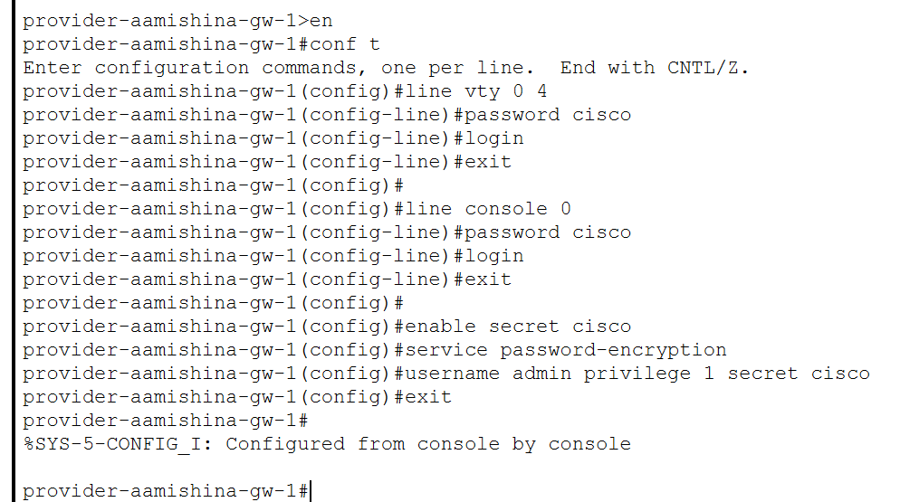{#fig:001 width=70%}

Проведем первоначальную настройку коммутатора provider-sw-1 (рис. [-@fig:002]). Зададим имя, настроим доступ по паролю.

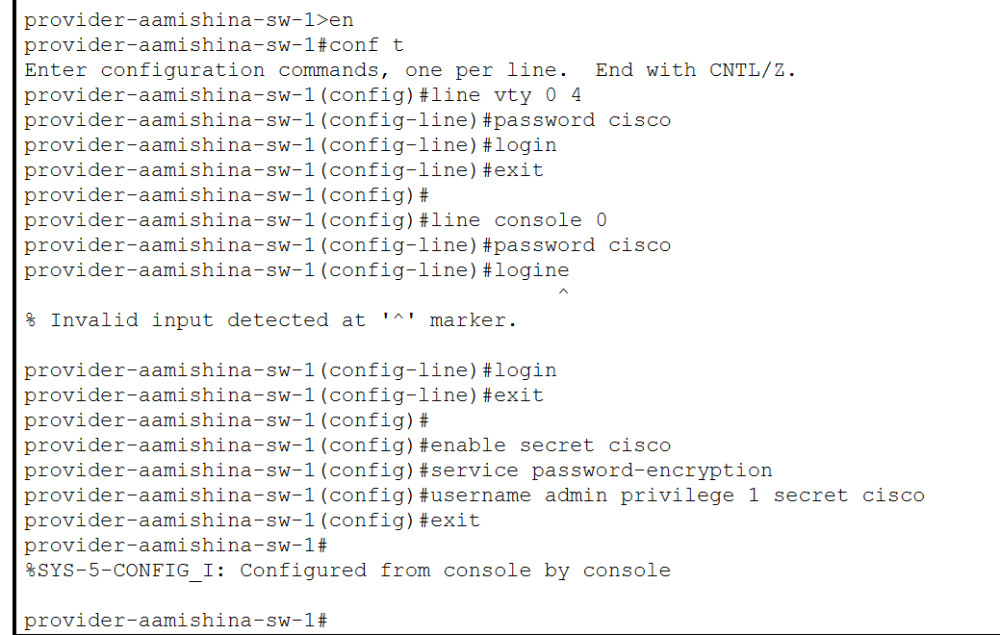{#fig:002 width=70%}

Проведем настройку интерфейсов маршрутизатора provider-gw-1 (рис. [-@fig:003]). Поднимем интерфейс f0/0, создадим интерфейс f0/0.4 для 4 vlan и зададим ip-адрес, поднимем интерфейс f0/1.

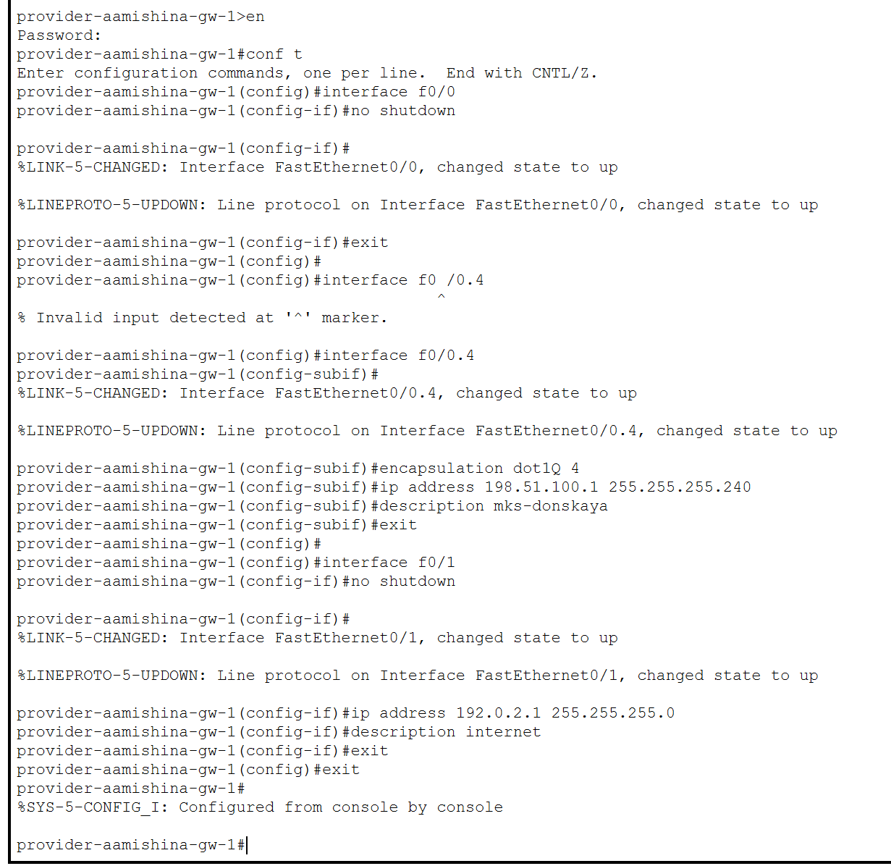{#fig:003 width=70%}

Проведем настройку интерфейсов коммутатора provider-sw-1 (рис. [-@fig:004]). Сделаем порты f0/1 и f0/2 транковыми, зададим 4 vlan с именем nat.

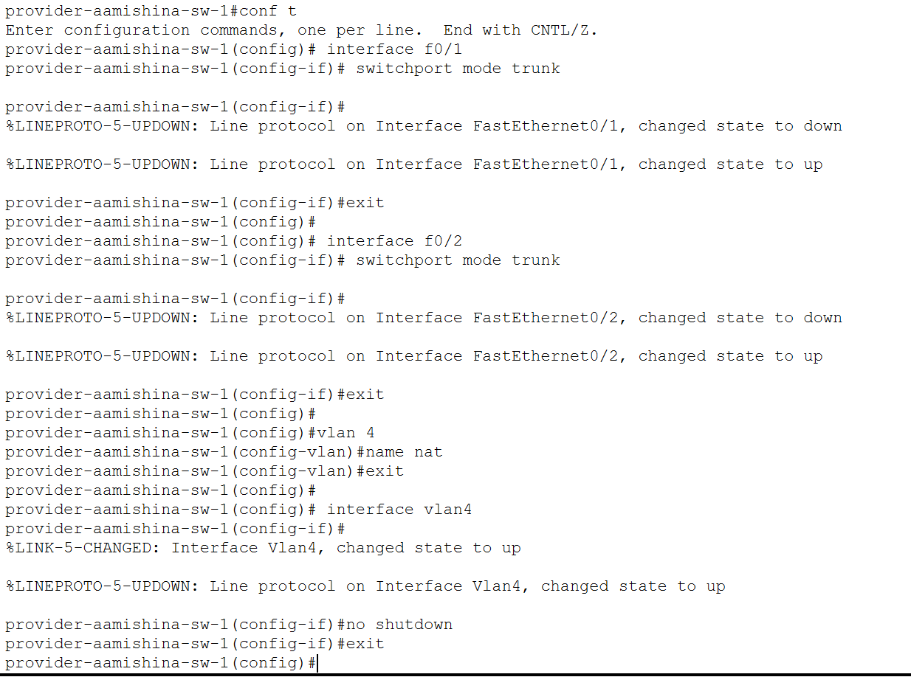{#fig:004 width=70%}

Проведем настройку интерфейсов маршрутизатора msk-donskaya-gw-1 (рис. [-@fig:005]). Поднимем интерфейс f0/1, создадим интерфейс f0/1.4 для 4 vlan и зададим ip-адрес.

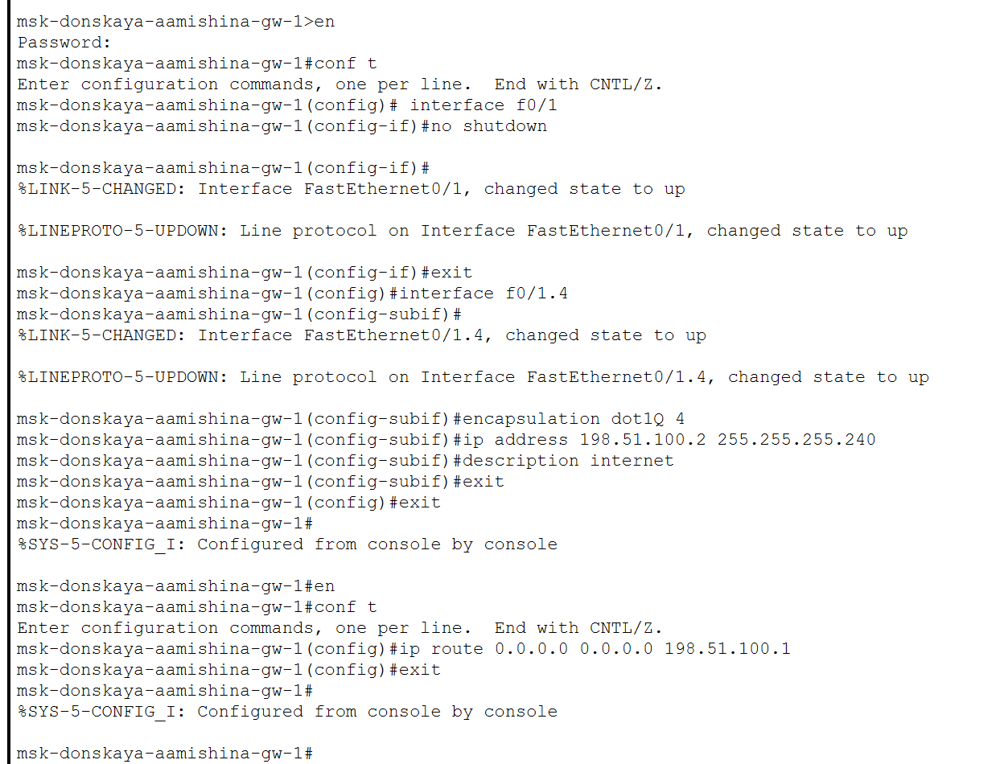{#fig:005 width=70%}

Проверим доступ с маршрутизатора на Донской к маршрутизатору провайдера (рис. [-@fig:006]).

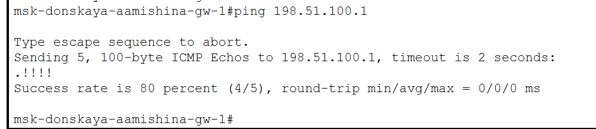{#fig:006 width=70%}

Настроим пул адресов 198.51.100.2 -- 198.51.100.14 для NAT (рис. [-@fig:007]).

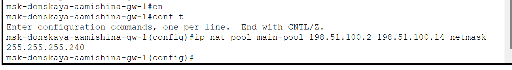{#fig:007 width=70%}

Теперь настроим список доступа к nat на всех подсетях для пользователей(рис. [-@fig:008]).

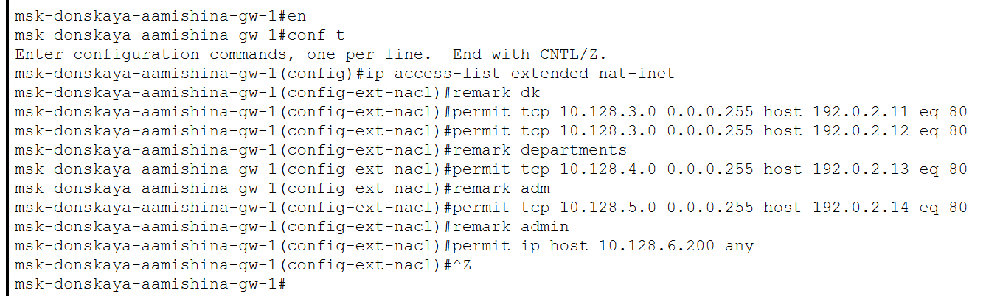{#fig:008 width=70%}

Настроим Port Address Translation (PAT) на субинтерфейсах маршрутизатора с территории Донская (рис. [-@fig:009]).

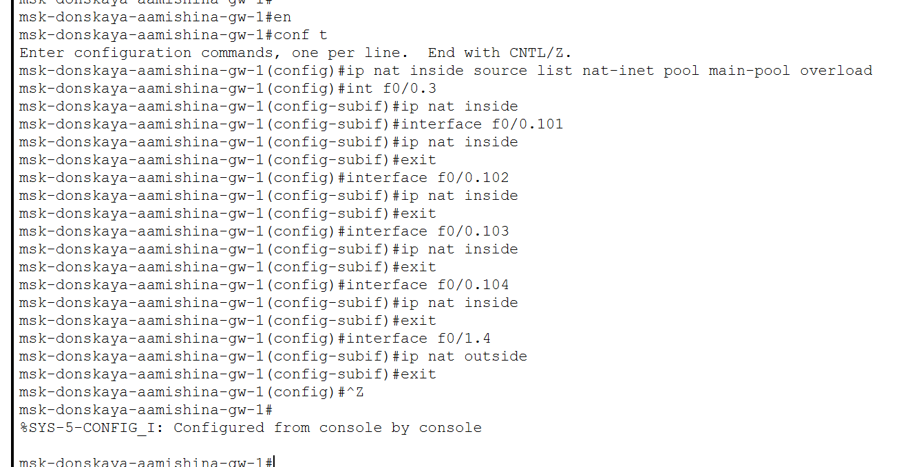{#fig:009 width=70%}

Проверка доступности к маршрутизаторам от ноутбука админ (рис. [-@fig:010]).

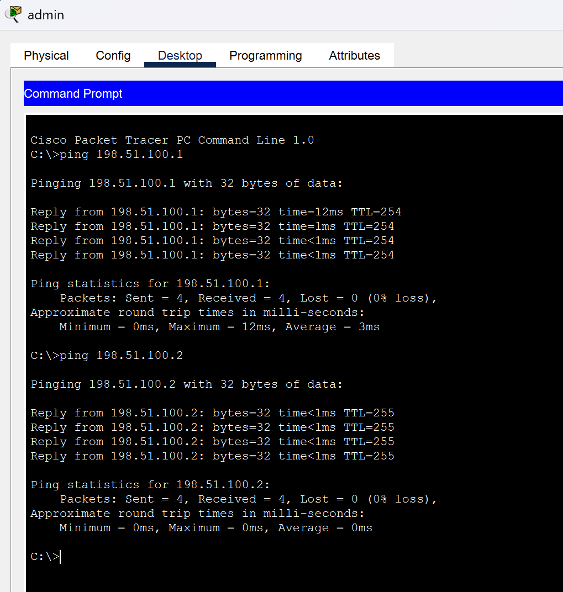{#fig:010 width=70%}

Настроим доступа из Интернета (рис. [-@fig:011]).

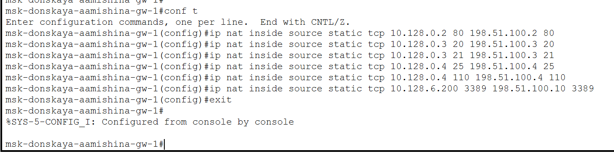{#fig:011 width=70%}

Добавим ноутбук на территории Интернета (рис. [-@fig:012]).

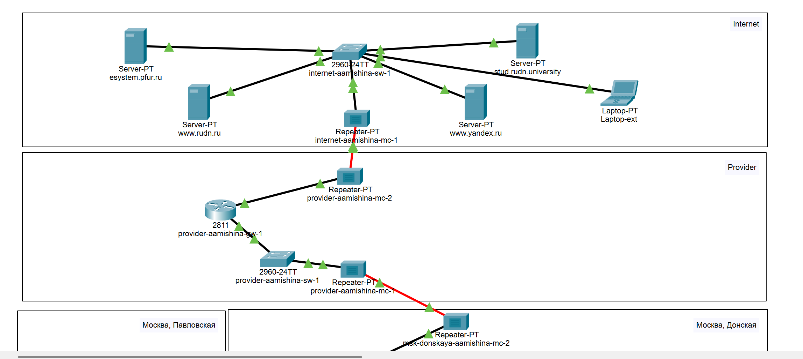{#fig:012 width=70%}

Проверим работоспособность соединения из сети Интернет в сеть Донской к web-серверу и файловому серверу по ftp (рис. [-@fig:013], [-@fig:014]).

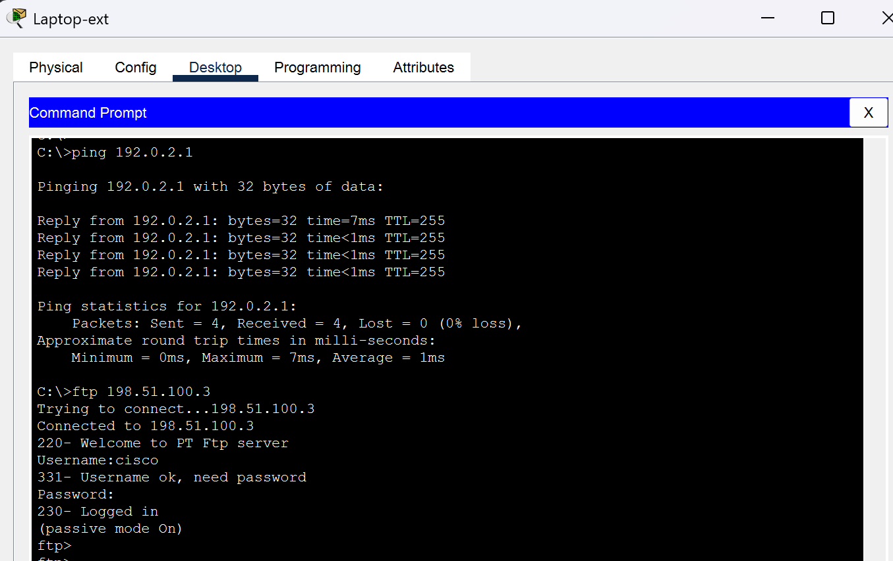{#fig:013 width=70%}

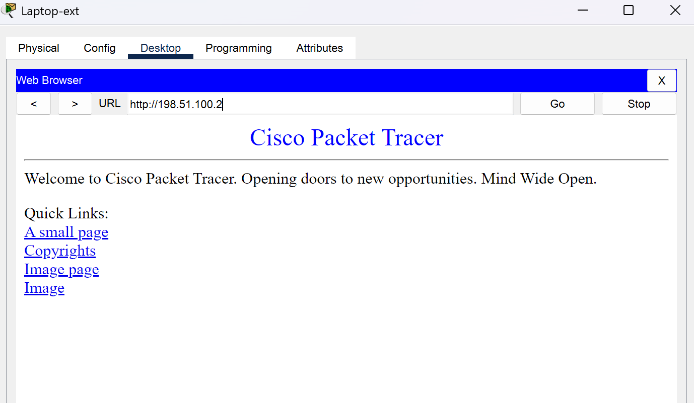{#fig:014 width=70%}

Проверим доступ к необходимым интернет-ресурсам конечных устройств сети. Убедимся, что устройствам доступны и недоступны заданные нами сайты (рис. [-@fig:015] - [-@fig:018]).

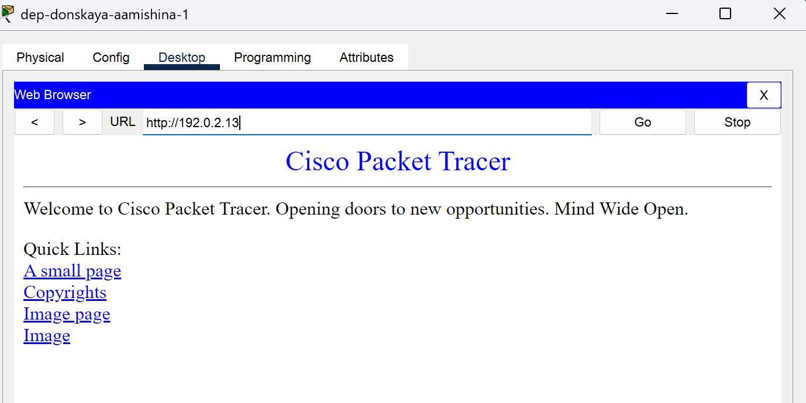{#fig:015 width=70%}

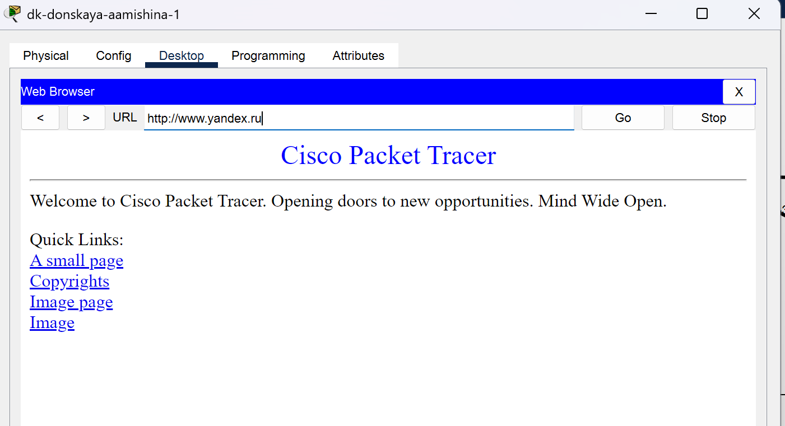{#fig:016 width=70%}

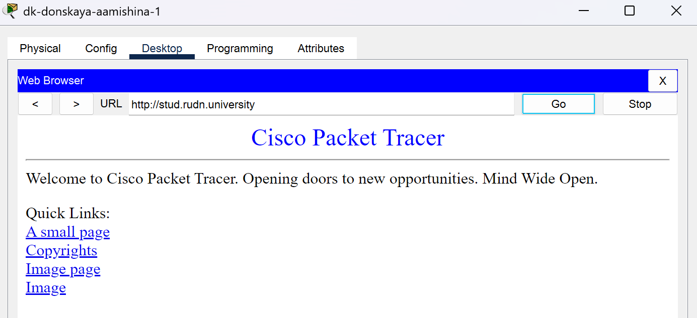{#fig:017 width=70%}

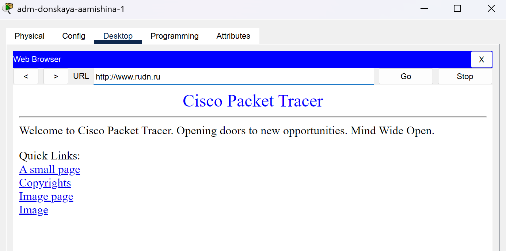{#fig:018 width=70%}

# Выводы

В результате выполнения данной лабораторной работы я приобрела практические навыки по настройке доступа локальной сети к внешней сети посредством NAT.

# Контрольные вопросы

1. В чём состоит основной принцип работы NAT (что даёт наличие NAT в сети
организации)?

Идея NAT заключается в том, чтобы осуществлять перевод частного локального IP-адреса в общедоступный глобальный IP-адрес и наоборот. Это необходимо для обеспечения доступа к Интернету локальным узлам, использующим частные адреса.

Наличие NAT в сети организации позволяет экономить публичные IP-адреса и повышать безопасность защитой внутренних устройств от прямого доступа извне.

2. В чём состоит принцип настройки NAT (на каком оборудовании и что
нужно настроить для из локальной сети во внешнюю сеть через NAT)?

Как правило, граничный маршрутизатор настроен для NAT, то есть маршрутизатор, который имеет один интерфейс в локальной (внутренней, inside) сети и один интерфейс в глобальной (внешней, outside) сети. Когда пакет проходит за пределы локальной (inside) сети, NAT преобразует локальный (частный, private) IP-адрес в глобальный (публичный, public) IP-адрес. Когда пакет входит в локальную сеть, глобальный (public) IP-адрес преобразуется в локальный (private) IP-адрес. Граничный маршрутизатор выступает в роли шлюза между внутренней корпоративной сетью и внешней сетью, например, Интернетом.

3. Можно ли применить Cisco IOS NAT к субинтерфейсам?

Да. Преобразования NAT источника или назначения могут применяться к любому интерфейсу или подинтерфейсу с
IP-адресом (включая интерфейсы программы набора номера).

4. Что такое пулы IP NAT?

Пул NAT — это набор из одного или нескольких общедоступных IPv4-адресов, которые используются в маршрутизаторе NAT.

При отправке трафика устройством из внутренней сети во внешнюю сеть маршрутизатор преобразует его внутренний IPv4-адрес в один из адресов, входящих в состав пула.

В результате действия такого механизма весь исходящий из сети трафик внешние устройства «видят» с общедоступным адресом IPv4, который можно назвать NAT IP-адресом.

5. Что такое статические преобразования NAT?

Статическое преобразование сетевых адресов (NAT) выполняет взаимно однозначное преобразование внутренних IP-адресов во внешние. Это позволяет преобразовать IP-адрес внутренней сети во внешний IP-адрес. Статический NAT позволяет устанавливать соединения как внутренним, так и внешним системам, например, хостам Internet.

# Список литературы{.unnumbered}

::: {#refs}
:::
