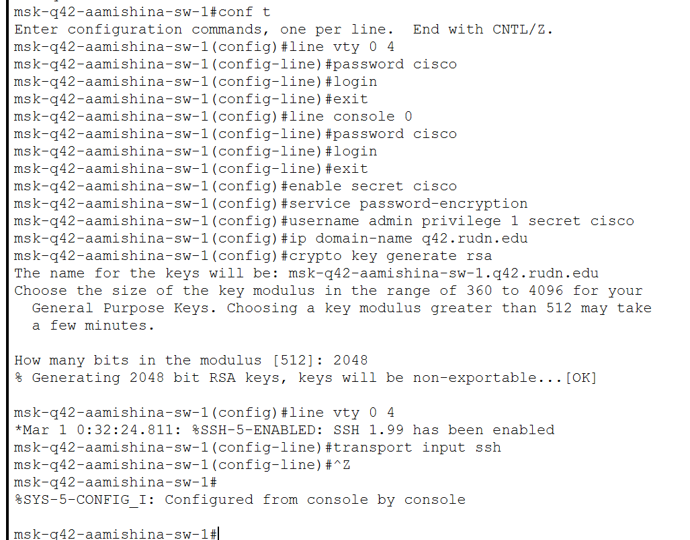

---
## Front matter
lang: ru-RU
title: Лабораторная работа №13
subtitle: Администрирование локальных сетей
author:
  - Мишина А. А.
date: 07 мая 2025

## i18n babel
babel-lang: russian
babel-otherlangs: english

## Formatting pdf
toc: false
toc-title: Содержание
slide_level: 2
aspectratio: 169
section-titles: true
theme: metropolis
header-includes:
 - \metroset{progressbar=frametitle,sectionpage=progressbar,numbering=fraction}
---

## Докладчик

:::::::::::::: {.columns align=center}
::: {.column width="70%"}

  * Мишина Анастасия Алексеевна
  * НПИбд-02-22
  * <https://github.com/nasmi32>

:::
::: {.column width="30%"}

:::
::::::::::::::

## Цель работы

- Провести подготовительные мероприятия по организации взаимодействия через сеть провайдера посредством статической маршрутизации локальной сети с сетью основного здания, расположенного в 42-м квартале в Москве, и сетью филиала, расположенного в г. Сочи.

## Задание

1. Внести изменения в схемы L1, L2 и L3 сети, добавив в них информацию о сети основной территории (42-й квартал в Москве) и сети филиала в г. Сочи.
2. Дополнить схему проекта, добавив подсеть основной территории организации 42-го квартала в Москве и подсеть филиала в г. Сочи.
3. Сделать первоначальную настройку добавленного в проект оборудования.
4. При выполнении работы необходимо учитывать соглашение об именовании.

# Выполнение лабораторной работы

## Изменения в схемах

{#fig:001 width=40%}

## Изменения в схемах

{#fig:002 width=40%}

## Изменения в схемах

{#fig:003 width=60%}

## Схема проекта

{#fig:004 width=80%}

## Замена модулей

{#fig:005 width=40%}

## Добавление интерфейса

{#fig:006 width=40%}

## Физическая область

{#fig:007 width=80%}

## Физическая область

{#fig:008 width=80%}

## Физическая область

{#fig:009 width=80%}

## Физическая область

{#fig:010 width=80%}

## Соединение

{#fig:011 width=80%}

## Первоначальная настройка

{#fig:012 width=50%}

## Первоначальная настройка

{#fig:013 width=60%}

## Первоначальная настройка

{#fig:014 width=50%}

## Первоначальная настройка

{#fig:015 width=40%}

## Первоначальная настройка

{#fig:016 width=40%}

## Первоначальная настройка

{#fig:017 width=40%}

## Выводы

- В процессе выполнения лабораторной работы я провела подготовительные мероприятия по организации взаимодействия через сеть провайдера посредством статической маршрутизации локальной сети с сетью основного здания, расположенного в 42-м квартале в Москве, и сетью филиала, расположенного в г. Сочи.