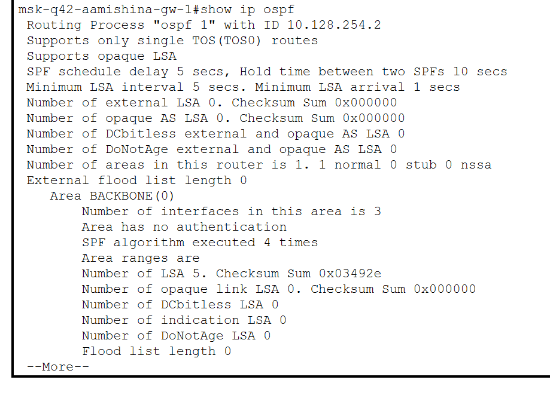

---
## Front matter
lang: ru-RU
title: Лабораторная работа №15
subtitle: Администрирование локальных сетей
author:
  - Мишина А. А.
date: 22 мая 2025

## i18n babel
babel-lang: russian
babel-otherlangs: english

## Formatting pdf
toc: false
toc-title: Содержание
slide_level: 2
aspectratio: 169
section-titles: true
theme: metropolis
header-includes:
 - \metroset{progressbar=frametitle,sectionpage=progressbar,numbering=fraction}
---

## Докладчик

:::::::::::::: {.columns align=center}
::: {.column width="70%"}

  * Мишина Анастасия Алексеевна
  * НПИбд-02-22
  * <https://github.com/nasmi32>

:::
::: {.column width="30%"}

:::
::::::::::::::

## Цель работы

- Настроить динамическую маршрутизацию между территориями организации.

## Задание

1. Настроить динамическую маршрутизацию по протоколу OSPF на маршрутизаторах msk-donskaya-gw-1, msk-q42-gw-1, msk-hostel-gw-1, sch-sochi-gw-1.
2. Настроить связь сети квартала 42 в Москве с сетью филиала в г. Сочи напрямую.
3. В режиме симуляции отследить движение пакета ICMP с ноутбука администратора сети на Донской в Москве (Laptop-PT admin) до компьютера пользователя в филиале в г. Сочи pc-sochi-1.
4. На коммутаторе провайдера отключить временно vlan 6 и в режиме симуляции убедиться в изменении маршрута прохождения пакета ICMP с ноутбука администратора сети на Донской в Москве (Laptop-PT admin) до компьютера пользователя в филиале в г. Сочи pc-sochi-1.
5. На коммутаторе провайдера восстановить vlan 6 и в режиме симуляции убедиться в изменении маршрута прохождения пакета ICMP с ноутбука администратора сети на Донской в Москве (Laptop-PT admin) до компьютера пользователя в филиале в г. Сочи pc-sochi-1.

# Выполнение лабораторной работы

## Настройка OSPF

{#fig:001 width=70%}

## Проверка

{#fig:002 width=70%}

## Проверка

{#fig:003 width=50%}

## Настройка OSPF

{#fig:004 width=70%}

## Настройка OSPF

{#fig:005 width=70%}

## Настройка OSPF

{#fig:006 width=70%}

## Проверка

{#fig:007 width=70%}

## Проверка

{#fig:008 width=60%}

## Проверка

{#fig:009 width=50%}

## Проверка

{#fig:010 width=50%}

## Проверка

{#fig:011 width=50%}

## Проверка

{#fig:012 width=50%}

## Проверка

{#fig:013 width=50%}

## Настройка линка 42-й квартал–Сочи

{#fig:014 width=70%}

## Настройка линка 42-й квартал–Сочи

{#fig:015 width=70%}

## Настройка линка 42-й квартал–Сочи

{#fig:016 width=70%}

## Настройка линка 42-й квартал–Сочи

{#fig:017 width=70%}

## Проверка настроек

{#fig:018 width=50%}

## Проверка настроек

{#fig:019 width=70%}

## Проверка настроек

{#fig:020 width=35%}

## Проверка настроек

{#fig:021 width=70%}

## Выводы

- В результате выполнения данной лабораторной работы я приобрела практические навыки по настройке динамической маршрутизации между территориями организации.