---
## Front matter
lang: ru-RU
title: Лабораторная работа №16
subtitle: Администрирование локальных сетей
author:
  - Мишина А. А.
date: 28 мая 2025

## i18n babel
babel-lang: russian
babel-otherlangs: english

## Formatting pdf
toc: false
toc-title: Содержание
slide_level: 2
aspectratio: 169
section-titles: true
theme: metropolis
header-includes:
 - \metroset{progressbar=frametitle,sectionpage=progressbar,numbering=fraction}
---

## Докладчик

:::::::::::::: {.columns align=center}
::: {.column width="70%"}

  * Мишина Анастасия Алексеевна
  * НПИбд-02-22
  * <https://github.com/nasmi32>

:::
::: {.column width="30%"}

:::
::::::::::::::

## Цель работы

- Получить навыки настройки VPN-туннеля через незащищённое Интернет-соединение.

## Задание

1. Разместить в рабочей области проекта в соответствии с модельными предположениями оборудование для сети Университета г. Пиза.
2. В физической рабочей области проекта создать город Пиза, здание Университета г. Пиза. Переместить туда соответствующее оборудование.
3. Сделать первоначальную настройку и настройку интерфейсов оборудования сети Университета г. Пиза.
4. Настроить VPN на основе протокола GRE.
5. Проверить доступность узлов сети Университета г. Пиза с ноутбука администратора сети «Донская».

# Выполнение лабораторной работы

## Медиаконвертер

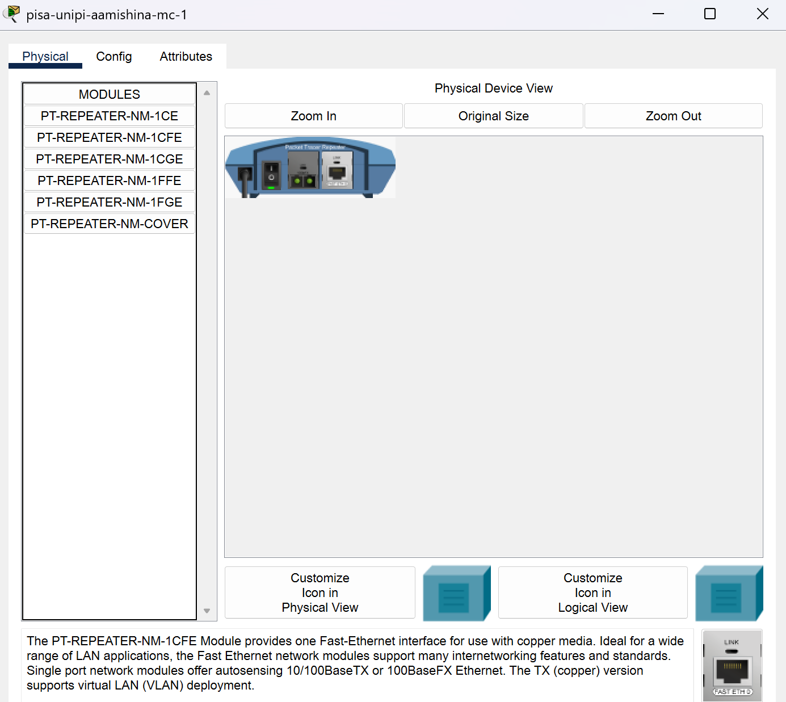{#fig:001 width=50%}

## Логическая область cisco

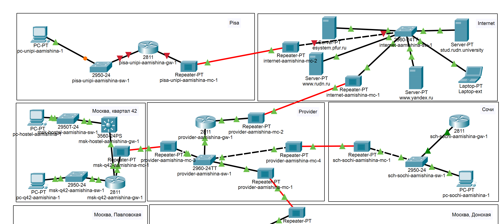{#fig:002 width=70%}

## Физическая область cisco

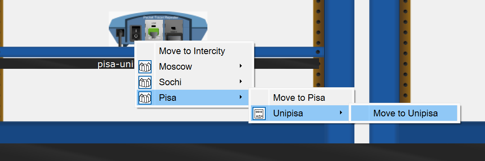{#fig:003 width=70%}

## Физическая область cisco

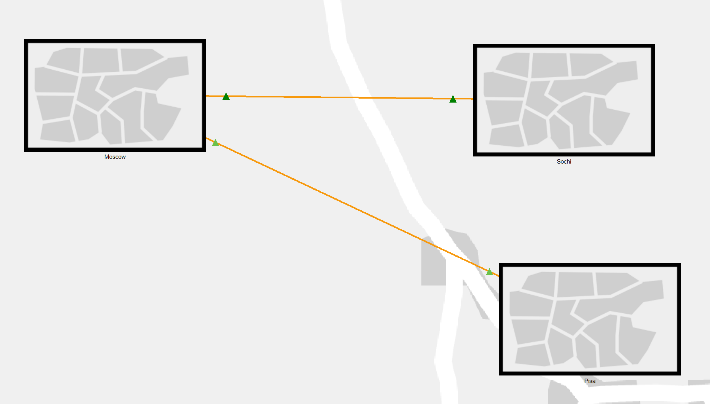{#fig:004 width=70%}

## Первоначальная настройка

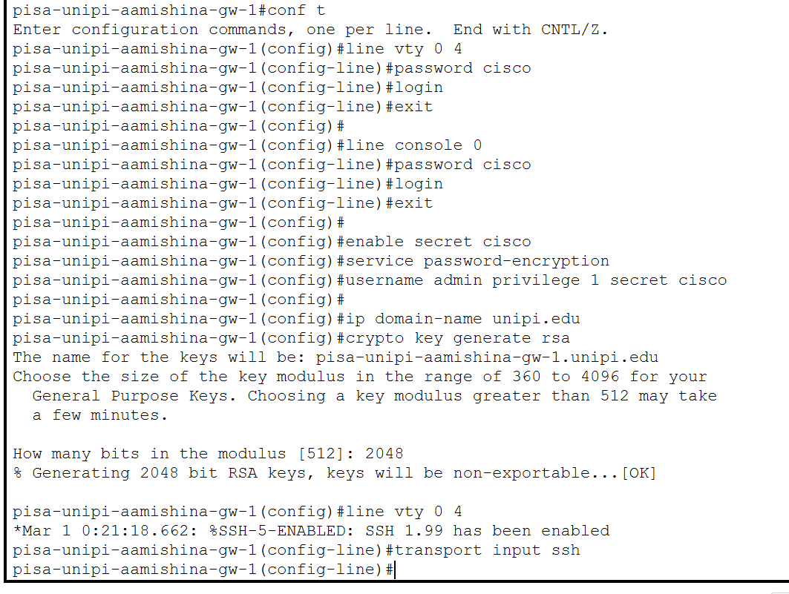{#fig:005 width=50%}

## Первоначальная настройка

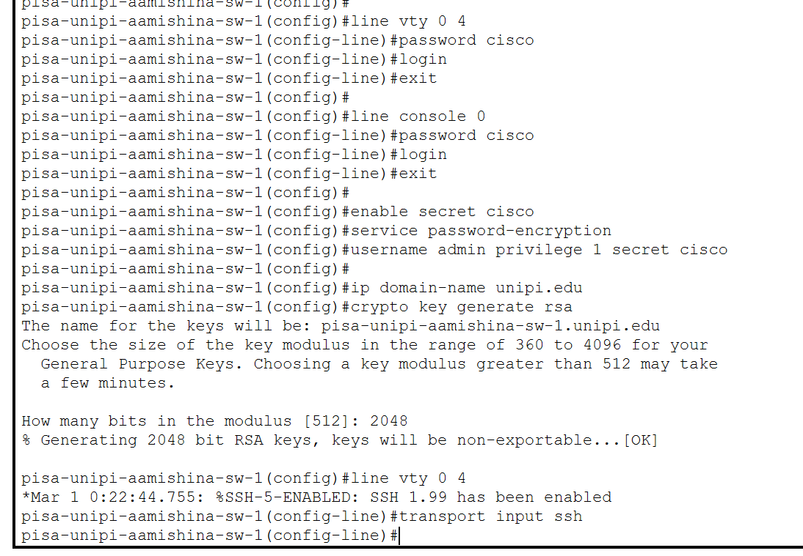{#fig:006 width=70%}

## Настройка интерфейсов

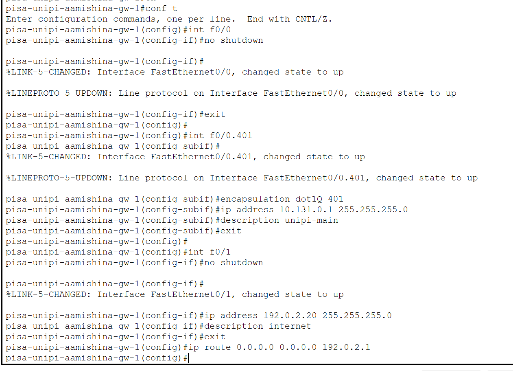{#fig:007 width=60%}

## Настройка интерфейсов

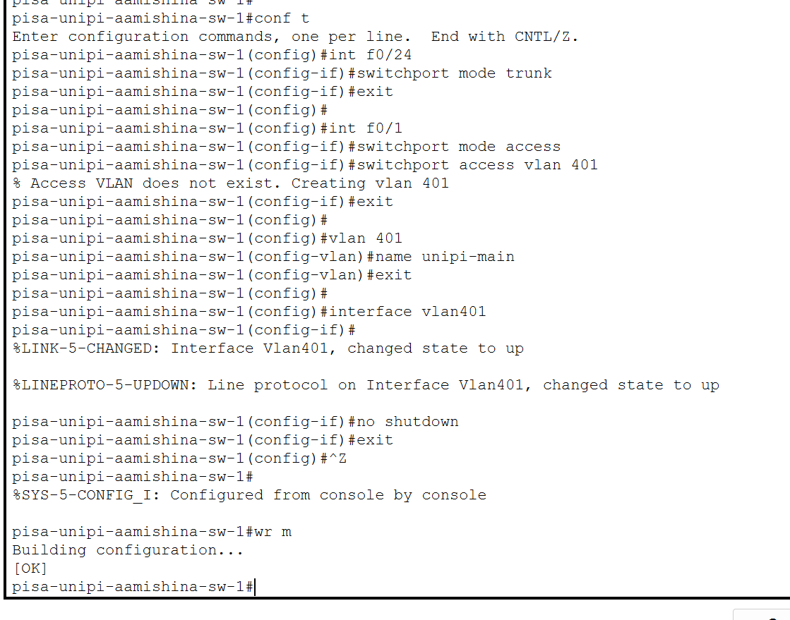{#fig:008 width=50%}

## Проверка

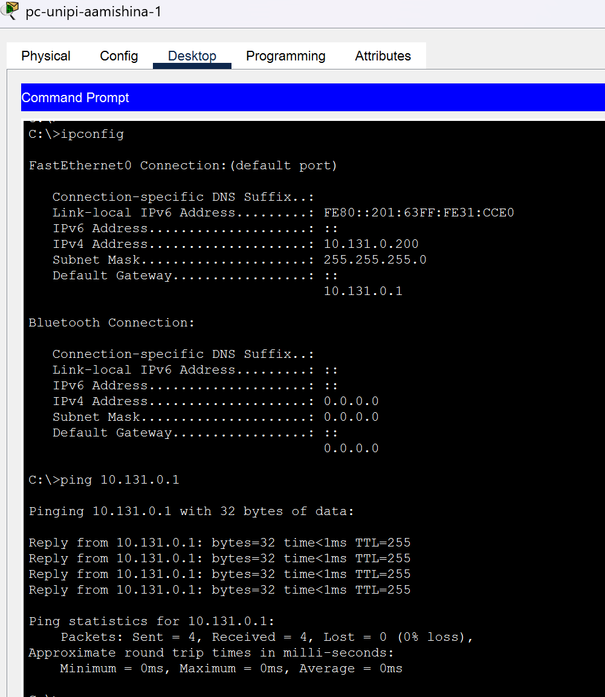{#fig:009 width=40%}

## Настройка VPN на основе GRE

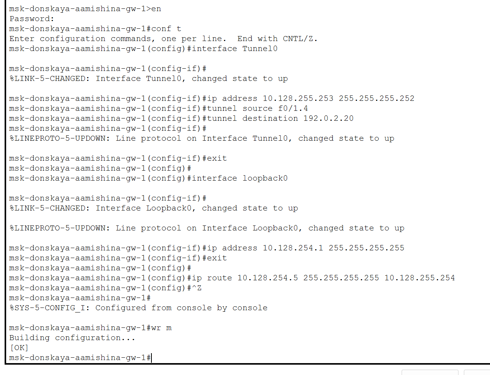{#fig:010 width=50%}

## Настройка VPN на основе GRE

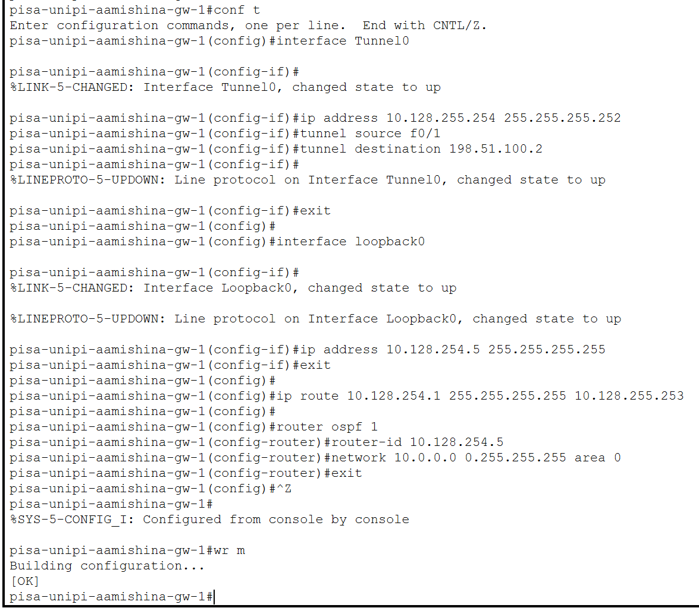{#fig:011 width=50%}

## Проверка

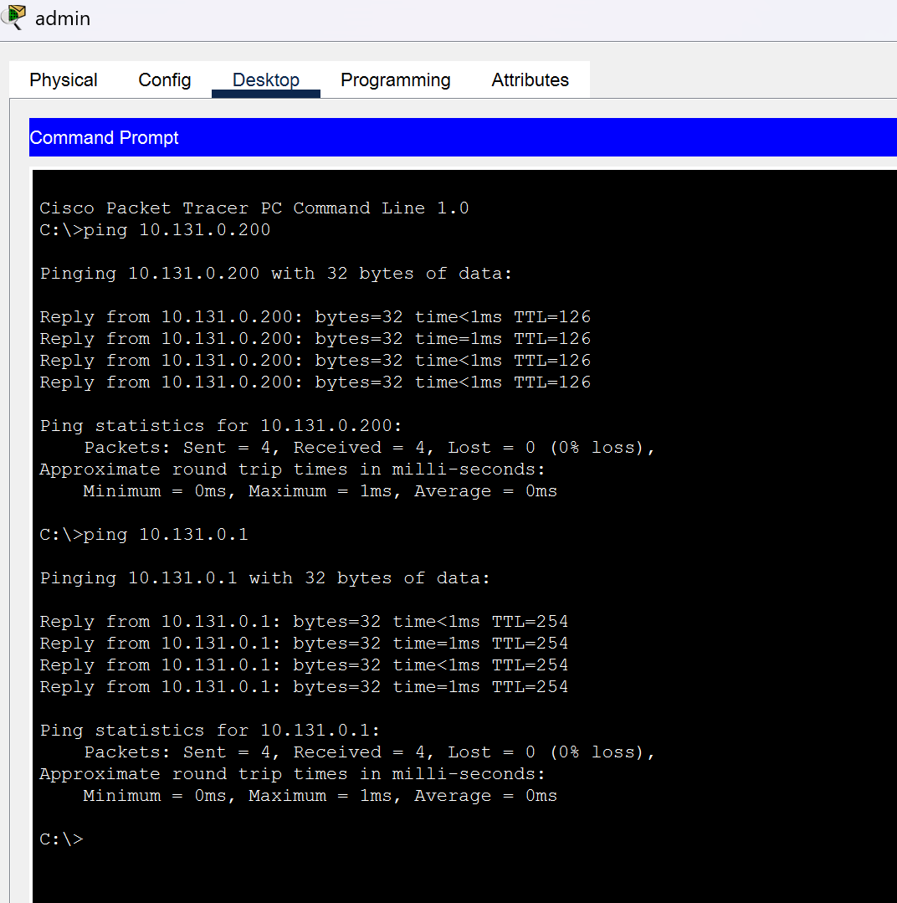{#fig:012 width=45%}

## Выводы

- В результате выполнения данной лабораторной работы я получила навыки настройки VPN-туннеля через незащищённое Интернет-соединение.