---
## Front matter
title: "Лабораторная работа №16"
subtitle: "Дисциплина: Администрирование локальных сетей"
author: "Мишина Анастасия Алексеевна"

## Generic otions
lang: ru-RU
toc-title: "Содержание"

## Bibliography
bibliography: bib/cite.bib
csl: pandoc/csl/gost-r-7-0-5-2008-numeric.csl

## Pdf output format
toc: true # Table of contents
toc-depth: 2
lof: true # List of figures
lot: true # List of tables
fontsize: 12pt
linestretch: 1.5
papersize: a4
documentclass: scrreprt
## I18n polyglossia
polyglossia-lang:
  name: russian
  options:
	- spelling=modern
	- babelshorthands=true
polyglossia-otherlangs:
  name: english
## I18n babel
babel-lang: russian
babel-otherlangs: english
## Fonts
mainfont: IBM Plex Serif
romanfont: IBM Plex Serif
sansfont: IBM Plex Sans
monofont: IBM Plex Mono
mathfont: STIX Two Math
mainfontoptions: Ligatures=Common,Ligatures=TeX,Scale=0.94
romanfontoptions: Ligatures=Common,Ligatures=TeX,Scale=0.94
sansfontoptions: Ligatures=Common,Ligatures=TeX,Scale=MatchLowercase,Scale=0.94
monofontoptions: Scale=MatchLowercase,Scale=0.94,FakeStretch=0.9
mathfontoptions:
## Biblatex
biblatex: true
biblio-style: "gost-numeric"
biblatexoptions:
  - parentracker=true
  - backend=biber
  - hyperref=auto
  - language=auto
  - autolang=other*
  - citestyle=gost-numeric
## Pandoc-crossref LaTeX customization
figureTitle: "Рис."
tableTitle: "Таблица"
listingTitle: "Листинг"
lofTitle: "Список иллюстраций"
lotTitle: "Список таблиц"
lolTitle: "Листинги"
## Misc options
indent: true
header-includes:
  - \usepackage{indentfirst}
  - \usepackage{float} # keep figures where there are in the text
  - \floatplacement{figure}{H} # keep figures where there are in the text
---

# Цель работы

Получить навыки настройки VPN-туннеля через незащищённое Интернет-соединение [@netadmin].

# Задание

1. Разместить в рабочей области проекта в соответствии с модельными предположениями оборудование для сети Университета г. Пиза.
2. В физической рабочей области проекта создать город Пиза, здание Университета г. Пиза. Переместить туда соответствующее оборудование.
3. Сделать первоначальную настройку и настройку интерфейсов оборудования сети Университета г. Пиза.
4. Настроить VPN на основе протокола GRE.
5. Проверить доступность узлов сети Университета г. Пиза с ноутбука администратора сети «Донская».

# Выполнение лабораторной работы

Виртуальная частная сеть (Virtual Private Network, VPN) — технология,
обеспечивающая одно или несколько сетевых соединений поверх другой сети
(например, Интернет).

Сеть Университета г. Пиза (Италия) содержит маршрутизатор Cisco 2811
pisa-inipi-gw-1, коммутатор Cisco 2950 pisa-unipi-sw-1 и оконечное устройство PC pc-unipi-1.

Разместим эти устройства в рабочей области, заменим у медиаконвертеров имеющиеся модули на PT-REPEATERNM-1FFE и PT-REPEATER-NM-1CFE для подключения витой пары по технологии Fast Ethernet и оптоволокна соответственно (рис. [-@fig:001]).

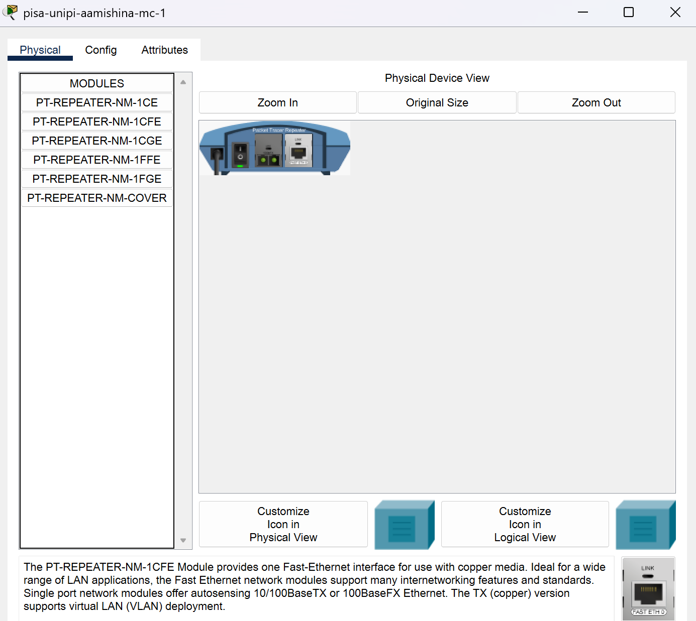{#fig:001 width=70%}

Назовем устройства, выполняя соглашение об именовании, а также соединим устройства (рис. [-@fig:002]).

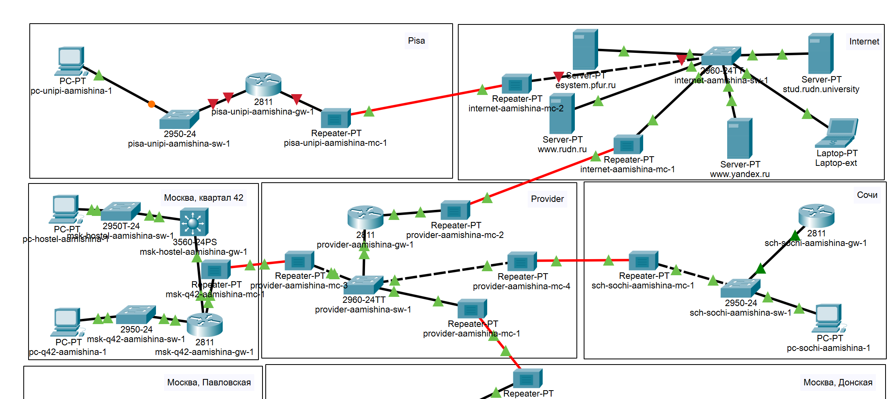{#fig:002 width=70%}

В физической рабочей области проекта создадим город Пиза, здание Университета г. Пиза и переместим туда соответствующее оборудование (рис. [-@fig:003],[-@fig:004]). 

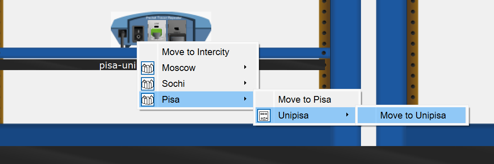{#fig:003 width=70%}

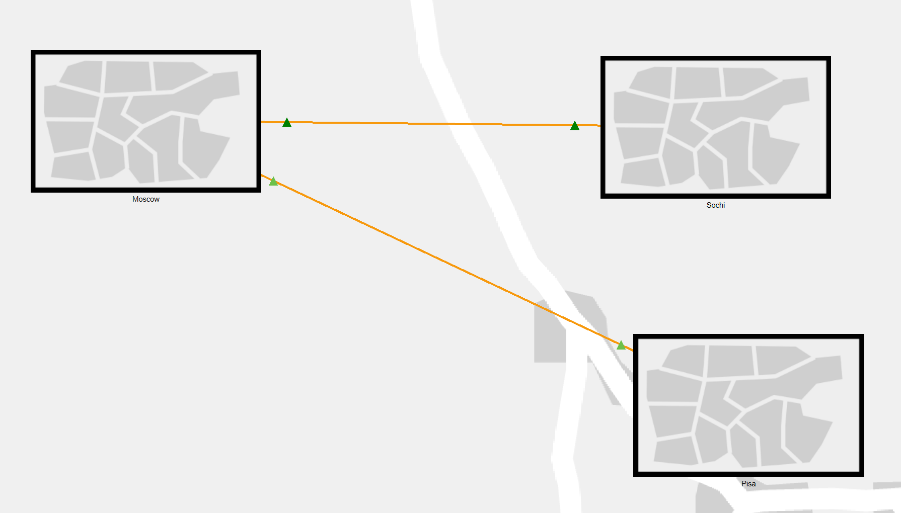{#fig:004 width=70%}

Выполним первоначальную настройку маршрутизатора pisa-unipi-gw-1 (рис. [-@fig:005]). Зададим имя, установим доступ по паролю и оставим доступ по ssh.

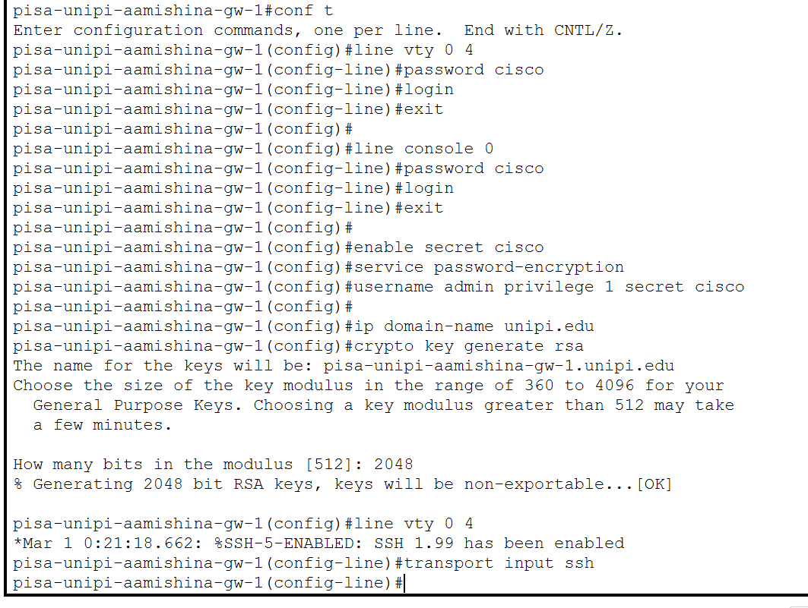{#fig:005 width=70%}

Выполним первоначальную настройку коммутатора pisa-unipi-sw-1 (рис. [-@fig:006]). Зададим имя, установим доступ по паролю и оставим доступ по ssh.

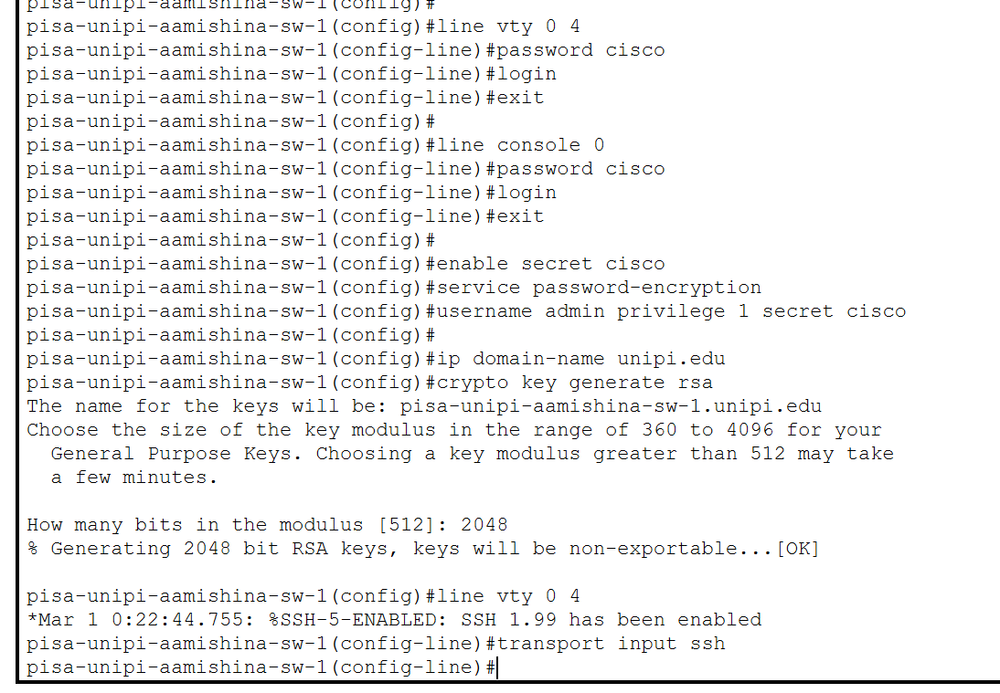{#fig:006 width=70%}

Выполним настройку интерфейсов маршрутизатора pisa-unipi-gw-1 (рис. [-@fig:007]).

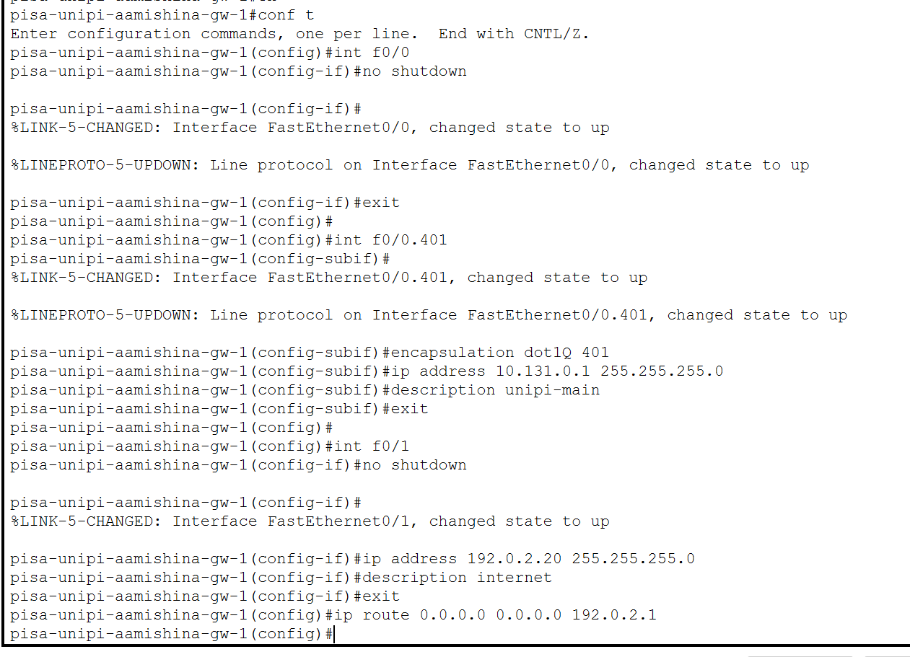{#fig:007 width=70%}

Выполним настройку интерфейсов коммутатора pisa-unipi-sw-1 (рис. [-@fig:008]).

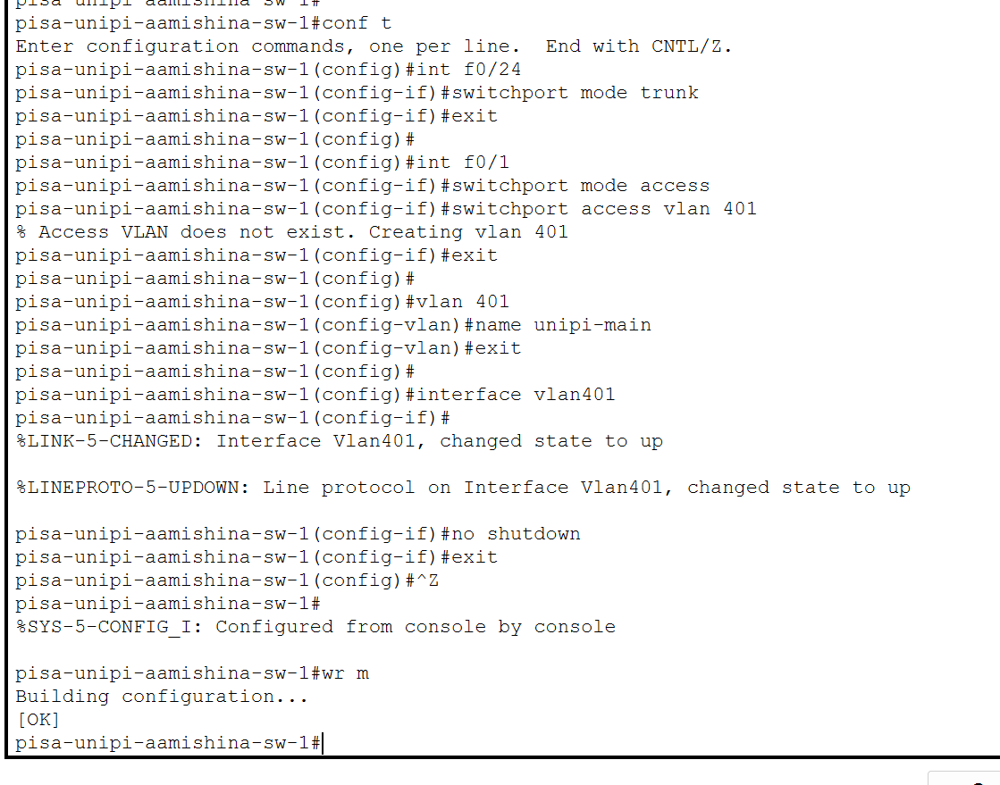{#fig:008 width=70%}

Зададим ПК в г. Пиза ip-адрес и пропингуем маршрутизатор, чтобы проверит работоспособность соединения (рис. [-@fig:009]). Пингование прошло успешно.

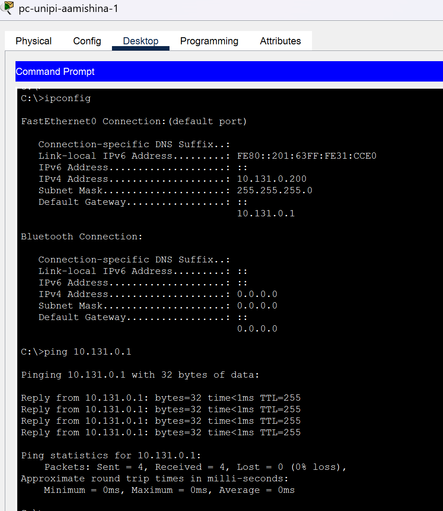{#fig:009 width=70%}

Выполним настройку VPN на основе GRE (рис. [-@fig:010],[-@fig:011]). Создадим интерфейс туннель, зададим ip-адрес, укажем начало и конец туннеля, также настроим интерфейс loopback.

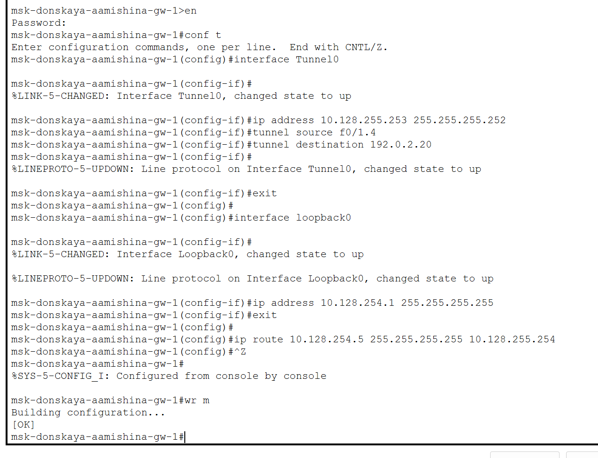{#fig:010 width=70%}

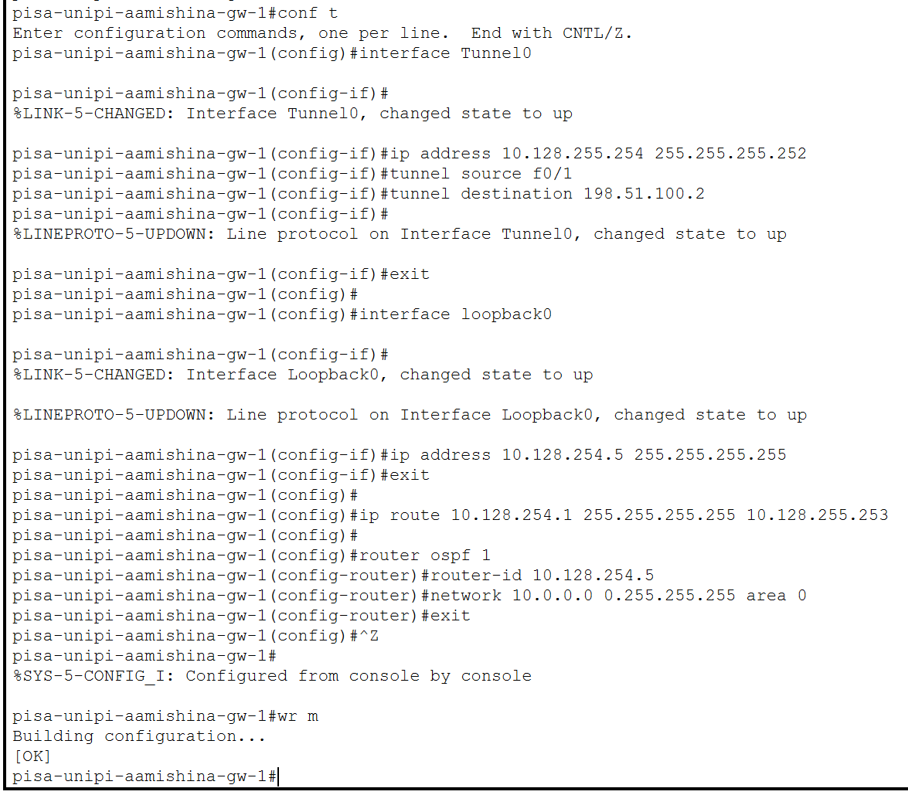{#fig:011 width=70%}

Проверим доступность узлов сети Университета г. Пиза с ноутбука администратора сети «Донская» (рис. [-@fig:012]). Пингование прошло успешно.

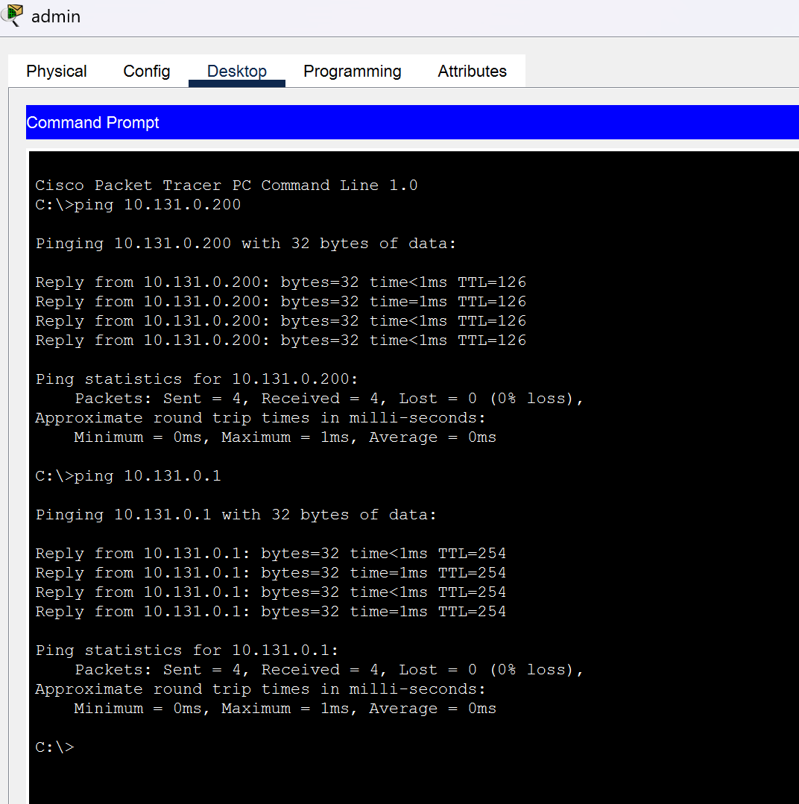{#fig:012 width=70%}

# Выводы

В результате выполнения данной лабораторной работы я получила навыки настройки VPN-туннеля через незащищённое Интернет-соединение.

# Контрольные вопросы

1. Что такое VPN?

Виртуальная частная сеть (Virtual Private Network, VPN) — технология, обеспечивающая одно или несколько сетевых соединений поверх другой сети (например, Интернет).

2. В каких случаях следует использовать VPN?

VPN шифрует интернет-трафик, защищая данные от хакеров и интернет-провайдеров, что особенно важно в общедоступных Wi-Fi сетях. Он скрывает реальный IP-адрес, предотвращая отслеживание местоположения и онлайн-активности.
VPN помогает обходить цензуру и географические ограничения, предоставляя доступ к заблокированным сайтам и региональному контенту. Он также незаменим для безопасной работы в корпоративных сетях, позволяя сотрудникам удаленно подключаться к корпоративным ресурсам и защищая корпоративные данные от несанкционированного доступа.
VPN защищает от атак типа «человек посередине» и блокирует вредоносные веб-сайты и фишинговые атаки. Он также позволяет экономить на покупках, предоставляя доступ к региональным ценам на товары и услуги в интернете.
Примеры использования VPN включают защиту личной информации в общедоступных Wi-Fi сетях, обход географических ограничений, безопасную удаленную работу и анонимный серфинг. В современном цифровом мире, где угрозы кибербезопасности и ограничения доступа становятся все более распространенными, VPN является мощным инструментом для обеспечения безопасности и конфиденциальности.

3. Как с помощью VPN обойти NAT?

Обход NAT с помощью VPN возможен благодаря тому, что VPN создает зашифрованное соединение между устройством пользователя и удаленным сервером, обходя при этом ограничения, налагаемые NAT. Это позволяет устройству пользователя обмениваться данными через интернет, игнорируя ограничения NAT.

# Список литературы{.unnumbered}

::: {#refs}
:::
