---
## Front matter
lang: ru-RU
title: Средство моделирования Mininet. Установка и пример моделирования. 
subtitle: Администрирование локальных сетей
author:
  - Мишина А. А.
date: 04 апреля 2025

## i18n babel
babel-lang: russian
babel-otherlangs: english

## Formatting pdf
toc: false
toc-title: Содержание
slide_level: 2
aspectratio: 169
section-titles: true
theme: metropolis
header-includes:
 - \metroset{progressbar=frametitle,sectionpage=progressbar,numbering=fraction}
---

## Докладчик

:::::::::::::: {.columns align=center}
::: {.column width="70%"}

  * Мишина Анастасия Алексеевна
  * НПИбд-02-22
  * <https://github.com/nasmi32>

:::
::: {.column width="30%"}


:::
::::::::::::::

## Введение

- Mininet – это виртуальная тестовая среда, предназначенная для разработки и тестирования сетевых инструментов и протоколов.

- Сети в Mininet создаются с помощью Python-скриптов.

- **Цель доклада:** разобраться с установкой Mininet на Windows, провести эксперимент.

# Установка и настройка Mininet

## Настройка образа Mininet

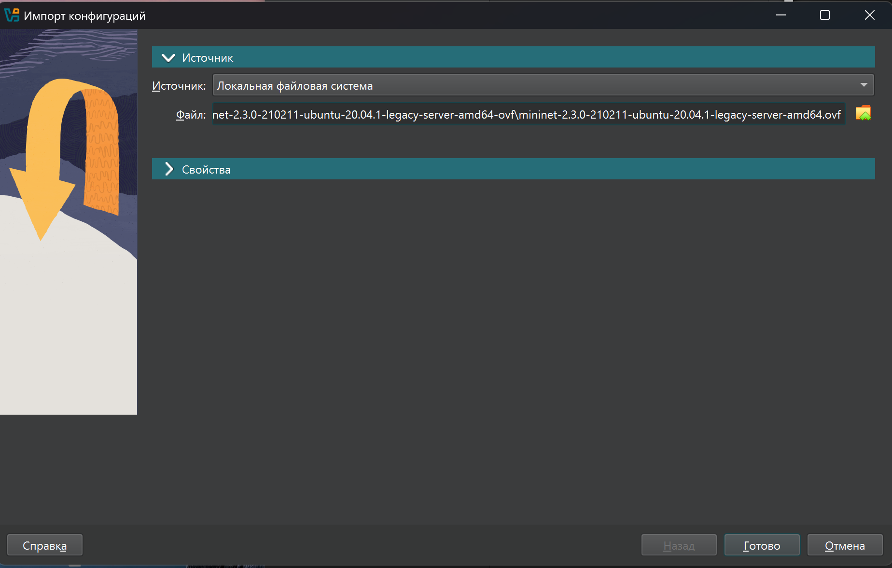{ #fig:001 width=60% }

## Настройка образа Mininet

:::::::::::::: {.columns align=center}
::: {.column width="50%"}

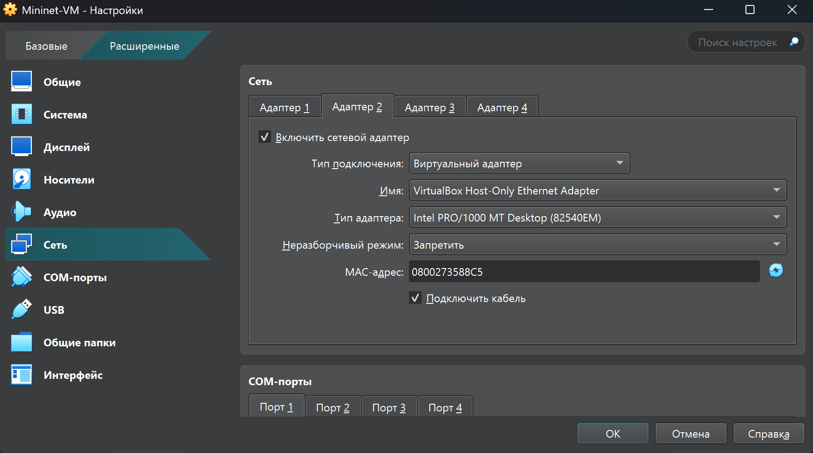{ #fig:002 width=100% }

:::
::: {.column width="50%"}

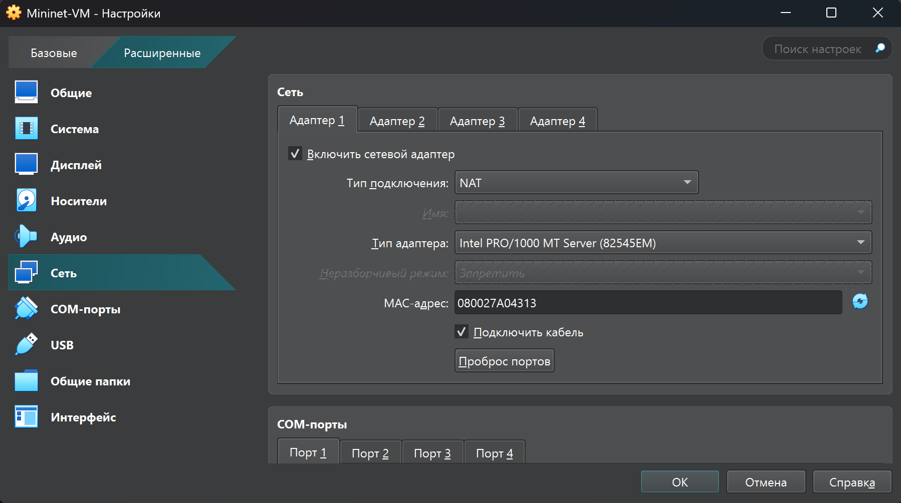{ #fig:003 width=100% }

:::
::::::::::::::

## Подключение к виртуальной машине

:::::::::::::: {.columns align=center}
::: {.column width="50%"}

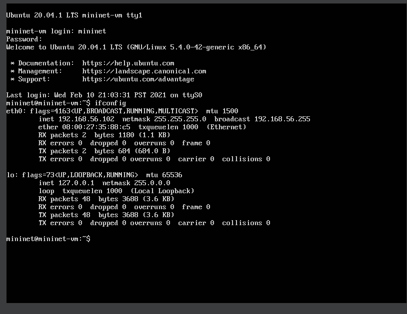{ #fig:004 width=100% }

:::
::: {.column width="50%"}

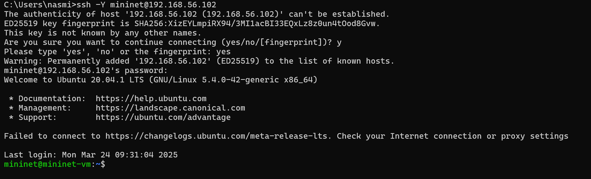{ #fig:005 width=100% }

:::
::::::::::::::

## Работа с Mininet из-под Windows

```bash
choco install vcxsrv
```

:::::::::::::: {.columns align=center}
::: {.column width="50%"}

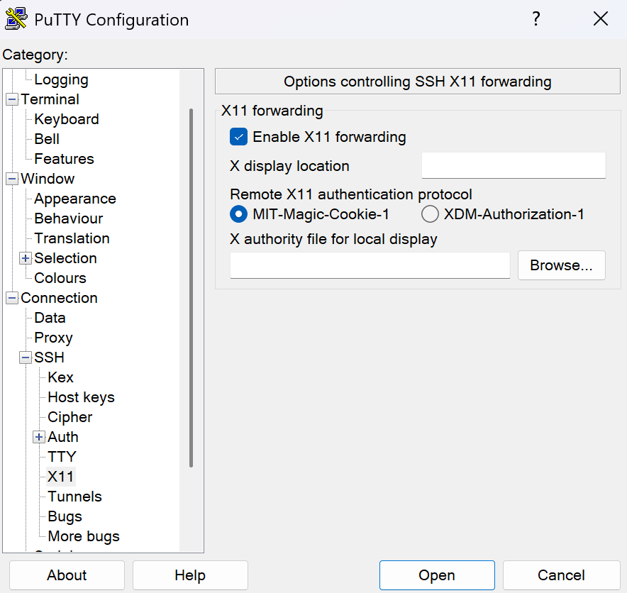{ #fig:006 width=85% }

:::
::: {.column width="50%"}

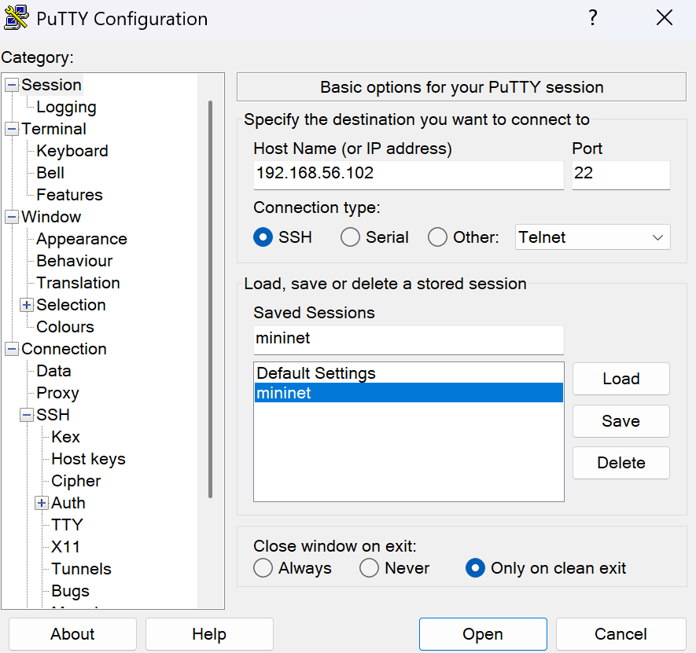{ #fig:007 width=85% }

:::
::::::::::::::

## Интернет

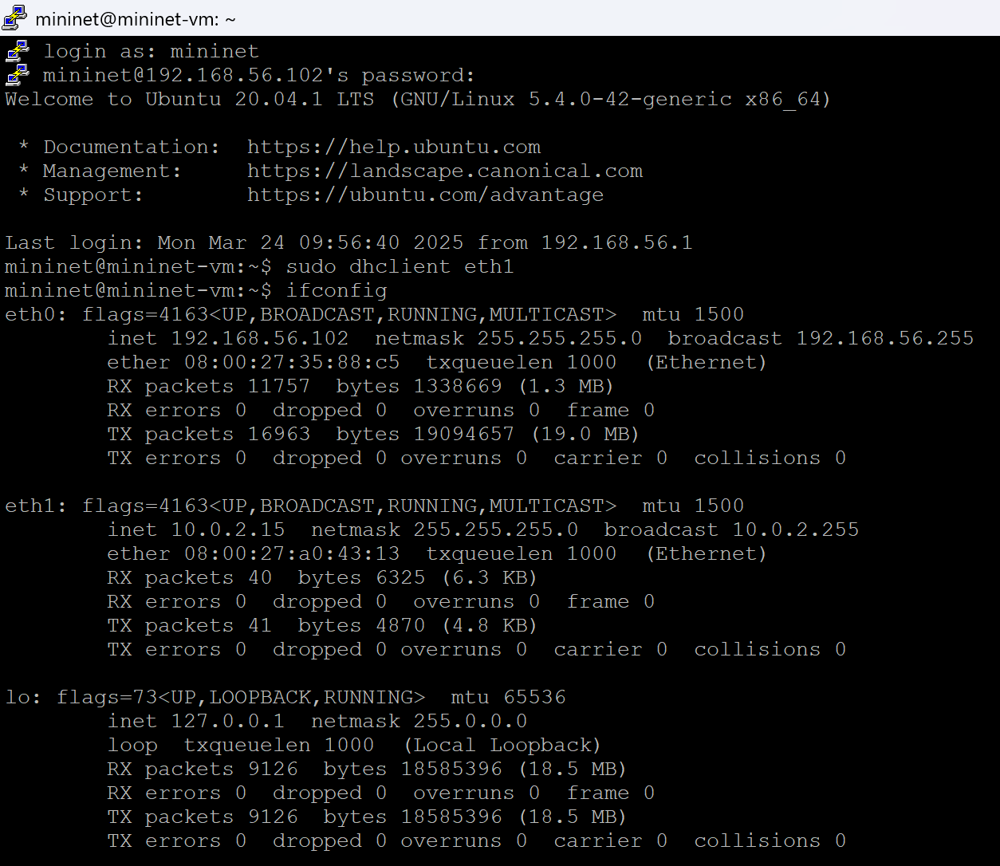{ #fig:008 width=50% }

## Основы Mininet

:::::::::::::: {.columns align=center}
::: {.column width="50%"}

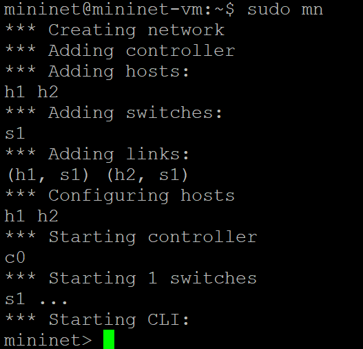{ #fig:009 width=90% }

:::
::: {.column width="50%"}

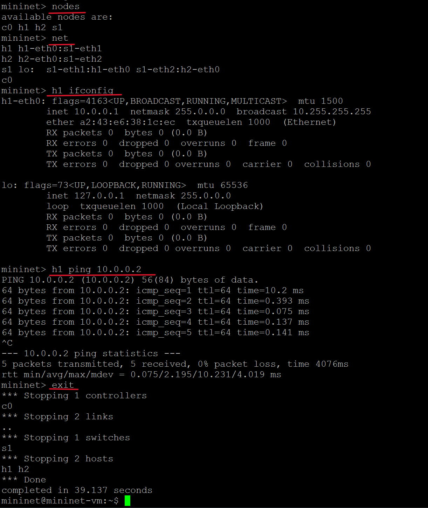{ #fig:010 width=80% }

:::
::::::::::::::

# Практическая часть

## Файл topology.py

```Python
net = Mininet(controller=Controller, waitConnected=True, link=TCLink)  

info('*** Adding hosts\n')
h1 = net.addHost('h1', ip='10.0.1.2/24', defaultRoute='via 10.0.1.1')
h2 = net.addHost('h2', ip='10.0.2.2/24', defaultRoute='via 10.0.2.1')

info('*** Adding router\n')
router = net.addHost('router', ip='10.0.1.1/24')

info('*** Creating links\n')
net.addLink(h1, router, intfName2='router-eth1',
params2={'ip': '10.0.1.1/24'}, bw=100, delay='10ms')
net.addLink(h2, router, intfName2='router-eth2',
params2={'ip': '10.0.2.1/24'}, bw=100, delay='10ms')
```

## Файл topology.py

```Python
info('*** Starting network\n')
net.start()

router.cmd('sysctl net.ipv4.ip_forward=1')

info('*** Starting iperf3 server on h2\n')
h2.cmd('iperf3 -s -D')
time.sleep(5)

info('*** h1 using iperf3\n')
h1.cmd(f'iperf3 -c {h2.IP()} -t 10 -l 1500 -J > iperf_result.json')

info('*** Stopping network\n')
net.stop()
```

## Графики

:::::::::::::: {.columns align=center}
::: {.column width="50%"}

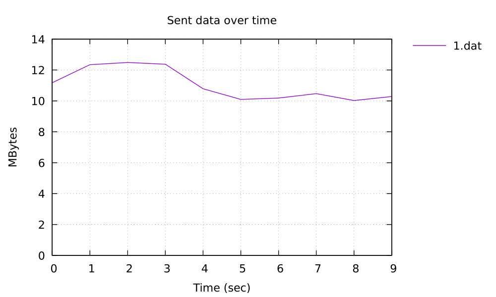{ #fig:011 width=100% }

:::
::: {.column width="50%"}

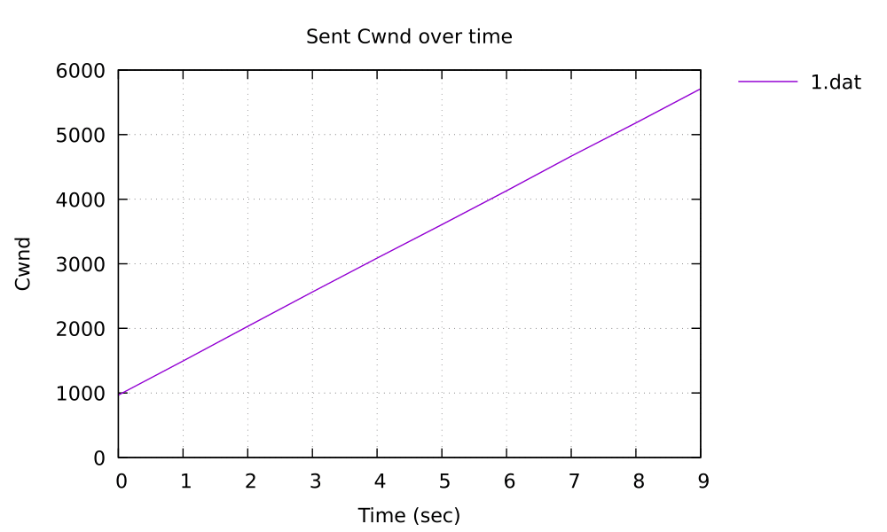{ #fig:012 width=100% }

:::
::::::::::::::

## Графики

:::::::::::::: {.columns align=center}
::: {.column width="50%"}

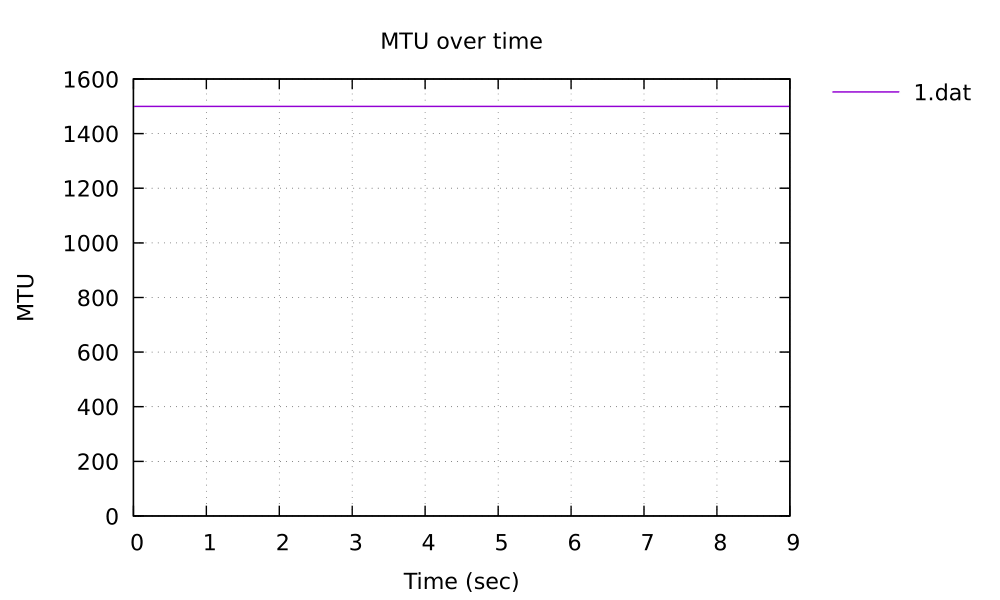{ #fig:013 width=100% }

:::
::: {.column width="50%"}

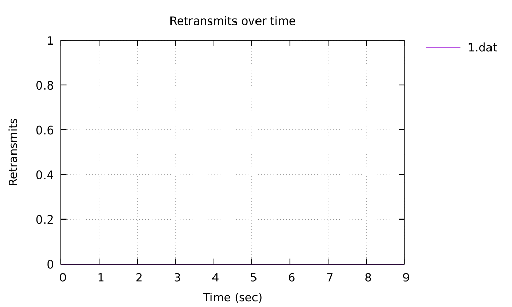{ #fig:014 width=100% }

:::
::::::::::::::

## Графики

:::::::::::::: {.columns align=center}
::: {.column width="50%"}

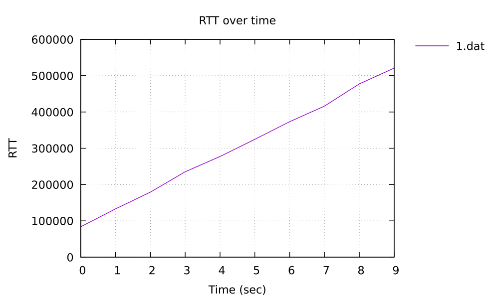{ #fig:015 width=100% }

:::
::: {.column width="50%"}

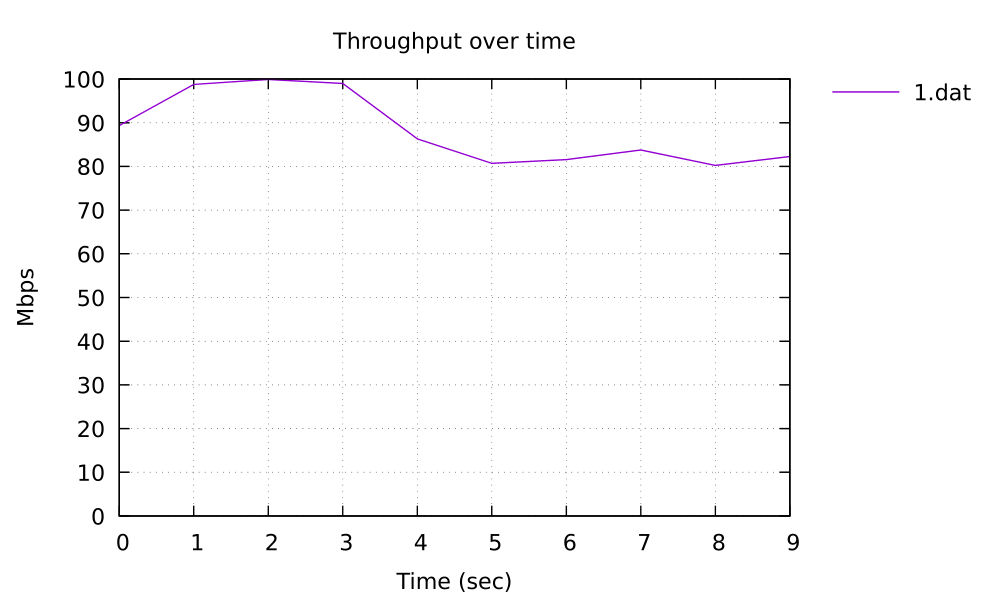{ #fig:016 width=100% }

:::
::::::::::::::

## Заключение

В ходе работы мы успешно развернули Mininet на платформе Windows и провели эксперимент по анализу пропускной способности сети.