---
## Front matter
title: "Доклад на тему: Средство моделирования Mininet. Установка и пример моделирования."
subtitle: "Дисциплина: Администрирование локальных сетей"
author: "Мищина Анастасия Алексеевна"

## Generic otions
lang: ru-RU
toc-title: "Содержание"

## Bibliography
bibliography: bib/cite.bib
csl: pandoc/csl/gost-r-7-0-5-2008-numeric.csl

## Pdf output format
toc: true # Table of contents
toc-depth: 2
lof: true # List of figures
lot: true # List of tables
fontsize: 12pt
linestretch: 1.5
papersize: a4
documentclass: scrreprt
## I18n polyglossia
polyglossia-lang:
  name: russian
  options:
	- spelling=modern
	- babelshorthands=true
polyglossia-otherlangs:
  name: english
## I18n babel
babel-lang: russian
babel-otherlangs: english
## Fonts
mainfont: IBM Plex Serif
romanfont: IBM Plex Serif
sansfont: IBM Plex Sans
monofont: IBM Plex Mono
mathfont: STIX Two Math
mainfontoptions: Ligatures=Common,Ligatures=TeX,Scale=0.94
romanfontoptions: Ligatures=Common,Ligatures=TeX,Scale=0.94
sansfontoptions: Ligatures=Common,Ligatures=TeX,Scale=MatchLowercase,Scale=0.94
monofontoptions: Scale=MatchLowercase,Scale=0.94,FakeStretch=0.9
mathfontoptions:
## Biblatex
biblatex: true
biblio-style: "gost-numeric"
biblatexoptions:
  - parentracker=true
  - backend=biber
  - hyperref=auto
  - language=auto
  - autolang=other*
  - citestyle=gost-numeric
## Pandoc-crossref LaTeX customization
figureTitle: "Рис."
tableTitle: "Таблица"
listingTitle: "Листинг"
lofTitle: "Список иллюстраций"
lotTitle: "Список таблиц"
lolTitle: "Листинги"
## Misc options
indent: true
header-includes:
  - \usepackage{indentfirst}
  - \usepackage{float} # keep figures where there are in the text
  - \floatplacement{figure}{H} # keep figures where there are in the text
---

# Введение

Mininet – это виртуальная тестовая среда, предназначенная для разработки и тестирования сетевых инструментов и протоколов. Всего одной командой Mininet позволяет создать реалистичную виртуальную сеть на любом типе машины (виртуальной машине, облачном сервере или физическом компьютере). Таким образом, он предоставляет недорогое и эффективное решение для разработки, работающее в условиях, приближенных к реальным сетевым окружениям [@mininet].

Mininet обладает следующими ключевыми возможностями:

- Быстрое прототипирование новых сетевых протоколов.
- Упрощённое тестирование сложных топологий без необходимости закупать дорогостоящее оборудование.
- Реалистичное выполнение, так как использует реальный код в ядрах Unix и Linux.
- Открытая среда с активным сообществом, предоставляющим обширную документацию.

Главное преимущество Mininet — его гибкость. Сети в Mininet создаются с помощью Python-скриптов, что позволяет легко настраивать топологию, параметры соединений и поведение узлов. Это делает Mininet идеальным инструментом для обучения, исследований и отладки сетевых решений.

В этом докладе мы разберём, как установить Mininet на Windows и провести небольшой практический эксперимент.

# Установка и настройка Mininet

## Настройка образа Mininet

Перейдем к настройке образа Mininet, который можно скачать по ссылке с официального сайта Mininet. Образ виртуальной машины, который мы используем, — это `mininet-2.3.0-210211-ubuntu-20.04.1-legacy-server-amd64-ovf`. Импортируем его в VirtualBox (рис. [-@fig:001]): "Файл" -> "Импорт конфигурации" и указываем путь к файлу `.ovf`. После импорта важно настроить сетевые параметры виртуальной машины: выбираем виртуальный адаптер хоста (рис. [-@fig:002]) и добавляем дополнительный сетевой адаптер типа **Host-only Network** (рис. [-@fig:003]). Второй адаптер позволит нам подключаться к виртуальной машине с хостовой системы (Windows) через SSH.

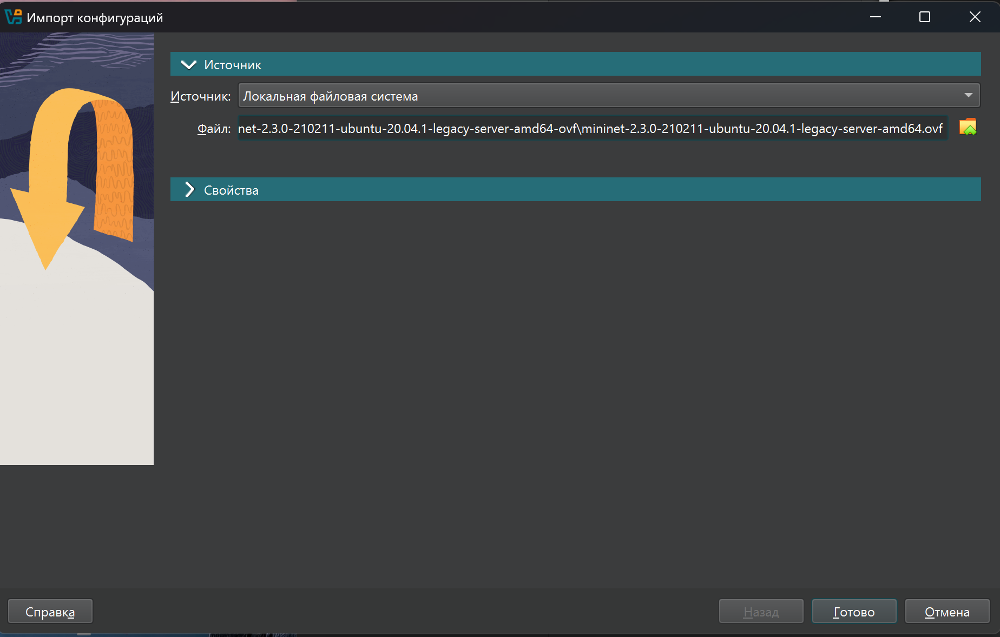{ #fig:001 width=60% }

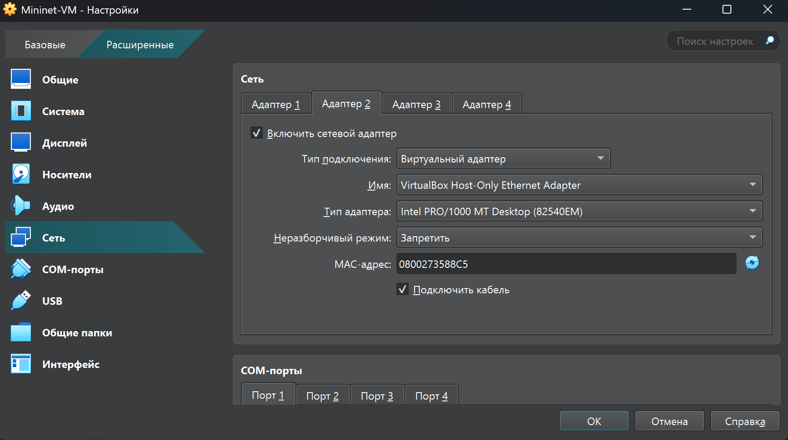{ #fig:002 width=60% }

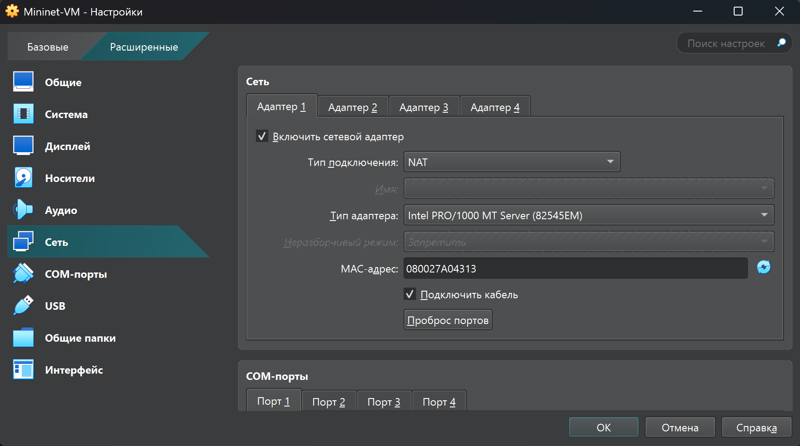{ #fig:003 width=60% }

## Подключение к виртуальной машине

После настройки VirtualBox запускаем виртуальную машину. При первом запуске система запросит логин и пароль. Используем стандартные учетные данные:

- Логин: `mininet`
- Пароль: `mininet`

После входа в систему необходимо определить IP-адрес виртуальной машины с помощью команды `ifconfig`. Внутренний адрес машины будет иметь вид `192.168.x.y`, в моем случае `192.168.56.102` (рис. [-@fig:004]). Этот адрес понадобится для подключения к виртуальной машине с хостовой системы.

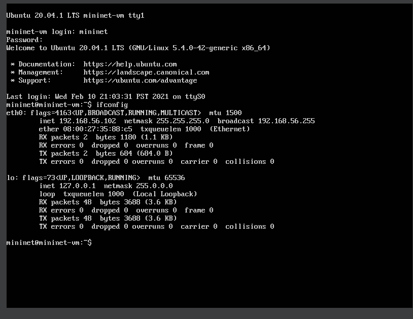{ #fig:004 width=60% }

Для удобства работы настроим SSH-подключение (рис. [-@fig:005]). С хостовой машины (Windows) открываем терминали и подключаемся к виртуальной машине с помощью команды:

```bash
ssh -Y mininet@192.168.x.y
```

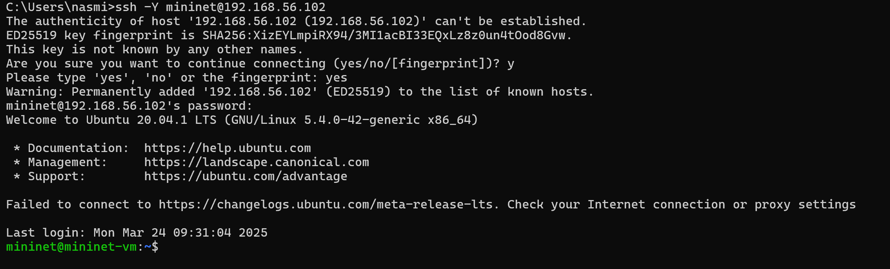{ #fig:005 width=60% }

## Настройка XTerm

Mininet активно использует графические приложения, такие как XTerm, для отображения терминалов виртуальных сетевых узлов. Однако по умолчанию XTerm использует растровые шрифты малого размера, что может затруднить чтение. Для улучшения читаемости перейдем на векторные шрифты и увеличим их размер.

Для этого редактируем файл конфигурации XTerm, который находится по пути `/etc/X11/app-defaults/XTerm`. Добавляем в него следующие строки:

```bash
xterm*faceName: Monospace
xterm*faceSize: 14
```

Здесь мы выбрали моноширинный шрифт с размером 14 пунктов. После сохранения изменений все новые окна XTerm будут использовать указанные настройки.

## Настройка X11 для суперпользователя

При попытке запуска графических приложений от имени суперпользователя (например, с использованием `sudo`) может возникнуть ошибка:

```
X11 connection rejected because of wrong authentication.
```

Эта ошибка связана с тем, что X-соединение устанавливается от имени пользователя `mininet`, а приложение запускается от имени `root`. Чтобы исправить эту проблему, необходимо скопировать значение куки (MIT magic cookie) из пользователя `mininet` в файл для пользователя `root`.

Для этого выполняем следующие шаги:

1. В терминале виртуальной машины выполняем команду:

   ```bash
   xauth list $DISPLAY
   ```

   Эта команда покажет значение куки для текущего сеанса.

2. Переходим в режим суперпользователя:

   ```bash
   sudo -i
   ```

3. Добавляем куку для пользователя `root`:

   ```bash
   xauth add mininet-vm/unix:10  MIT-MAGIC-COOKIE-1  <ваше_значение_куки>
   ```

После этого графические приложения запускаются без ошибок.

## Работа с Mininet из-под Windows

Для работы с Mininet на Windows необходимо установить X-сервер, который будет отображать графические приложения, запущенные на виртуальной машине. Одним из популярных вариантов является **VcXsrv Windows X Server**. Его можно установить через Chocolatey, выполнив команду:

```bash
choco install vcxsrv
```

После установки запускаем XLaunch и настраиваем его для работы с Mininet. Выбираем опции:

- Multiple windows;
- Display number: -1;
- Start no client.

Для подключения к виртуальной машине используем SSH-клиент, например, Putty. В настройках Putty включаем опцию "Enable X11 forwarding" в разделе "Connection" -> "SSH" -> "X11" (рис. [-@fig:006]). Запомним сессию mininet, где укажем ip-адрес, тип подкючения ssh (рис. [-@fig:007]). Это позволит перенаправлять графические приложения с виртуальной машины на хост.

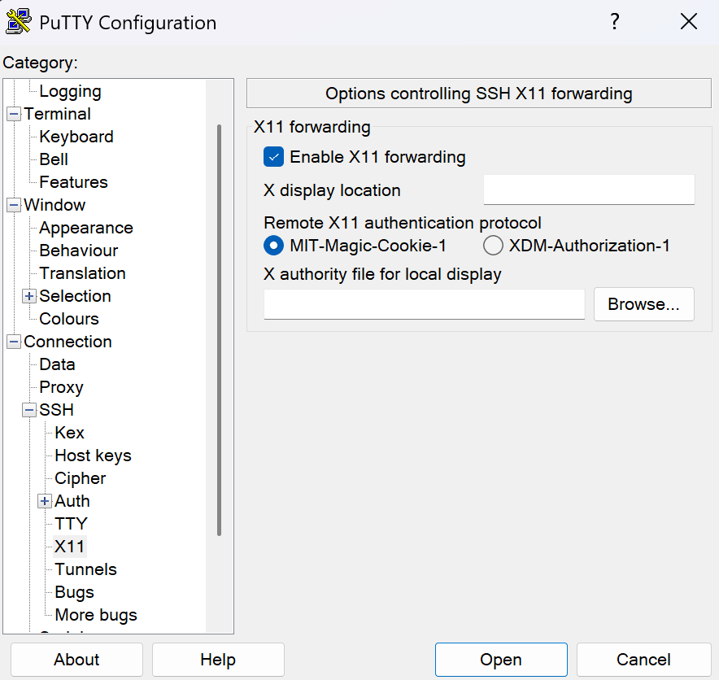{ #fig:006 width=60% }

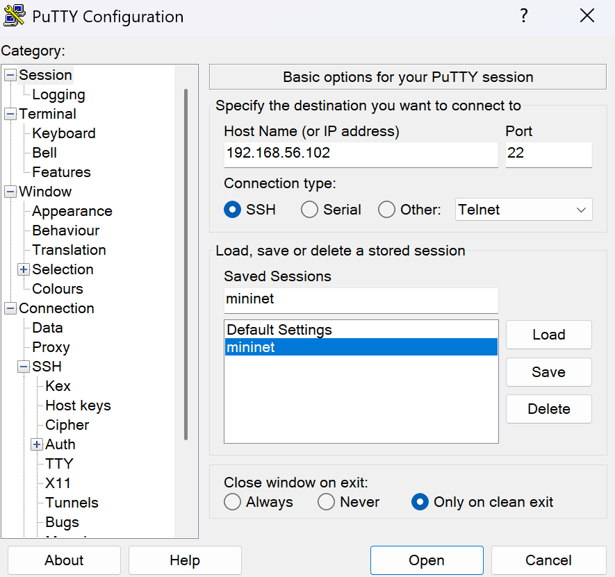{ #fig:007 width=60% }

Теперь настроим доступ к интернету на виртуальной машине. Активируем интерфейс NAT в виртуальной машине с помощью команды ```sudo dhclient eth1``` (рис. [-@fig:008]).

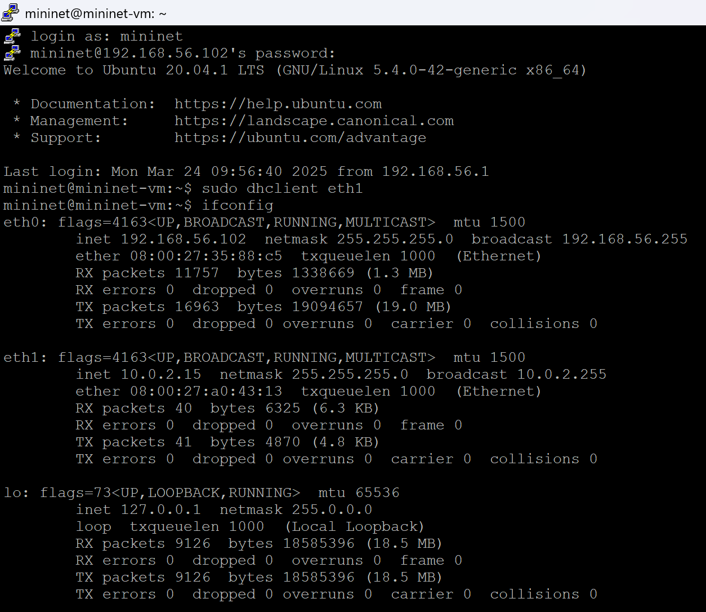{ #fig:008 width=60% }

# Основы Mininet

Чтобы запустить минимальную топологию, введем команду ```sudo mn```. Эта команда запускает Mininet с минимальной топологией, состоящей из коммутатора, подключенного к двум хостам (рис. [-@fig:009]).

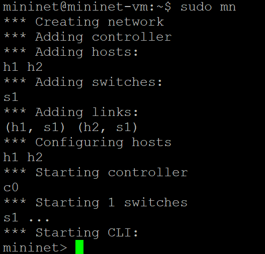{ #fig:009 width=60% }

Чтобы отобразить доступные узлы, введем команду: ```nodes``` (рис. [-@fig:010]).

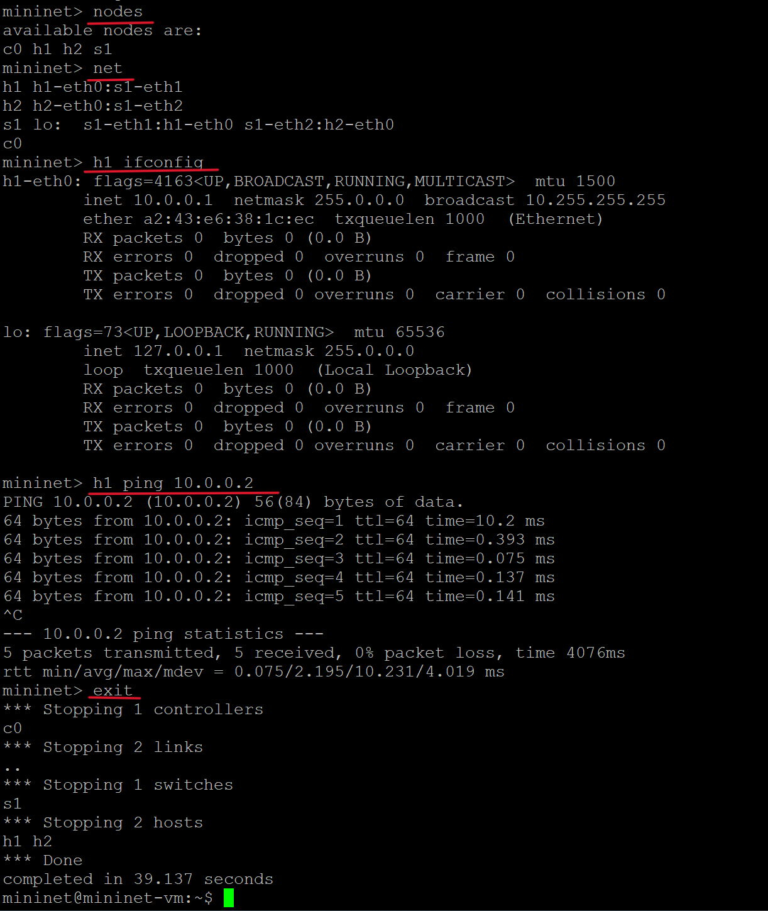{ #fig:010 width=60% }

Видим, что есть два хоста (хост h1 и хост h2) и коммутатор (s1).

Иногда бывает полезно отобразить связи между устройствами в Mininet, чтобы понять топологию. Введем команду net в интерфейсе командной строки Mininet, чтобы просмотреть доступные линки: ```net```.

Вывод этой команды показывает:

- Хост h1 подключён через свой сетевой интерфейс h1-eth0 к коммутатору на интерфейсе s1-eth1.
- Хост h2 подключён через свой сетевой интерфейс h2-eth0 к коммутатору на интерфейсе s1-eth2.
- Коммутатор s1:
  - имеет петлевой интерфейс lo.
  - подключается к h1-eth0 через интерфейс s1-eth1.
  - подключается к h2-eth0 через интерфейс s1-eth2.

Mininet позволяет выполнять команды на конкретном устройстве. Чтобы выполнить команду для определенного узла, необходимо сначала указать устройство, а затем команду, например: ```h1 ifconfig```. Эта команда выполняет команду ifconfig на хосте h1. Команда показывает интерфейсы хоста h1. Показано, что хост h1 имеет интерфейс h1-eth0, настроенный с IP-адресом 10.0.0.1, и другой интерфейс lo, настроенный с IP-адресом 127.0.0.1.

По умолчанию назначаются IP-адреса 10.0.0.1/8 и 10.0.0.2/8 узлам h1 и h2 соответственно. Чтобы проверить связь между ними, вы можете использовать команду ping. Команда ping работает, отправляя сообщения эхо-запроса протокола управляющих сообщений Интернета (ICMP) на удаленный компьютер и ожидая ответа.
Введем: ```h1 ping 10.0.0.2```. Пинг проходит успешно.

Заметим, что команда sudo mn -c часто используется в терминале для очистки предыдущего экземпляра Mininet (например, после сбоя).

# Практическая часть

Для примера напишем свою топологию, состоящую из двух оконечных устройств и маршрутизатора. Для этих целей подойдет MiniEdit - графический интерфейс для построения топологий в Mininet, однако мы будем создавать топологию вручную на языке Python.

Для работы нам понадобится установить iperf3 [@iperf3] - ```sudo apt-get install iperf3```. iPerf3 — это инструмент для измерения максимально достижимой пропускной способности в IP-сетях. Он позволяет настраивать различные параметры, связанные с таймингом, буферами и протоколами (TCP, UDP, SCTP с поддержкой IPv4 и IPv6). Для каждого теста он отображает пропускную способность, потери и другие параметры.

Основной синтаксис iperf3, используемый как на клиенте, так и на сервере, выглядит следующим образом:

```
iperf3 [-s|-c] [ options ]
```

-  -s: запуск сервера;
-  -c: запуск клиента.

Создадим файл topology.py, откроем его на редактирование, напишем код, который тестирует проходную способность между узлами h1 и h2.

```Python
from mininet.net import Mininet #Основной модуль для создания виртуальной сети.
from mininet.node import Controller #Контроллер для управления сетью (используется стандартный контроллер Mininet).
from mininet.log import setLogLevel, info #Для настройки уровня логирования и вывода информационных сообщений.
from mininet.link import TCLink #Для добавления задержек в скрипте.

import time

def emptyNet():
    net = Mininet(controller=Controller, waitConnected=True, link=TCLink) #Создание сети

    #Добавление узлов в сети
    info('*** Adding hosts\n')
    #Конечные узлы в сети
    h1 = net.addHost('h1', ip='10.0.1.2/24', defaultRoute='via 10.0.1.1')
    h2 = net.addHost('h2', ip='10.0.2.2/24', defaultRoute='via 10.0.2.1')

    info('*** Adding router\n')
    #Маршрутизатор
    router = net.addHost('router', ip='10.0.1.1/24')

    info('*** Creating links\n')
    #Настройка соединений infName2 - имя интерфейса на маршрутизаторе,
    #params2 - настройка ip-адреса для интерфейса маршрутизатор,
    #bw - пропускная способность 100 Мбит/с, delay - искусственная задержка 10 мс
    net.addLink(h1, router, intfName2='router-eth1',
    params2={'ip': '10.0.1.1/24'}, bw=100, delay='10ms')
    net.addLink(h2, router, intfName2='router-eth2',
    params2={'ip': '10.0.2.1/24'}, bw=100, delay='10ms')

    info('*** Starting network\n')
    net.start()

    #Включает IP-форвардинг на маршрутизаторе,
    #позволяя ему пересылать пакеты между подсетями
    router.cmd('sysctl net.ipv4.ip_forward=1')

    info('*** Starting iperf3 server on h2\n')
    h2.cmd('iperf3 -s -D') #Запуск сервера iperf3 на h2 в фоновом режиме
    time.sleep(5) #Пауза для инициализации сервера

    info('*** h1 using iperf3\n')
    h1.cmd(f'iperf3 -c {h2.IP()} -t 10 -l 1500 -J > iperf_result.json')

    info('*** Stopping network\n')
    net.stop() #Останавливает виртуальную сеть и освобождает ресурсы.

if __name__ == '__main__':
    setLogLevel('info')
    emptyNet()
```

Рассмотрим подробнее команду с утилитой iperf:

```
h1.cmd(f'iperf3 -c {h2.IP()} -t 10 -P 3 -l 1500 -J > iperf_result.json')
```

- **iperf3 -c {h2.IP()}**: Клиент `iperf3` на узле `h1` подключается к серверу.
- **-t 10**: Тест длится 10 секунд.
- **-i 0.2**: Интервал вывода статистики (0.2 секунды).
- **-l 1500**: Размер пакета (1500 байт).
- **-J > iperf_result.json**: сохранение результатов в файл `iperf_result.json`, который будет содержать данные о пропускной способности, задержках и других метриках.

Дополнительно я установила следующее ПО `sudo apt-get install git jq gnuplot-nox mc`. Также поставила `iperf3_plotter`, для построения графиков. Чтобы сгенерировать выходные данные для файла JSON iPerf3, выполним следующую команду: `plot_iperf.sh iperf_results.json`.

Этот сценарий создаёт графики для следующих полей:

-  окно перегрузки (cwnd.pdf - Congestion Window),
-  повторная передача (retransmits.pdf),
-  время приема-передачи (RTT.pdf - Round-Trip Time),
-  отклонение времени приема-передачи (RTT_Var.pdf - Round-Trip Time Variation),
-  пропускная способность (throughput.pdf),
-  максимальная единица передачи (MTU.pdf - Maximum Transmission Unit),
-  количество переданных байтов (bytes.pdf).

Посмотрим некоторые из графиков.

Количество переданных байт меняется примерно от 10 Мб до 12.5 Мб на протяжении всего эксперимента (рис. [-@fig:011]).

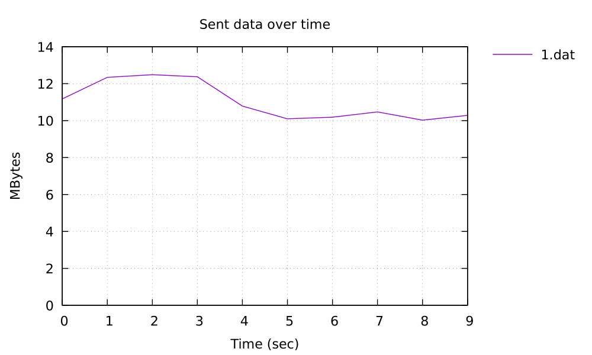{ #fig:011 width=60% }

Окно перегрузки растёт линейно, что типично для TCP в начале передачи. Отсутствие резких падений говорит об отсутствии потери пакетов (рис. [-@fig:012]).

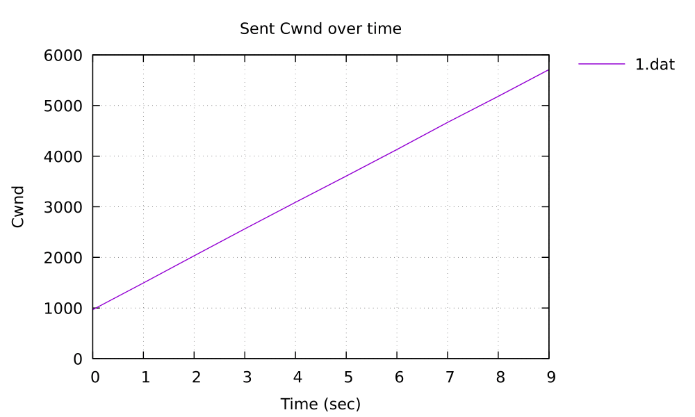{ #fig:012 width=60% }

Maximum transmission unit (MTU) это максимальный объём данных, который может быть передан протоколом за одну итерацию. Так как мы указали, что максимальный размер в нашей сети Ethernet MTU равняется 1500 байт, то на графике и видно это константное значение (рис. [-@fig:013]).

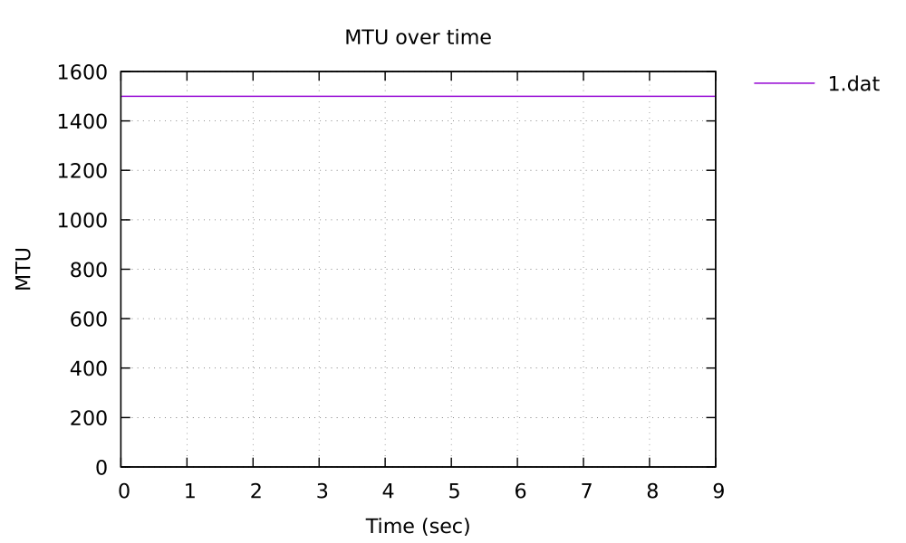{ #fig:013 width=60% }

На графике повторных передач видим, что их не было (рис. [-@fig:014]).

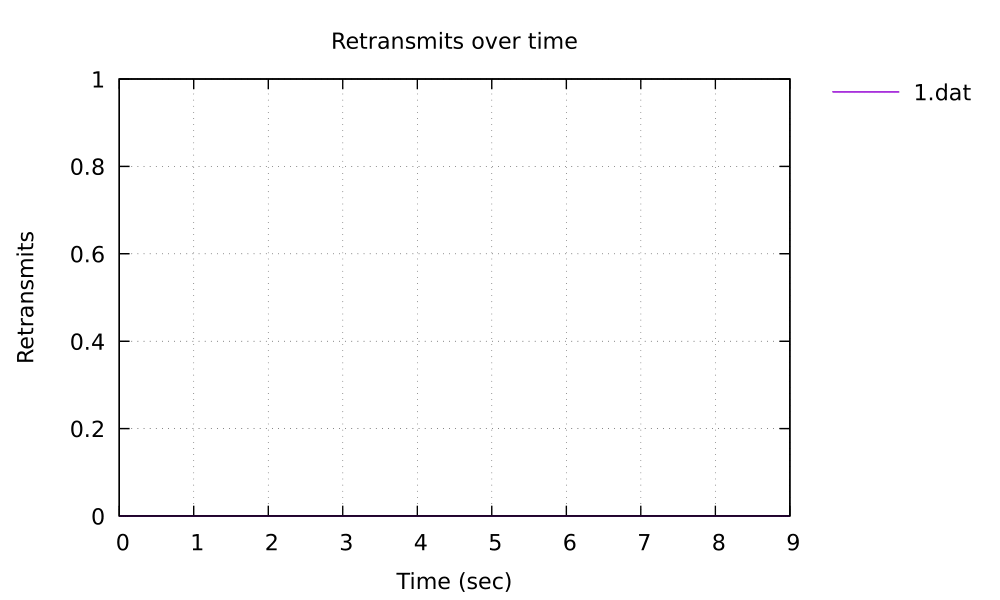{ #fig:014 width=60% }

RTT (Round-Trip Time) - это время, затраченное на прохождение пакета от клиента к серверу и обратно. Mininet по умолчанию использует очень большие буферы очередей, конкретно в моем случае очередь ядра установлена на 5000 пакетов (она приоритетнее чем очередь tc), поэтому они не теряются, а накапливаются, что увеличивает RTT.

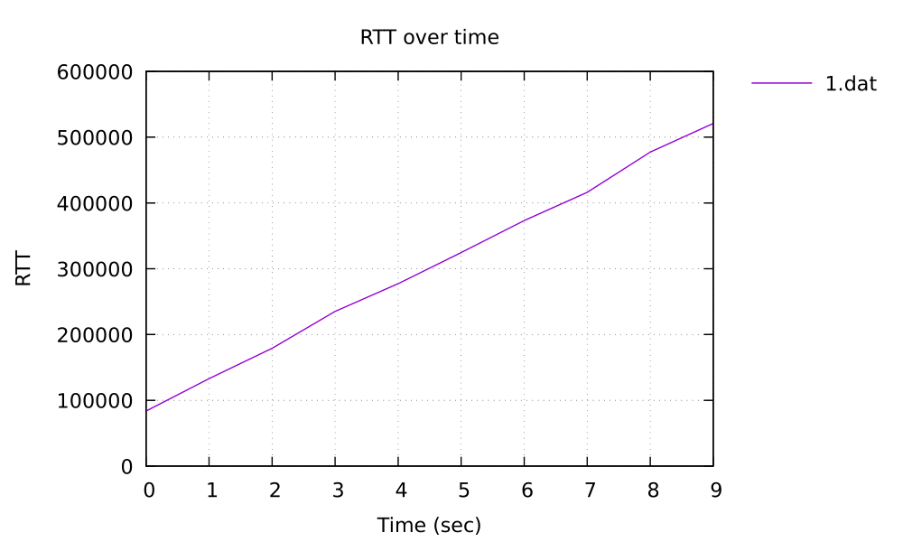{ #fig:015 width=60% }

На графике пропускной способности линия стабильно держится в диапазоне 80–100 Мбит/с, что близко к максимальной скорости Ethernet (100 Мбит/с), подтверждая эффективное использование канала без значительных потерь (рис. [-@fig:016]).

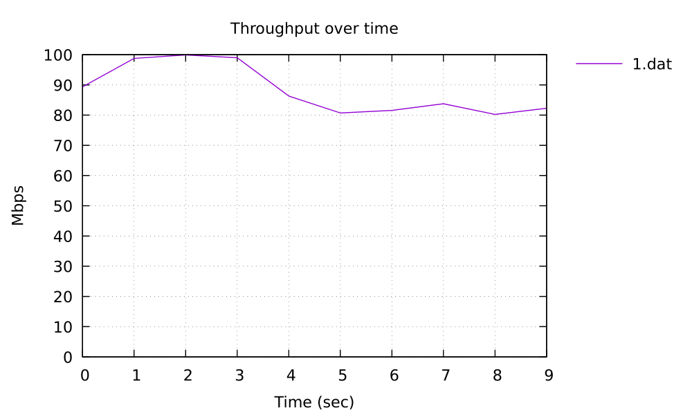{ #fig:016 width=60% }

# Заключение

В ходе работы мы успешно развернули Mininet на платформе Windows и провели эксперимент по анализу пропускной способности сети. Mininet доказал свою эффективность: с его помощью мы смогли быстро создать реалистичную сетевую среду, настроить параметры соединений и получить детальную статистику с помощью инструмента iperf3. Проведённый эксперимент подтвердил, что даже на виртуальной сети можно изучать важные аспекты работы протоколов, такие как влияние размера очереди на задержку передачи данных. Mininet остаётся одним из лучших инструментов для моделирования сетей, сочетая простоту использования с мощными возможностями для экспериментов.

# Список литературы{.unnumbered}

::: {#refs}
:::
